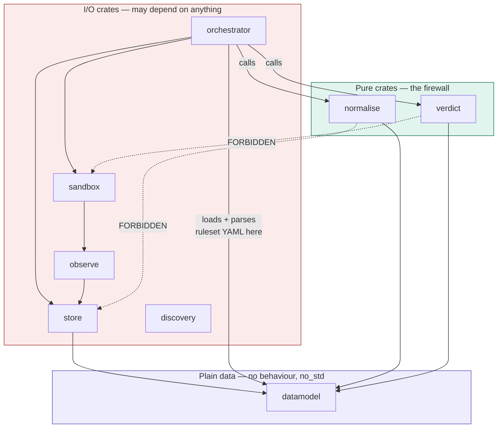

# ADR-007: Implementation language and workspace layout

**Status:** Accepted
**Date:** 2026-07-26
**Author:** Jun Cui
**Closes:** [F-01](../tasks.md#f-01--choose-implementation-language-and-workspace-layout--adr-007)
**Related:** ADR-005 (pure, offline derivation), [architecture.md §8](../architecture.md)

---

## Context

[architecture.md §8](../architecture.md) deliberately leaves the language open (`crates/ (or
packages/)`). It cannot stay open: two downstream commitments pull in opposite directions and
the choice determines which one is enforceable rather than aspirational.

- **ADR-005** requires `normalise` and `verdict` to be pure functions of
  `(evidence, ruleset_version)`, with no dependency on I/O, clocks, the network, or models.
  §8 states the consequence bluntly: *"If that edge ever appears in the dependency graph,
  reproducibility is gone."*
- **The `sandbox` layer is Linux syscall work** — mount/PID/user/net namespaces, overlayfs,
  cgroups v2, seccomp-bpf.

F-01 listed three evaluation criteria: syscall ergonomics, static enforceability of the
purity rule, and MCP client library maturity. The third turns out to point the wrong way.

### The MCP-client-maturity criterion is inverted

Python and TypeScript have the reference MCP SDKs. That is a reason to *avoid* using an SDK
here, not a reason to pick those languages:

- **P0-01 requires the raw response captured byte-exact before any parsing.** A mature SDK's
  central service is deserialising JSON-RPC into typed structs and discarding the wire bytes.
  **P0-02** pins over `(name, inputSchema, annotations, description)` *as received*, with no
  normalisation — explicitly, *"the pin is over bytes, not semantics."* A pin computed over
  re-serialised structs is a pin over the SDK's serialiser, not over the server's output. The
  test in P0-02 — reorder JSON keys, pin changes — fails through no fault of the server.
- **P0-01 requires that discovery cannot call a tool, "structurally, not by discipline."** An
  SDK client object exposes a tool-call method. A `DiscoveryClient` we own can simply have no
  such method in its API surface.

What is actually needed is JSON-RPC 2.0 over stdio and streamable HTTP, capture-then-parse,
`initialize` and `tools/list`. That is a few hundred lines, and owning it is a requirement
rather than a cost. A supporting data point: `rmcp`, the Rust SDK, is at `3.0.0-beta.2` —
pre-1.0 and churning — so in Rust specifically there is no mature option to forgo.

**Consequence for the evaluation:** the criterion is struck. The decision rests on syscall
ergonomics and static purity enforcement.

---

## Decision

**Rust**, edition 2024, single Cargo workspace, one crate per component in
[architecture.md §8](../architecture.md). Toolchain pinned exactly in `rust-toolchain.toml`.

The MCP client is **hand-rolled**, not `rmcp`, for the reasons above.

---

## Options considered

| | Rust | Go | Python | TypeScript |
|---|---|---|---|---|
| **Namespace/overlayfs/cgroup/seccomp ergonomics** | `nix` 0.31, `rustix` 1.1, `seccompiler` 0.5, `cgroups-rs` 0.5; cgroups are plain file writes. youki is the existence proof | Workable. `SysProcAttr.Cloneflags`/`UidMappings` covers launching a child into new namespaces | `ctypes` syscall wrapping; fragile at the seccomp and mount layers | Effectively requires a native addon for the whole sandbox layer |
| **ADR-005 purity, enforced statically** | **Crate-level dependency graph is the unit of enforcement.** Three independent layers available (below) | One module; package-level `depguard`. Real, but a lint over a flat namespace | `import-linter`. Convention with a checker | Project references / ESLint boundaries. Weakest |
| **MCP client** | Hand-rolled (required — see above) | Hand-rolled | Hand-rolled | Hand-rolled |

**On Go, honestly.** The folklore that Go cannot do namespace work is overstated and should
not be the stated reason for rejecting it. The Go runtime spawns threads before `main`, which
makes `unshare(CLONE_NEWUSER|CLONE_NEWNS)` *in the calling process* impossible without the
cgo constructor trick runc uses. But our supervisor never enters a namespace — it **launches
a child into one**, which `os/exec` handles correctly at the syscall level. Go was rejected on
the purity criterion alone: with one module and a flat package namespace, "`verdict` may not
reach `store`" is a linter rule rather than a property of the build graph.

**Python** remains attractive for census-only work and was seriously considered given that
Phase 0 ships a publishable finding with no sandbox code in it. Rejected because ADR-001
specifies that census *shares the discovery client and metadata pinner with the conformance
path*; splitting languages at that seam duplicates the two components whose byte-exactness
the entire pin depends on.

---

## Purity enforcement mechanism

This is the substance of the decision — the reason the language choice matters at all. F-04's
exit criterion is that a deliberately-added edge from `verdict` to `store` fails CI.



Three layers, in increasing strength:

**Layer 1 — dependency-graph assertion (mandatory).** Implemented as `cargo purity`
(`xtask/src/purity.rs`), run as its own CI step.

Two refinements emerged during implementation:

- **Allowlist, not denylist.** F-04 phrases the rule as a prohibition on named crates. Taken
  literally that is a denylist, and a denylist over a package ecosystem passes for any I/O
  crate nobody thought to name. The check instead asserts that a pure crate's transitive
  closure is a *subset* of an explicit allowlist (currently `{datamodel}`). Strictly
  stronger, and adding a dependency now requires editing the allowlist — exactly the friction
  ADR-005 wants.
- **`cargo tree`, not `cargo metadata`.** `cargo metadata` emits JSON, which would put a JSON
  parser inside the one tool whose job is keeping dependencies out. `cargo tree --prefix none`
  emits one package per line and needs nothing. Build-dependencies are included in the closure
  — a build script can read a clock just as easily as the crate can.

*Rejected:* `cargo-deny`'s `[bans]` section is workspace-wide and cannot express "crate X may
not depend on Y while crate Z may" except through an inverted `wrappers` allowlist.
`cargo-deny` remains appropriate for licence and advisory scanning, which is a different job.

**Layer 2 — `clippy.toml` per pure crate (mandatory).** A crate can be I/O-free in its
dependency graph and still call `std`. `disallowed-methods` / `disallowed-types` ban
`SystemTime::now`, `Instant::now`, `env::var`, `PathBuf`, `fs::File`, and `net::TcpStream`.

**Per-crate scoping was verified empirically, and it matters.** Clippy resolves `clippy.toml`
from `CARGO_MANIFEST_DIR`, so `crates/verdict/clippy.toml` applies to `verdict` alone — which
is essential, because `sandbox`, `store`, and `observe` legitimately need every method banned
there. A workspace-root config would have been unusable. Beware when checking this yourself:
clippy does not re-run on an unchanged crate, so a stale "no issues found" is not evidence
that a config was loaded. Falsify with a deliberately malformed `clippy.toml` *and* a forced
rerun.

Under the current `#![no_std]` this layer is belt-and-braces. It is retained because it
becomes load-bearing the moment a pure crate relaxes to `std` — see P1-06.

**Layer 3 — `#![no_std]` + `alloc` (adopted for `verdict`; to be evaluated for
`normalise`).** This is the difference between a check that fires and a capability that does
not exist. `verdict` consumes canonical changesets and emits an outcome plus a reason code —
`BTreeSet`, `String`, and arithmetic. There is no clock or filesystem to reach for because
neither is linked.

The architectural precondition that makes this possible, and which is correct independently:
**ruleset YAML parsing lives outside the pure crates.** `normalise` takes an already-parsed
`Ruleset` value, not a path. Signature:

```rust
pub fn normalise(evidence: &RawEvidence, ruleset: &Ruleset) -> CanonicalChangeset;
```

For `normalise` this is recorded as *evaluate*, not *decided*: its path-matching rules need
`regex` (which supports `no_std` + `alloc`) or `globset` (which likely does not). If matching
forces `std`, `normalise` falls back to Layers 1 and 2, and that fallback is not a failure —
it is the mandatory baseline.

---

## Platform gating

`sandbox` stays a workspace member on every host. Linux-only is expressed at the build level,
per F-02, not by runtime check:

- `#![cfg(target_os = "linux")]` at the crate root — on Darwin the crate compiles to nothing
- `[target.'cfg(target_os = "linux")'.dependencies]` for `nix`, `seccompiler`, `cgroups-rs`

`cargo build` therefore succeeds on the macOS development host with `sandbox` empty, and
nothing degrades silently into a runtime capability probe. Note that this makes the sandbox
untestable on the primary development machine, which is F-00's problem, not this ADR's.

---

## Second language

Permitted in exactly two places, neither of which touches the deterministic core:

1. **Fixtures, mock backends, and the P4-05 hostile test server.** These are throwaway and
   deliberately adversarial; they must not share a build graph with the harness. Any language,
   chosen per fixture.
2. **`results/` analysis and publication figures.** Python.

Everywhere else — intake, discovery, census, planner, world, argsynth, sandbox, observe,
integrity, normalise, verdict, destructive, store, orchestrator — is Rust. In particular the
`destructive` crate is Rust despite calling a model, because ADR-006's quarantine is a
dependency-graph property and is cheapest to enforce inside one graph.

---

## Consequences

**Good.**

- ADR-005 becomes a property of the build rather than a comment. For `verdict`, taking a clock
  as a dependency is not a mistake that CI catches; it is code that does not link.
- One graph covers the whole system, so ADR-006's quarantine of `destructive` and ADR-005's
  purity firewall are enforced by the same mechanism.
- The sandbox layer gets first-class syscall crates with a production precedent.

**Costs, accepted.**

- **Schedule risk against the two-week Phase 1 target** in design.md §10. Rust is the slower
  language to write namespace and mount code in, measured in developer time rather than
  library availability. Mitigation: Phase 0 has no sandbox code at all (ADR-001), so the
  critical path to a publishable result — F-02 → P0-01 → P0-02 → P0-05 → P0-06 — never
  touches the hard part. If Phase 1 slips, Phase 0 still ships.
- **Hand-rolling the MCP client** means tracking spec revisions ourselves. O-01 already exists
  for this reason, and `TOOL_SNAPSHOT.spec_revision` already exists to make results survive a
  revision change.
- **No mature MCP SDK to fall back to** if the hand-rolled client proves wrong about some
  transport detail. `rmcp` at `3.0.0-beta.2` is available as a cross-check oracle for
  debugging, but must never be in the discovery path.
- **`no_std` for `verdict` constrains its dependencies permanently.** Anything that later
  wants `std` in the verdict engine is a signal that it belongs outside the verdict engine —
  which is the intended effect, but it will feel like an obstruction at least once.

---

## Follow-on decisions this ADR does not make

- **F-00** — the Linux development and CI target, pinned kernel version, and fixed overlayfs
  mount options. `sandbox` is unbuildable on the macOS host by construction (above), so this
  is now blocking.
- **F-07 / ADR-009** — canonical serialisation of the overlay upper layer. The primary
  evidence artifact is a directory tree, not a byte string, and F-05's content addressing
  needs a tree format before it means anything.
- **ADR-008** — the `user_state` / `server_internal` / `ephemeral` path taxonomy, which blocks
  ruleset v1.
