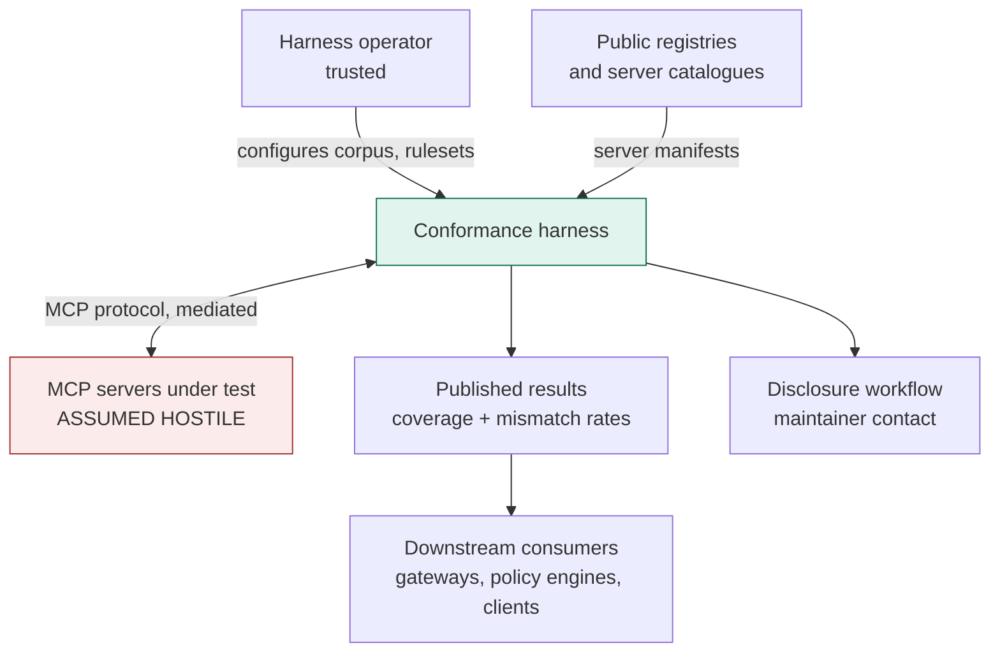
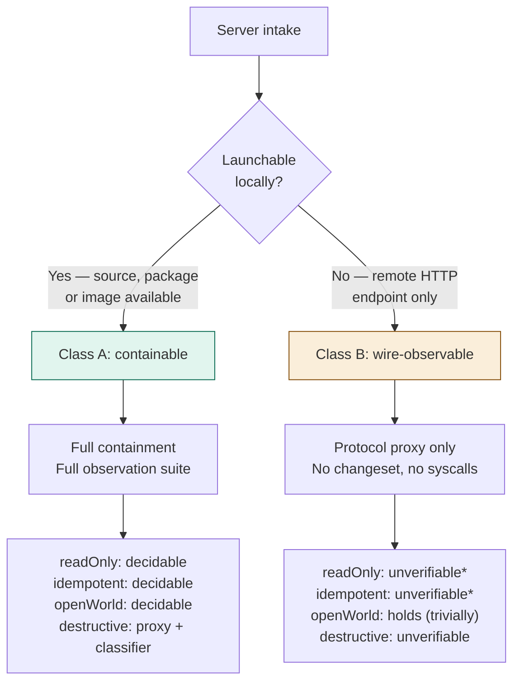
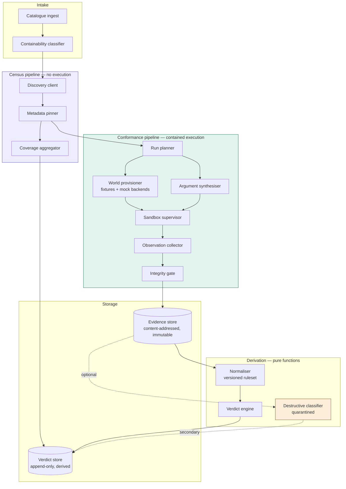
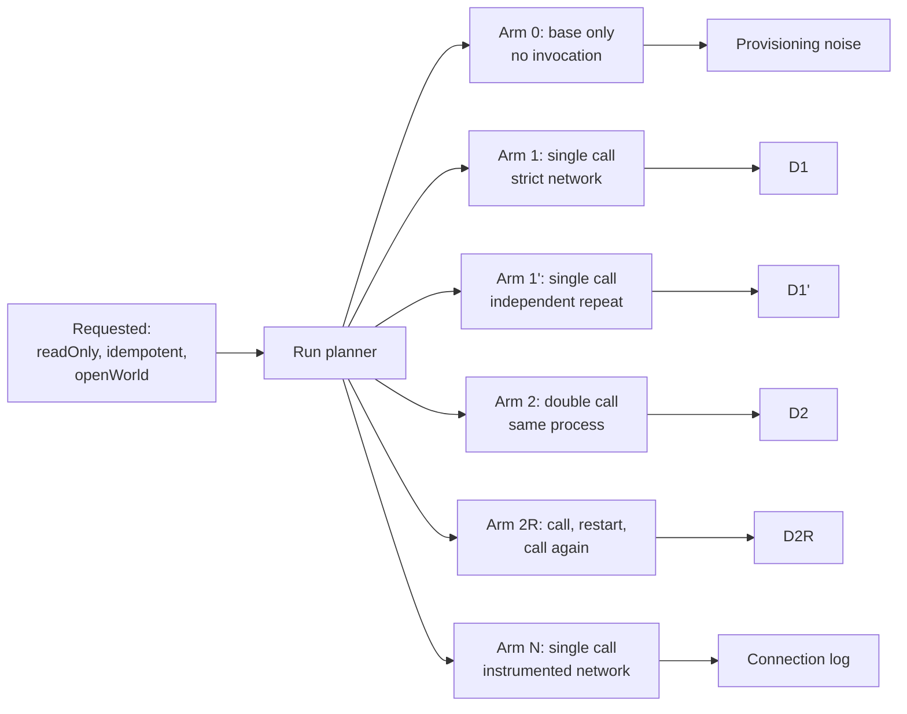
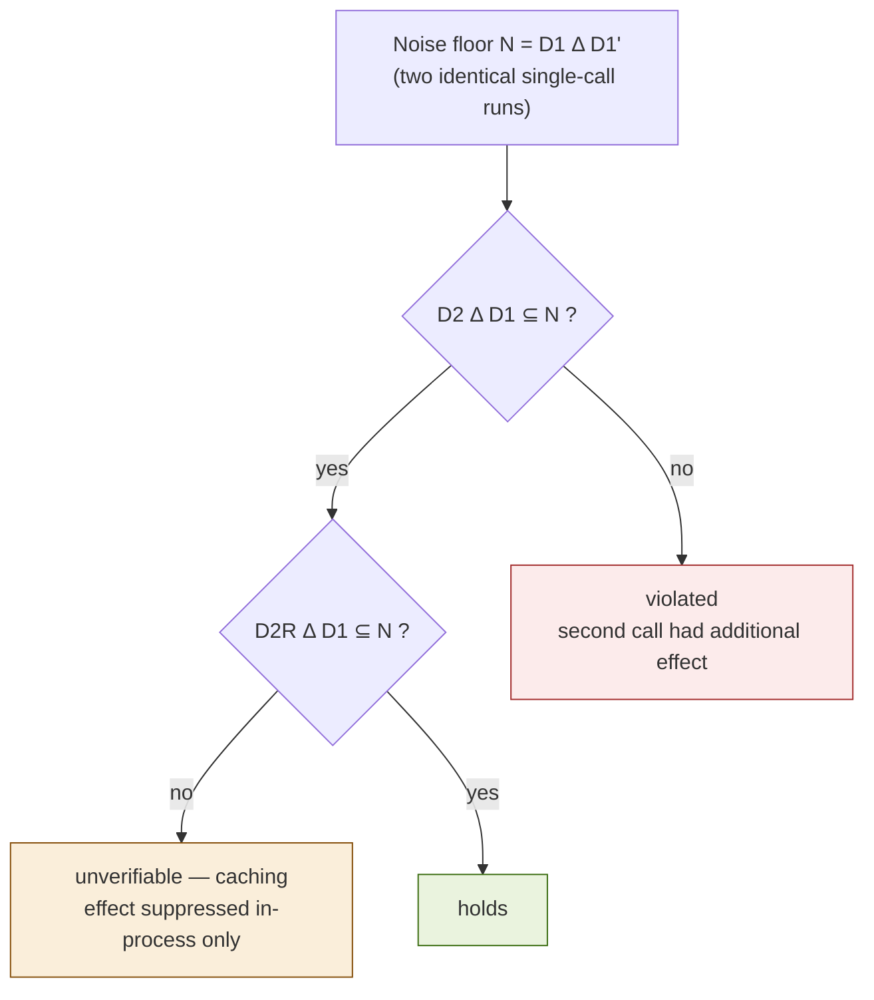
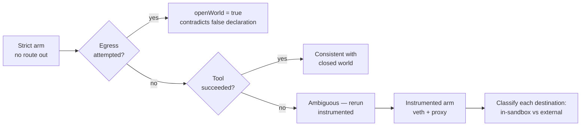
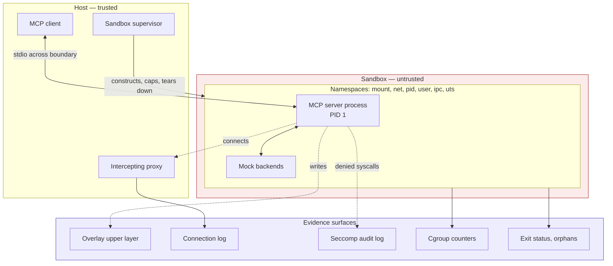
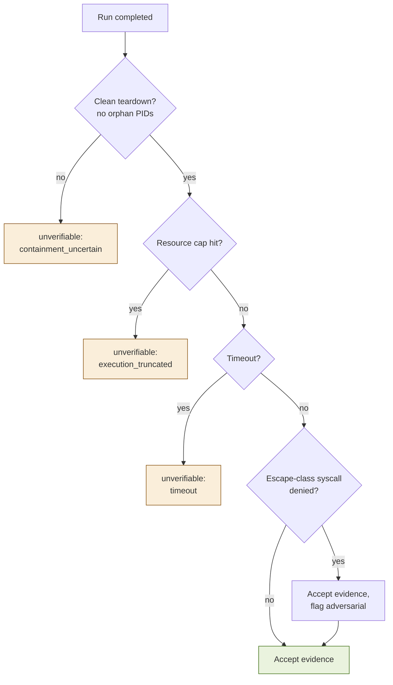
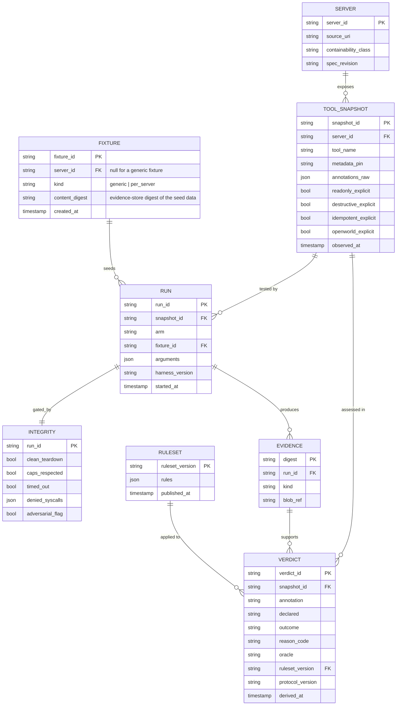
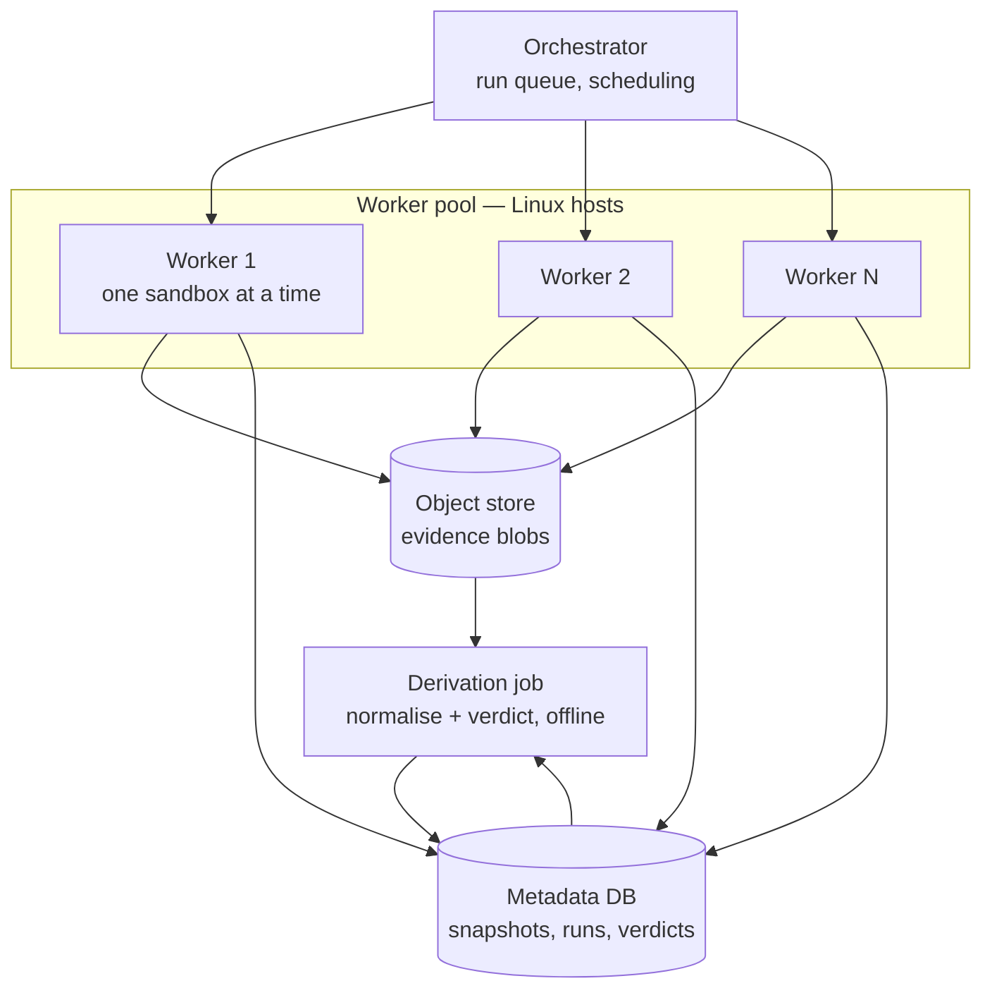

# MCP Annotation Conformance Harness — Architectural Plan

**Status:** Proposed
**Author:** Jun Cui
**Supersedes:** *MCP Annotation Conformance Harness — High-level architectural design* (draft, July 2026)
**Last updated:** July 2026

This document takes the original design doc as given and turns it into an implementable
architecture. It assumes the reader has read that doc; it does not restate the problem.

---

## 0. What the prior-art survey changed

Four architectural consequences fall out of the literature review. Everything downstream
in this document follows from them.

| Finding | Architectural consequence |
|---|---|
| No study reports annotation coverage; "absence" is the likely headline (open question 1) | Census is promoted to a **separate pipeline** with its own throughput profile and its own publishable output. It requires no sandbox. |
| Remote HTTP servers run on infrastructure we do not control | **Containability becomes a corpus partition**, decided at intake. Class B (remote-only) servers can never yield a filesystem changeset; that must be a structural property of the record, not a per-run surprise. |
| Rug-pull attacks (Invariant Labs) mutate tool metadata after approval | Every record carries a **metadata pin** — a hash over the tool's schema plus annotation set as observed at test time. A verdict without a pin is meaningless. |
| Static description-vs-code work (MCPDiFF, DCIChecker) already exists and is orthogonal | A static pre-pass is admitted as an **optional oracle for triage and cross-checking only**. It must not touch behavioural verdicts. Isolating it preserves the "no model judgement in the deterministic core" property. |

One methodological consequence, from the metamorphic testing literature: the idempotency
protocol needs a **control arm**. Comparing one call against two calls without first
establishing how much two *identical* single-call runs differ is measuring noise plus
signal and reporting it as signal. §4.2 makes this explicit.

---

## 1. Context



The trust boundary is drawn once and never crossed: everything reaching the harness from
`SRV` is evidence, never instruction. This matters more than it sounds — tool descriptions
are an established prompt-injection vector, and any component of this harness that feeds a
tool description to a model (§6, the `destructiveHint` classifier) is exposed to exactly
the attack MCPTox benchmarks.

---

## 2. Corpus partitioning

Intake classifies every server before any other work happens. This is the single decision
that determines what verdicts are reachable.



`*` Class B admits a narrow exception: if a server exposes MCP **resources** or read-only
tools that reflect its own state, a state-probe protocol can sometimes decide `readOnlyHint`
and `idempotentHint` from the protocol surface alone (probe → invoke → probe). This is a
weaker oracle — it only observes state the server chooses to expose — and records produced
this way carry `oracle: protocol_probe` rather than `oracle: kernel_changeset`. Do not
aggregate the two without separating them in the results.

**Design note.** The temptation is to treat Class B as a degenerate case and bolt it on
later. Resist it. The class ratio in the corpus is itself a finding — if 70% of public
servers are remote-only, the honest headline is "most of the ecosystem is unauditable by
any third party," which is a stronger claim than a mismatch rate.

---

## 3. Component architecture



### 3.1 Component contracts

| Component | Responsibility | Must not |
|---|---|---|
| **Catalogue ingest** | Resolve registry entries to installable artifacts or endpoints | Execute anything |
| **Containability classifier** | Assign Class A / Class B; record why | Guess — an unresolvable server is its own class, `unclassifiable` |
| **Discovery client** | `initialize` + `tools/list`; capture raw JSON verbatim | Call any tool |
| **Metadata pinner** | Hash `(name, inputSchema, annotations, description)` per tool; hash the tool set | Normalise before hashing — the pin is over bytes as received |
| **Coverage aggregator** | Per-annotation: explicit / defaulted / absent, per tool and per server | Touch behavioural evidence |
| **Run planner** | Compile requested annotations into a minimal deduplicated set of run specs | Reorder runs that must be independent |
| **World provisioner** | Build a byte-reproducible base layer: seeded FS, seeded DB, mock backends | Produce nondeterministic bases — this silently poisons every diff |
| **Argument synthesiser** | Schema-driven generation + fixture binding + cache-busting variants | Reuse an argument across arms that must be identical without recording that it did |
| **Sandbox supervisor** | Construct namespaces, launch, enforce caps, tear down | Emit any verdict |
| **Observation collector** | Harvest upper layer, conntrack log, seccomp audit log, cgroup counters, exit status | Interpret anything |
| **Integrity gate** | Decide whether containment held well enough for the run to count | Be bypassable by configuration |
| **Normaliser** | `(raw_evidence, ruleset_version) → canonical_changeset`, pure and deterministic | Read anything outside its inputs |
| **Verdict engine** | `(canonical_evidence, protocol_version) → verdict`, pure | Call a model, network, or clock |
| **Destructive classifier** | Mechanical proxy + model classification + human-label agreement | Write into the deterministic verdict path |

The purity of the last three is what makes §7 of the original doc ("verdicts reproducible
from stored evidence plus the normalisation ruleset") actually true rather than aspirational.
Enforce it in the type system if the language allows: the verdict engine should not be
able to take a network client or a clock as a dependency.

---

## 4. Run topology and verification protocols

### 4.1 The run planner

Annotations do not map one-to-one onto runs. A single-invocation run from a clean base
serves as the `readOnlyHint` evidence *and* as the `D1` arm of the idempotency protocol
*and* as the strict-mode `openWorldHint` observation. The planner exists to exploit that.



Every arm runs in a freshly constructed sandbox from a byte-identical base layer. Arms are
never reused across tools.

### 4.2 `idempotentHint` — the multi-arm protocol

This is the substantive change from the original design. A bare `D1 == D2` comparison
conflates three things: real non-idempotence, environmental noise, and internal caching.



Two properties worth stating explicitly:

- **The noise floor is measured, not assumed.** `N` is derived per tool, per run, from the
  `D1`/`D1'` pair. This is how the normalisation ruleset gets built empirically, as §8 of
  the original doc intended — every element of `N` is a candidate normalisation rule, and
  a rule that never appears in any observed `N` should not exist.
- **Arm 2R resolves the caching confound rather than deferring it.** If the effect
  reappears after a server restart, the tool was caching, not idempotent. The original doc
  listed this as an unresolved limitation; it is now a decidable branch that produces an
  honest `unverifiable` with a specific reason code instead of a false `holds`.

Framed in the metamorphic testing vocabulary (Segura et al., IEEE TSE 2017), `D1 ≡ D2`
is an equivalence metamorphic relation over the state-transformation output, and `N` is the
tolerance under which the relation is evaluated. Say it that way in the paper.

### 4.3 `readOnlyHint`

Single arm. `canonical(D1)` non-empty contradicts a `true` declaration. The subtlety is
entirely in the normaliser: a tool that writes only a log line to its own cache directory
is arguably read-only with respect to *user* state and not read-only with respect to the
filesystem. Decide this once, in the ruleset, versioned, and publish the ruleset.

Recommend: classify changeset paths into `user_state`, `server_internal`, and `ephemeral`,
and emit the verdict against `user_state` while reporting the other two. This gives
critics something to argue with that isn't the verdict itself.

### 4.4 `openWorldHint`



The instrumented arm is where mock-backend redirection lives, and where open question 2
gets answered empirically: log how many tools need bespoke fixtures versus how many work
against a generic mock. That ratio is a publishable result in its own right.

### 4.5 `destructiveHint`

Quarantined by construction. The mechanical proxy partitions the canonical changeset into
`deletions ∪ overwrites` versus `pure additions`. The model classifier and human labels
are evaluated for agreement against that proxy on a held-out set, and the headline number
is the agreement statistic, not a mismatch rate.

Because this component reads tool descriptions and feeds them to a model, it is the one
place in the system exposed to tool-poisoning. Run it out-of-band, on stored evidence,
with the description treated as untrusted data — never in the run loop.

---

## 5. Containment, observation, and the integrity gate



Note the topology: the **MCP client lives on the host, the server lives in the sandbox**,
and the protocol crosses the boundary over stdio. This is the correct arrangement — it
keeps the harness's own protocol handling outside the blast radius, and it means the
transport itself is a mediation point.

### 5.1 The integrity gate

Containment is a correctness requirement, so make it a *precondition* rather than a hope.
No evidence proceeds to the verdict engine until the gate passes.



A cgroup memory cap hit mid-invocation means the tool did not finish its work, which means
an empty changeset proves nothing. Treating that as `readOnlyHint: holds` would be the
exact failure mode the original doc identifies as worst-possible. The gate is what prevents
it structurally rather than by remembering to check.

Attempted escapes do not invalidate the run — they are among the most interesting findings
the harness can produce — but they set a flag that follows the record into publication.

---

## 6. Data model



`FIXTURE`'s columns were left unspecified in the original version of this diagram — only
its relationship to `RUN` ("seeds") was. F-06 filled the gap: `server_id` is `NULL` for a
`fixtures/generic` fixture and required for a `fixtures/per-server` one, enforced as a
`CHECK` alongside the FK, and `content_digest` points into the same evidence store F-05
built rather than duplicating fixture bytes into the metadata DB.

Three invariants:

1. **Verdicts key on `snapshot_id`, never on `server_id` + `tool_name`.** A rug pull produces
   a new snapshot with a new pin, and old verdicts remain correct about the tool they tested.
2. **`EVIDENCE` is immutable and content-addressed; `VERDICT` is derived and disposable.**
   Re-running the normaliser with a new ruleset over historical evidence regenerates the
   whole verdict table without re-executing a single tool. This is the property that makes
   the normalisation ruleset safe to iterate on, and it is worth an integration test that
   literally does it.
3. **`outcome` carries a `reason_code`.** `unverifiable` without a reason is not a finding,
   it is a shrug. The reason codes are the taxonomy the paper reports.

---

## 7. Deployment topology



Constraints that shape this:

- **One sandbox per worker slot at a time.** Arms must be independent; concurrent sandboxes
  on one host share a kernel and a page cache, and the resulting timing coupling is exactly
  the kind of noise the noise-floor arm is trying to measure. Scale out, not up.
- **Derivation is offline and re-runnable.** It is a batch job over the object store, not a
  step in the run loop. This is what makes ruleset iteration cheap.
- **Workers are disposable and re-imaged between servers**, not between tools. Between-server
  re-imaging bounds the damage from a successful escape.

---

## 8. Repository layout

```
mcp-conformance/
  crates/ (or packages/)
    intake/          catalogue ingest, containability classification
    discovery/       MCP client, tools/list, metadata pinning
    census/          coverage aggregation — depends on discovery only
    planner/         annotation set -> run specs
    world/           fixtures, mock backends, base-layer construction
    argsynth/        schema-driven generation, cache-busting variants
    sandbox/         namespaces, overlayfs, cgroups, seccomp   [Linux-only]
    observe/         evidence harvesting
    integrity/       the gate
    normalise/       pure; versioned rulesets as data
    verdict/         pure; protocol implementations
    destructive/     quarantined; proxy + classifier + agreement eval
    store/           evidence + verdict persistence
    orchestrator/    queue, workers, scheduling
  rulesets/
    v1.yaml ... vN.yaml
  fixtures/
    generic/         the default mock world
    per-server/      bespoke fixtures, one dir per server
  results/
    census/
    conformance/
  docs/
    design.md        the original doc
    architecture.md  this doc
    adr/
```

`normalise` and `verdict` must have no dependency on `sandbox`, `observe`, or any I/O
crate. If that edge ever appears in the dependency graph, reproducibility is gone.

---

## 9. Architecture decision records

### ADR-001: Census as a separate pipeline

**Status:** Proposed

**Context.** The original design treats discovery as stage one of a single linear pipeline.
The prior-art survey found that no existing study reports how many MCP tools declare
annotations at all, and that this is plausibly the more significant finding.

**Decision.** Split census into an independent pipeline that shares only the discovery
client and the metadata pinner with the conformance path.

**Options considered.**

| Option | Complexity | Time to first result | Corpus reach |
|---|---|---|---|
| A: single pipeline, census as byproduct | Low | Gated on sandbox | Limited to Class A |
| B: separate census pipeline | Low-Med | Days | Entire corpus, both classes |

**Consequences.** Publishable coverage numbers become available before any sandbox code
exists, which de-risks the schedule considerably. Costs a small amount of duplication in
orchestration. Makes it harder to present one unified "conformance rate" — which is
correct, because there isn't one.

---

### ADR-002: Containability as a corpus partition

**Status:** Proposed

**Context.** Remote HTTP MCP servers cannot be contained. The original doc treats external
state invisibility as a limitation (§8) rather than a structural property.

**Decision.** Classify at intake. Class A gets the full protocol suite; Class B gets a
protocol-probe oracle at most, with `oracle` recorded on every verdict.

**Consequences.** The class ratio becomes a headline finding. Prevents the silent
production of a corpus that looks large but is mostly `unverifiable`. Requires that results
never aggregate across oracles without disclosure — an easy invariant to state and an easy
one to violate in a summary table.

---

### ADR-003: Multi-arm idempotency with a measured noise floor

**Status:** Proposed

**Context.** A two-run `D1` vs `D2` comparison cannot distinguish non-idempotence from
environmental nondeterminism from internal caching. The original doc lists normalisation
sensitivity and caching as separate open limitations.

**Decision.** Add a repeat single-call arm (`D1'`) to measure the noise floor empirically,
and a restart-interleaved arm (`D2R`) to resolve caching. Verdict is `holds` only if the
second-call delta falls inside the noise floor in both the in-process and restarted cases.

**Consequences.** Roughly doubles the runs per tool for idempotency — the dominant cost
driver. In exchange, the normalisation ruleset is derived from observed noise rather than
guessed, and the caching confound produces a specific `unverifiable` reason instead of a
false positive. Reviewers will ask about both; this answers both.

---

### ADR-004: Integrity gate as a hard precondition

**Status:** Proposed

**Context.** A truncated, timed-out, or resource-capped run produces an empty or partial
changeset that is indistinguishable from "the tool did nothing."

**Decision.** No evidence reaches the verdict engine without passing an integrity gate.
Failure produces `unverifiable` with a reason code. The gate is not configurable off.

**Consequences.** Some fraction of runs — possibly a large fraction early on — yield no
verdict. That fraction is itself a reported metric and a useful signal about harness
maturity. Removes the worst available failure mode by construction rather than by vigilance.

---

### ADR-005: Pure, offline derivation

**Status:** Proposed

**Context.** §7 of the original doc requires that a change to normalisation rules be
re-runnable over historical evidence without re-executing tools.

**Decision.** `normalise` and `verdict` are pure functions of `(evidence, ruleset_version)`.
Derivation runs as an offline batch job. Neither crate may depend on I/O, clocks, models,
or the network.

**Consequences.** Ruleset iteration becomes cheap and auditable; a reviewer can be handed
the evidence bundle and the ruleset and reproduce every verdict. Constrains the verdict
engine — anything needing a model (i.e. `destructiveHint`) must live outside it, which is
where ADR-006 comes from.

---

### ADR-006: `destructiveHint` quarantined from the deterministic core

**Status:** Proposed (unchanged from the original design, formalised here)

**Context.** Destructive-vs-additive is semantic. Any classifier reading tool descriptions
is exposed to tool poisoning, an attack class with demonstrated high success rates.

**Decision.** Keep the classifier out of the run loop and out of the verdict engine. Run it
out-of-band over stored evidence. Report agreement statistics against human labels, not a
mismatch rate. Treat all description text as untrusted data.

**Consequences.** Three clean deterministic results plus one honestly-caveated secondary
result, rather than four results of mixed epistemic quality. The secondary result is
weaker in isolation and stronger as a contribution to the "can this be automated at all"
question.

---

## 10. Phasing, mapped to components

| Phase | Components landed | Exit criterion |
|---|---|---|
| **0 — Census** | intake, discovery, census, store (partial) | Annotation coverage numbers over ≥1,000 servers. **Publishable on its own.** |
| **1 — Thinnest verdict** | sandbox (mount+overlay+timeout), observe (upper layer), integrity (teardown+timeout only), normalise v1, verdict (`readOnlyHint`) | One real `readOnlyHint` verdict on one real tool, end to end, within two weeks |
| **2 — Deterministic core** | sandbox (pid/user/cgroups), full integrity gate, planner, world (generic fixtures), argsynth, verdict (`idempotentHint` multi-arm) | Noise floor measured across ≥50 tools; ruleset v2 derived from it. **Publishable.** |
| **3 — Network** | sandbox (netns, veth), intercepting proxy, world (mock redirection), verdict (`openWorldHint`) | Fixture-generality ratio measured — answers open question 2 |
| **4 — Hardening** | seccomp-bpf, denied-syscall logging, adversarial flagging, worker re-imaging | Survives a deliberately hostile test server |
| **5 — Audit** | orchestrator scale-out, disclosure workflow, results publication | Aggregate rates by annotation, class, and oracle |

Phase 0 is new and it inverts the risk profile of the whole project. The original doc's
anti-goal — *do not build the full containment stack before producing the first verdict* —
is now enforceable structurally: Phase 0 ships a real finding with no sandbox code in it
at all.

---

## 11. Open questions, updated

| # | Question | Status after this plan |
|---|---|---|
| 1 | What fraction of servers declare annotations? | **Answerable in Phase 0.** Census pipeline exists to answer exactly this. |
| 2 | Can mock-backend redirection be made general? | **Instrumented as a metric** in Phase 3 — log generic-fixture success rate versus bespoke-fixture need. |
| 3 | Publish per named server or aggregate only? | Unresolved. The metadata pin (§6) makes named publication *defensible* — a claim is bound to an exact observed snapshot — which weakens the main objection. Recommend: aggregate by default, named on violation after disclosure. |
| 4 | Responsible-disclosure path? | Now a component, not an afterthought. Records need an embargo state and a disclosure timestamp; add both to `VERDICT` before Phase 5. |
| 5 | *(new)* Does the annotation spec change under you? | Five SEPs are open and a Tool Annotations Interest Group is actively debating runtime evaluation. `TOOL_SNAPSHOT.spec_revision` and `VERDICT.protocol_version` exist so results survive a spec change. Track the IG. |

---

## 12. Immediate action items

1. [ ] Build discovery + metadata pinner; run the census over a seed corpus of 100 servers to validate the pin and the coverage taxonomy
2. [ ] Decide the `user_state` / `server_internal` / `ephemeral` path taxonomy for the normaliser (§4.3) — this blocks ruleset v1
3. [ ] Write the containability classifier and measure the Class A / Class B ratio; this number gates how ambitious Phase 5 can be
4. [ ] Stand up the evidence store with content addressing before any sandbox work, so Phase 1 evidence is replayable from day one
5. [ ] Prototype the overlayfs base-layer builder and prove byte-reproducibility across two constructions — everything downstream depends on it
6. [ ] Add `embargo_state` and `disclosed_at` to the verdict schema now, while it is cheap