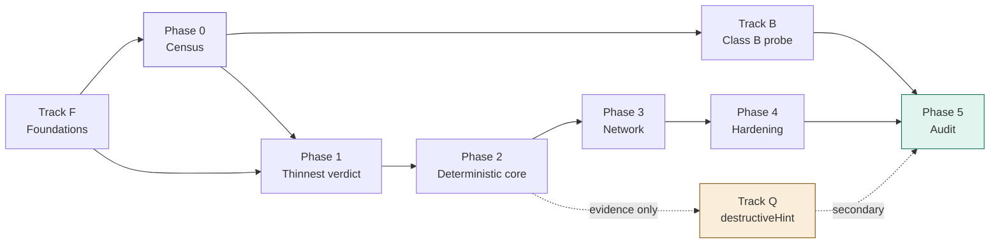

# Implementation Backlog

**Derived from:** [architecture.md](architecture.md), which supersedes [design.md](design.md).
**Status:** Pre-implementation
**Last updated:** July 2026

This is the canonical task list. It is mirrored into GitHub Issues; every issue title
carries its task ID so the two can be reconciled mechanically. When they disagree, this
file wins.

---

## How to read this

- **Tracks** run in parallel. **Phases** are sequential and match architecture.md §10.
- `Depends on` lists task IDs that must be complete, not merely started.
- `Exit` is the observable condition that closes the task. If it cannot be observed, it is
  not an exit criterion and the task needs rewriting.
- Tasks marked **⚑ blocking** gate an entire phase.

---

## Track F — Foundations

Cross-cutting work that gates Phase 0 and Phase 1. None of it produces a finding; all of it
prevents rework later.

### F-00 Pinned Linux development and CI target

**Depends on:** —
**Exit:** A reproducible Linux environment (fixed kernel version, fixed overlayfs mount
options) that development and CI can both target, documented as such.
**Status:** Done — [ADR-010](adr/010-pinned-linux-environment.md). Target: a pinned Ubuntu
24.04 LTS ("Noble Numbat") cloud image, referenced by an exact dated build serial (e.g.
`releases/noble/release-20260705/` via Canonical's permanent archive, never the `release/`
symlink that repoints over time) rather than a dedicated bare-metal/cloud box — the
trade-off table in the ADR turned on the box option not actually solving F-00's own
"contributor local access" checklist item (it gives remote access to one shared machine, not
local access to a reproducible one) and reintroducing the "one sandbox at a time" concurrency
constraint architecture.md §7 already imposes at worker-pool scale, now at the individual
contributor's desk too. GA kernel series pinned at **6.8** (`linux-image-generic`, not the
HWE track, which deliberately jumps series over the LTS lifecycle — exactly the drift being
prevented). Verification checksum is not asserted in the doc itself — recording it is the
first action for whoever actually provisions the image, not a value invented from an
unverified search result.

Referenced as blocking in [ADR-007](adr/007-implementation-language.md) ("sandbox is
unbuildable on the macOS host by construction... this is now blocking") and in
`crates/sandbox/src/lib.rs` ("untestable on the primary development host. That is F-00's
problem") since the language decision was made, but never actually added to this backlog
until now — a real gap between the docs and the tracked work, found while scoping the
census staging below.

**Gates P1-02 onward, not Phase 0.** Stage 0/1 census (registry metadata; `initialize` +
`tools/list` against remote HTTP servers) touches no sandbox code. Stage 2 census (Class A
servers, which requires locally executing the server to discover it) needs *containment*
but not *this* — a stock container runtime is adequate for containment-without-observation,
per the reasoning in the P0-06/P0-07 notes below. F-00 is specifically about the
fixed-kernel-version precision that *observation-grade* overlayfs work (Phase 1+) needs,
which containerized execution without observation does not.

**CI gap, disclosed rather than papered over.** GitHub's hosted `ubuntu-24.04` runner label
pins the Ubuntu release, not the point-in-time kernel build inside it — GitHub updates
images under a stable label over time, and hosted runners don't expose nested
virtualisation/KVM, so CI cannot simply boot the pinned VM image itself today. The ADR
records a self-hosted-runner-on-the-pinned-image escalation path but deliberately does not
build it yet (no Phase 1+ sandbox code exists to need it). What ships now: F-03's existing
kernel-prerequisite probe step in `.github/workflows/ci.yml` prints `uname -r` so drift
against the ADR-010 pin is visible in every CI run's log rather than silent — it does not
fail the build on a mismatch, since the hosted runner was never claimed to satisfy the pin
exactly and there is no owned fallback yet to fail over to.

- [x] Choose the target: a pinned VM image (recommended — a container shares the host
      kernel, which defeats "pinned" if the host itself isn't fixed) vs. a dedicated
      bare-metal/cloud Linux box — VM image chosen, full trade-off table in ADR-010
- [x] Pin the kernel version and record it — Ubuntu 24.04 LTS GA kernel series 6.8
      (`linux-image-generic`), image referenced by dated archive serial
- [x] Pin overlayfs mount options — `redirect_dir=off`, `metacopy=off` (security-load-bearing:
      the kernel's own docs warn against `metacopy=on` with untrusted layers, which is
      exactly design.md §3's hostile-tool trust model), `index=off` (no layer reuse/export
      exists to protect, per architecture.md §4.1's "arms are never reused"), `userxattr`
      conditional on P1-03's not-yet-made privileged-vs-rootless mount choice
- [x] Document how a contributor gets local access matching CI's environment — Lima (or
      Vagrant+libvirt/qemu/UTM) booting the pinned, checksum-verified image locally on any
      host OS/architecture; arm64 natively for Apple Silicon contributors since none of the
      namespace/overlayfs/cgroups behaviour in scope is architecture-sensitive

### F-01 ⚑ Choose implementation language and workspace layout — ADR-007

**Depends on:** —
**Exit:** ADR-007 merged in `docs/adr/`, recording the choice and the rejected options.
**Status:** Done — [ADR-007](adr/007-implementation-language.md). **Rust**, edition 2024,
single Cargo workspace, hand-rolled MCP client.

architecture.md §8 deliberately leaves this open (`crates/ (or packages/)`). It cannot stay
open — the purity constraint in ADR-005 is materially easier to enforce in a language with a
real module/dependency graph, and the sandbox layer is Linux syscall work.

- [x] Evaluate against: syscall ergonomics (namespaces, overlayfs, cgroups, seccomp), ability
      to enforce the `normalise`/`verdict` purity rule statically, ~~MCP client library
      maturity~~ — **criterion struck.** SDK maturity points the wrong way: mature SDKs
      discard wire bytes during deserialisation, which breaks P0-01's byte-exact capture and
      therefore P0-02's pin, and they expose a tool-call method that P0-01 forbids
      structurally. Decision rests on the first two criteria.
- [x] Record the decision and consequences as ADR-007
- [x] Note explicitly which parts, if any, are permitted to be a second language — fixtures /
      mock backends / P4-05 hostile server (any language, never in the harness build graph),
      and `results/` analysis (Python). Everything else is Rust, `destructive` included.

### F-02 Scaffold the repository skeleton

**Depends on:** F-01
**Exit:** Every directory in architecture.md §8 exists with a placeholder module that builds.
**Status:** Done — `cargo build --workspace` and `cargo clippy --workspace --all-targets`
both clean on the macOS host.

- [x] `intake` `discovery` `census` `planner` `world` `argsynth` `sandbox` `observe`
      `integrity` `normalise` `verdict` `destructive` `store` `orchestrator`
- [x] `rulesets/` `fixtures/generic/` `fixtures/per-server/` `results/census/`
      `results/conformance/` `docs/adr/`
- [x] `sandbox` gated as Linux-only at the build level, not by runtime check —
      `#![cfg(target_os = "linux")]` at the crate root, so off Linux it compiles to an empty
      crate and the workspace still builds
- [x] **One crate added beyond architecture.md §8: `datamodel`.** Shared vocabulary, pure
      data types, no behaviour, `no_std`. It is what lets `normalise` and `verdict` name
      their inputs without reaching for an I/O crate. Named `datamodel` rather than `model`
      because "model" already means *language model* throughout these docs — and this crate
      sits inside the pure allowlist, where that ambiguity would be actively dangerous.
- [x] `xtask/` added for workspace tooling (hosts the F-04 check)

### F-03 CI: build, test, lint

**Depends on:** F-02
**Exit:** CI green on a trivial PR; Linux runner exercises the `sandbox` module.
**Status:** Done — `.github/workflows/ci.yml`, `ubuntu-24.04` (version-pinned, matching the
ADR-007 posture rather than `ubuntu-latest`). Triggers on push to `main` and on pull
requests. Local baseline confirmed clean before landing: `cargo build`, `cargo test`, and
`cargo clippy --workspace --all-targets -- -D warnings` all pass with zero warnings on
1.85.1.

- [x] Build + test + lint on every push — checkout → cache → `rustup show` (installs the
      pinned toolchain from `rust-toolchain.toml`) → build → test → clippy → `cargo purity`
- [x] Linux runner with the kernel features the sandbox needs (overlayfs, cgroups v2, user
      ns) — a dedicated smoke-check step probes all three (`/sys/fs/cgroup/cgroup.controllers`,
      `sudo unshare` across mount/uts/ipc/net/pid/user, a real overlay mount/unmount) and
      fails the build loudly if the runner image lacks one, rather than letting P1-03
      discover it silently later. Probes run under `sudo` deliberately — they check kernel
      *subsystem* availability, independent of the unprivileged-userns policy question,
      which is P1-03's design concern, not this check's.
- [x] Fail the build on warnings in `normalise` and `verdict` — implemented as
      `cargo clippy --workspace --all-targets -- -D warnings`, a strict superset of the
      minimum ask. Workspace is at zero warnings today; the one known future cost is that
      `unsafe_code = "warn"` (workspace lint) becomes a hard error once P1-03 adds real
      syscall code to `sandbox`, forcing an explicit `#[allow(unsafe_code)]` per block —
      consistent with this codebase's existing pattern of demanding explicit justification
      for risky code (the ADR-005 purity allowlist), so treated as intended friction rather
      than a defect.

### F-04 ⚑ Enforce the purity rule in CI

**Depends on:** F-02
**Exit:** A deliberately-added edge from `verdict` to `store` fails CI. Demonstrate it, then
revert.
**Status:** Done — `cargo purity`. Demonstrated: with `store.workspace = true` added to
`crates/verdict/Cargo.toml`, `cargo build --workspace` **succeeds** (the edge is legal Rust —
which is precisely why the check must exist) and `cargo purity` **fails with exit 1**, naming
the offending edge. Reverted; check green.

ADR-005 is the invariant that makes reproducibility real rather than aspirational.
architecture.md §8: *"If that edge ever appears in the dependency graph, reproducibility is
gone."* A rule nobody checks is a comment.

- [x] Dependency-graph assertion — implemented as an **allowlist**, not the denylist this
      task's wording implies. A pure crate's transitive closure must be a *subset* of
      `PURE_ALLOWLIST` (currently `{datamodel}`). Strictly stronger: a denylist passes for
      any I/O crate nobody thought to name.
- [x] Negative test proving the check fires — `xtask/tests/purity.rs`, 6 tests. Run against
      *synthetic* graphs, so proving the rule bites does not require leaving a broken edge in
      the tree. Includes the literal `verdict` → `store` case and unforeseen offenders
      (`tokio`, `reqwest`, `chrono`, …) that are caught without being enumerated.
- [x] Layer 2 — per-crate `clippy.toml` in `normalise` and `verdict` banning clock, path,
      file, and socket types. A crate can have an empty dependency tree and still call `std`.
- [x] Layer 3 — `#![no_std]` on `datamodel`, `normalise`, and `verdict`. Taking a clock as a
      dependency is not a mistake CI catches after the fact; it is code that does not link.
      For `normalise` this is provisional, per ADR-007 — P1-06 tests whether real path
      matching can stay `no_std`.

**Note for F-03:** `cargo purity` must be its own CI step, not a test. `cargo tree` inside
`cargo test` is a recursive cargo invocation contending for the same package-cache lock.

### F-05 Content-addressed evidence store

**Depends on:** F-01
**Exit:** Blob written, addressed by digest, read back byte-identical; re-writing identical
content is a no-op.
**Status:** Done — `crates/store::BlobStore`, plus `datamodel::Digest` (a pure 32-byte value
type; hashing itself lives in `store`, not `datamodel`, so `sha2` never enters the
`normalise`/`verdict` purity closure). Algorithm: SHA-256, chosen as the unopinionated
well-audited default since no doc mandates one. 8 unit tests, `cargo purity` still clean.

architecture.md §12 item 4 — stand this up *before* any sandbox work so Phase 1 evidence is
replayable from day one.

- [x] Content addressing over raw bytes — `put` hashes the input itself; the caller never
      chooses the address
- [x] Immutability enforced at the API level, not by convention — no update/delete method
      exists at all; writes go through a temp-file-then-rename so a partial write is never
      observable; a digest whose on-disk content doesn't match what the address claims
      (`get` or `put`) is a hard `StoreError::Corrupt`, never silently accepted
- [x] Local filesystem backend; object-store backend deferred to P5-01
- [x] `re-put of identical content is a no-op` proven, not assumed — the test revokes write
      permission on the store root after the first `put`, so a second `put` of the same
      bytes can only pass if it truly skips the write

### F-06 Metadata DB schema

**Depends on:** F-01
**Exit:** Migrations apply cleanly; all seven entities from architecture.md §6 present with
their foreign keys.
**Status:** Done — `crates/store::db`, SQLite via `rusqlite` (`bundled` feature, same
reproducibility posture as the pinned toolchain and F-05's blob store). One migration,
`crates/store/migrations/0001_initial_schema.sql`, applied by a ~20-line hand-rolled runner
(a framework would be pure overhead for one file). `FIXTURE`'s columns were unspecified in
architecture.md §6 — filled in and mirrored back into that doc in the same change. 7 tests,
including that FK enforcement actually rejects a dangling reference, that a second
`open_and_migrate` against the same on-disk DB doesn't re-apply the migration (checked via
the `schema_migrations` row count, not just "no error"), and that every invariant below is
exercised in both directions (accepted when it should be, rejected when it shouldn't).

- [x] `SERVER` `TOOL_SNAPSHOT` `RUN` `INTEGRITY` `EVIDENCE` `VERDICT` `RULESET` `FIXTURE`
- [x] `VERDICT` keys on `snapshot_id`, never `(server_id, tool_name)` — invariant 1;
      `verdict` has no `server_id`/`tool_name` columns at all
- [x] `VERDICT.reason_code` non-null whenever `outcome = 'unverifiable'` — invariant 3,
      enforced as a `CHECK` constraint
- [x] `VERDICT.embargo_state` and `VERDICT.disclosed_at` included now (§12 item 6 — cheap
      today, expensive in Phase 5)
- [x] `VERDICT` table is derivable and safe to truncate; `EVIDENCE` is not — `evidence` has
      `BEFORE UPDATE`/`BEFORE DELETE` triggers that hard-fail, mirroring F-05's blob store
      (no update/delete method there either) so immutability holds on both sides of the
      evidence/metadata split

### F-07 Canonical evidence-tree serialisation — ADR-009

**Depends on:** F-05
**Exit:** ADR-009 merged defining how a directory tree (the overlay upper layer) serialises
into the byte blob F-05's content-addressed store actually stores.
**Status:** Done — [ADR-009](adr/009-evidence-tree-serialisation.md). Bespoke, sorted,
**single-blob** format (`evtree1`): one capture is one `Vec<u8>` handed straight to
`BlobStore::put`, matching architecture.md §6's one-`EVIDENCE`-row-one-`blob_ref` shape
exactly, rather than a git-tree-style multi-blob Merkle DAG (rejected — no repeated-history
use case here to amortise the extra indirection against; see the ADR's "On B specifically"
note) or an external tar/PAX format (rejected — classic `ustar` mtime resolution is 1 second,
lossy against the nanosecond-precision losslessness requirement). Entries are POSIX file
types generically (regular/directory/symlink/fifo/char-device/block-device/socket) plus a
full captured xattr set, sorted by raw path bytes with fixed-width big-endian fields — no
overlay-specific "whiteout" tag exists in the format itself, since a whiteout is fully
representable as a generic char-device entry with `dev_major=0`/`dev_minor=0`, and hardcoding
the special case would be interpretation, which architecture.md §3.1 forbids this layer from
doing (interpretation stays in `normalise`, per ADR-005).

Referenced in [ADR-007](adr/007-implementation-language.md) ("the primary evidence artifact
is a directory tree, not a byte string, and F-05's content addressing needs a tree format
before it means anything") and in `datamodel`'s `RawEvidence` doc comment ("shape is
deferred to ADR-009") since F-05 landed, but never actually added to this backlog until
now — found alongside the F-00 gap while scoping the census work below. Blocks P1-04
(Observation collector), the first component with an actual directory tree to harvest.

- [x] Decide the serialisation format (git-tree-like, tar-like, or bespoke) and its
      reproducibility properties — ordering, mtimes, whiteouts; design.md §9's overlayfs
      semantics apply directly — bespoke chosen; full options table and whiteout/opaque
      handling in the ADR
- [x] The format must stay lossless per `RawEvidence`'s existing contract: *"capture is
      lossless... discarding [mtimes/inode data] at capture time is normalisation, and
      ADR-005 requires normalisation to be a pure function of stored evidence"* — mode,
      uid/gid, nanosecond mtime, inode, dev major/minor, full xattr set, and complete file
      content are all retained verbatim; nothing is filtered or rounded at capture time
- [x] Two independent captures of the same directory tree must serialise to byte-identical
      output — this is what makes F-05's content addressing meaningful for tree evidence,
      not just single blobs, the same property P1-02 proves for the base layer itself —
      follows directly from the format's forced sort order and the absence of any
      capture-time-clock/PID/hostname field; the ADR states precisely how this is a
      narrower, cheaper claim than P1-02's own (harder) construction-reproducibility
      property, and how P1-02 reuses this format's digest-comparison test rather than
      inventing its own

---

## Phase 0 — Census

No sandbox code. Ships a publishable finding on its own (ADR-001), which is what inverts the
project's risk profile.

**Staging, added once P0-01–P0-05 landed and it became clear the phase decomposes further
than P0-06/07/08 originally implied:**

- **Stage 0 — registry-metadata census.** `registry::fetch_all` → `catalogue::ingest` →
  `classify::classify` → `census::coverage::tally`, over `server.json` documents alone.
  **Zero contact with any third-party MCP server** — the Class A/B/`unclassifiable` ratio
  needs nothing else. This decouples P0-08 from P0-07: the ratio does not need the full
  annotation census to exist first, only the registry listing, so it can and should ship
  before Stage 1/2 do.
- **Stage 1 — Class B annotation census.** `initialize` + `tools/list` over HTTP against
  live remote (Class B) servers. No local execution, no tool calls — exactly what any MCP
  client does on connect. Needs politeness controls (rate limiting, a `User-Agent`
  identifying the study, honest failure/timeout reporting per P0-07's own requirement).
- **Stage 2 — Class A annotation census.** Same as Stage 1, but discovering a Class A
  (locally-launchable) server means executing it (`npx`, `uvx`, a container image, ...) to
  speak stdio to it — this is execution, unlike Stage 0/1. It needs *containment* (don't let
  an adversarial server hurt the host) but, critically, **not the observation** the Phase
  1+ sandbox exists for (no changeset, no noise floor — census reads only what
  `tools/list` says, never what the tool does). A stock container runtime is adequate
  containment for that narrower job, and using one for Stage 2 does not compromise the
  hand-rolled-sandbox decision in ADR-007, which is about observation quality, not
  containment per se. Record how each server was discovered (bare host vs. containerized)
  as provenance on the result, so census data is never silently pooled across the two the
  way ADR-002 already forbids pooling across oracles.

### P0-01 ⚑ Discovery client

**Depends on:** F-02
**Exit:** `initialize` + `tools/list` succeeds against both a stdio server and a remote HTTP
server; raw JSON persisted verbatim.
**Status:** Done — `crates/discovery`. Hand-rolled JSON-RPC 2.0 (per ADR-007; no `rmcp`),
`serde`/`serde_json` for wire encoding and `ureq` (rustls, no native-tls/openssl) for the
HTTP transport. Verified against the live MCP spec before implementing rather than assuming
a revision: current stable is `2025-11-25` (a `2026-07-28` revision is in release-candidate
status and removes the `initialize` handshake entirely — a shape change for this whole
module, not a version bump; flagged for O-01, not addressed here). 15 tests: unit tests for
JSON-RPC framing and response routing (id mismatch, JSON-RPC error objects, malformed JSON,
peer-closed-without-responding — all via a real bidirectional `UnixStream` pair, not a
mock), plus true end-to-end integration tests against a real spawned subprocess (stdio) and
a real hand-rolled `TcpListener`-based HTTP/1.1 server (no external network calls, fully
hermetic and CI-reproducible). Re-ran 5x locally to rule out flakiness in the
thread/socket-timing-sensitive tests.

- [x] stdio transport — newline-delimited JSON-RPC over a spawned child's stdio; the
      `Child` is reaped on drop (kill + wait) so a discovery target that never exits can't
      accumulate as a zombie across a census run
- [x] Streamable HTTP transport — the single-JSON-response case; a server that upgrades to
      `text/event-stream` gets a clear rejection rather than silent mishandling (out of
      scope for this thinnest path, not silently broken)
- [x] Raw response captured **byte-exact** before any parsing — the pin depends on this;
      `Discovery.initialize_raw` / `.tools_list_raw` are the untouched wire bytes, and
      nothing in this crate parses them any further than routing the JSON-RPC envelope
      (id, result vs. error) to decide success/failure
- [x] Must not call any tool. Enforce structurally, not by discipline — the `Transport`
      trait (the only thing that can send an arbitrary MCP method string) is `pub(crate)`;
      nothing outside this crate can name it. `DiscoveryClient::discover` is the only
      public entry point, and its three method names (`initialize`,
      `notifications/initialized`, `tools/list`) are literals in its body, never parameters
- [x] Record the negotiated spec revision into `TOOL_SNAPSHOT.spec_revision` — taken from
      the server's own `initialize` response, not the version the client asked for

### P0-02 ⚑ Metadata pinner

**Depends on:** P0-01, F-05
**Exit:** Pin is stable across repeated discovery of an unchanged server, and changes when
any byte of a tool's name, schema, annotations, or description changes.
**Status:** Done — `crates/discovery::pin`, built on P0-01's byte-exact capture and reusing
F-05's `datamodel::Digest`/SHA-256 (one digest format across the system, not a second one
invented here). Every field is kept as `serde_json::value::RawValue` end to end — never
routed through `serde_json::Value`, whose `BTreeMap`-backed object type would silently sort
keys back into canonical order on re-serialisation and defeat the whole point. Per-tool pin
is a hash-of-hashes over `(name, inputSchema, annotations, description)`, each with a
presence marker byte so an absent field can never collide with a present-but-empty one; the
server pin hashes the per-tool pins in response order, so a server that reorders its own
tool list between two discoveries changes its pin too. 8 tests, including the literal exit
line ("reorder JSON keys → pin changes") and one that documents rather than papers over a
real boundary: serde's `Option<T>` collapses an explicit JSON `null` and an absent key
before `RawValue` ever sees either, so this module can't and doesn't try to tell them apart.

Defends against rug pulls (architecture.md §0). *"A verdict without a pin is meaningless."*

- [x] Per-tool hash over `(name, inputSchema, annotations, description)` as received
- [x] Per-server hash over the tool set
- [x] **No normalisation before hashing** — the pin is over bytes, not semantics
- [x] Test: reorder JSON keys → pin changes. That is correct behaviour, not a bug.

### P0-03 Catalogue ingest

**Depends on:** F-02
**Exit:** A registry entry resolves to either an installable artifact or an endpoint, with
provenance recorded.
**Status:** Done — `crates/intake::catalogue`. Targets the real, current schema (verified
via web search rather than assumed): the official MCP Registry's `server.json` format,
schema `2025-12-11`, `packages[]` (npm/pypi/cargo/nuget/oci/mcpb) and `remotes[]`
(streamable-http/sse), which the spec explicitly allows to coexist on one entry. `ingest`
takes already-fetched bytes — fetching from a live registry is a separate, later concern
this task's contract doesn't include. 9 tests, including one against the official schema
doc's own minimal example rather than an invented fixture.

- [x] Resolve registry entries to source, package, image, or HTTP endpoint — every
      `packages[]`/`remotes[]` entry with its required fields becomes a `ResolvedTarget`;
      both arrays are processed, not just whichever one is checked first
- [x] Must not execute anything, including package install scripts — there is no code path
      in this module that spawns a process or invokes a package manager; it only parses JSON
- [x] Unresolvable entries are recorded, not dropped — `ingest` returns `IngestOutcome`
      directly (never wrapped in a `Result`), so there is no `Err` arm a caller could
      discard; a malformed sub-entry (e.g. a package missing `identifier`) is recorded in
      `skipped` rather than sinking an otherwise-resolvable entry, and an entry with zero
      usable targets becomes `Unresolvable` rather than an empty `Resolved`

### P0-04 Containability classifier

**Depends on:** P0-03
**Exit:** Every corpus server carries Class A, Class B, or `unclassifiable`, plus the reason.
**Status:** Done — `crates/intake::classify`. Reuses `datamodel::ContainabilityClass`
(already scaffolded in F-02) rather than a second parallel type, so classification can
never drift from what F-06's `SERVER.containability_class` column and its `CHECK`
constraint accept. A package target always wins over a coexisting remote — the registry
schema explicitly allows `packages` and `remotes` on the same entry, and "launchable
locally" only needs one to be true. 6 tests, including one that constructs the
"resolved but empty" state directly (bypassing `ingest()`'s own invariant that `Resolved`
implies a non-empty target list) to prove the classifier doesn't blindly trust an
invariant it can't see enforced — it degrades to `Unclassifiable` rather than panicking.

architecture.md §12 item 3 — the Class A/B ratio gates how ambitious Phase 5 can be.

- [x] Class A: launchable locally — any `ResolvedTarget::Package`, regardless of what else
      the entry also declares
- [x] Class B: remote HTTP endpoint only — `ResolvedTarget::Endpoint` present, no package
- [x] `unclassifiable` is a real class, not a fallback — never guess — every classification
      traces to a concrete fact from `catalogue::ingest`'s output (an `Unresolvable` reason,
      or the target list's actual contents), never to absence of information defaulting
      silently to one class
- [x] Reason string stored alongside the class — always human-readable prose; no closed
      reason-code taxonomy at this layer the way the verdict engine has one (P2-11)

### P0-05 Coverage aggregator

**Depends on:** P0-02
**Exit:** Per annotation, per tool, per server: `explicit` / `defaulted` / `absent`.
**Status:** Done — `crates/census::coverage`. `Defaulted` (the tool's `annotations` object
exists but omits this key) and `Absent` (no `annotations` object at all) are kept as
separate buckets rather than collapsed into one "not set" — both reach the same spec
default from a client's point of view, but they're different findings for design.md's open
question 1 ("mismatch" vs. "absence"). Per-server and corpus-wide rollup are the same
`tally()` function applied to different-sized input slices — a tally has no notion of a
server boundary, only the caller's choice of which tools to include does, so a second
rollup function would have been pure duplication. 6 tests, including one that proves the
corpus-wide claim directly: tallying two servers separately and tallying their concatenated
tools together produce the same combined counts.

- [x] Distinguish explicitly-declared from spec-defaulted from wholly absent
- [x] Must not touch behavioural evidence — operates only on the `tools/list` response's
      `annotations` objects; no dependency on `sandbox`, `observe`, or `store` anywhere in
      this module
- [x] Roll up to per-server and corpus-wide — one `tally()` function, scope is just which
      tools you pass it

### P0-06 Seed corpus run — 100 servers

**Depends on:** P0-04, P0-05
**Exit:** Census completes over 100 servers; pin stability and coverage taxonomy validated
against hand inspection of a sample.
**Status:** Done — both halves complete.

**Class A half** (this being the half that was open): `cargo xtask census-stage2-class-a
100` against 100 live Class A (locally-launchable) servers sampled from the registry by the
same stable-hash selection Stage 1 uses, executed via Docker (`docker run`, `--memory=256m
--pids-limit=256 --cpus=1`, no other flags) rather than the hand-rolled Phase 1+ sandbox —
per the Staging note above, Stage 2 needs containment, not the observation machinery that
sandbox exists for, and a stock container runtime is adequate for that narrower job.
`results/census/class_a_annotation_coverage.json`, every record tagged
`"execution_provenance": "containerized_docker"` so this can never be silently pooled with
Stage 0/1 (registry-only / Class B) data. **57 succeeded (57.0%), 43 failed, 956 tools
discovered.** Failure breakdown: `io_or_timeout` 36 (real npm/uvx crashes — bad Node-engine
requirements, ESM/CJS mismatches, missing required env vars, wrong `uvx` entry-point names
— and genuinely hung servers the watchdog killed, indistinguishable at the transport layer
from each other, reported as one honest category rather than guessed apart), `protocol` 5,
`unsupported_registry_type` 2 (`nuget` — no container invocation built for it; `cargo` and
`mcpb` would land in the same bucket, not silently skipped from the sample). npm and pypi
are the only registry types this run's container invocations cover (`npx`/`uvx` inside
`node:22-alpine` / `ghcr.io/astral-sh/uv:python3.12-alpine`) plus `oci` (image reference run
directly) — the actual Class A registry-type mix turned out to be npm-dominant (see the
100-entry sample pulled while scoping this: 30 npm, 2 oci, 1 pypi), so this covers the
overwhelming majority of the class as it exists today.

Two real bugs found running this against live, arbitrary, unauthenticated third-party
package code rather than only fakes — same discipline the Class B half's commit already
established:

1. `ChildProcessTransport` had no timeout at all — a hung or deliberately stalling
   containerized server would block `recv_line` forever. Fixed by adding
   `DiscoveryClient::stdio_with_timeout` / `ChildProcessTransport::spawn_with_timeout`
   (`crates/discovery/src/{client,transport}.rs`): a watcher thread sends the child a `kill
   -9` after a 45s deadline. Regression test added:
   `discover_is_unblocked_by_the_watchdog_when_the_server_never_responds`
   (`crates/discovery/tests/stdio_discovery.rs`), against a new `hang` mode in the fake
   stdio server that never responds — asserts on wall-clock time, not just the error
   variant, so a regression that silently dropped the watchdog would hang the test rather
   than pass it.
2. That same watchdog's `kill -9` targets the *host-side `docker run` CLI process*, not the
   container. A SIGKILL'd CLI process gets no chance to tell the daemon to honour `--rm`,
   so the container it launched keeps running, orphaned. Found by hand: `docker ps` after
   the first full run showed four containers still `Up 3 hours` from timed-out attempts in
   that exact sweep. Fixed in `xtask/src/class_a_stage2.rs` by giving every attempt a unique
   `--name` and calling `docker rm -f` on it unconditionally after every attempt, success or
   failure — independent of whatever state the CLI process or container ended up in. This
   is a host-resource-hygiene bug, not a data-correctness one: it affects leftover
   containers, not what `tools/list` returned, so the published coverage numbers above
   (from the run that found the bug, before the fix) are unaffected and are being kept
   rather than discarded — a re-run to regenerate them with the fix already in place would
   be re-doing Stage 1/2 work for a cosmetic reason, and the fix itself is what matters for
   every run after this one. All orphaned containers from that run were found and removed by
   hand before this was closed out.

Hand-verified 5 of the 57 successful servers (245 tools total) by re-invoking their
container directly and comparing raw `tools/list` JSON against the recorded
[`census::coverage`] classification: `tiktapdown-mcp` (npm, 4 tools), `unreal-engine-mcp
-server` (npm, 23), `mcp-slack-crunchtools` (pypi, 15), and `@arielbk/anki-mcp` (npm, 91) —
all four tool-count-for-tool-count matches, and all had no `annotations` object on any tool
(uniformly `Absent`, matching the raw JSON exactly) — plus `mcparmory-apify` (pypi, 112
tools), which exercised the interesting case directly: every tool has an `annotations`
object but with varying keys (e.g. `create_actor` → `{"openWorldHint": true}` only,
correctly `Defaulted` for `readOnlyHint`/`destructiveHint`/`idempotentHint` and `Explicit`
for `openWorldHint`), and the per-tool `readOnlyHint` split (54 explicit + 58 defaulted, 0
absent) sums exactly to its recorded `tool_count`. Nothing needed fixing.

- [x] Hand-verify the taxonomy on a sample of Class A results, the same way the Class B
      half required — done above: 5 servers, 245 tools, spanning both the uniformly
      `Absent` case (4 servers) and the `Explicit`/`Defaulted` mix case (`mcparmory-apify`),
      every tool-count and per-tool classification matched the raw JSON by hand.
- [x] Every result record carries `execution_provenance` — `"containerized_docker"` on all
      100 attempts, checked as a `CHECK`-equivalent by inspection of the output file rather
      than a separate assertion; there is no code path in `class_a_stage2.rs` that emits a
      server record without it.
- [x] No bare-host execution path exists for Class A discovery — the only program this
      module ever spawns is `docker`; `npx`/`uvx` and the target package run *inside* the
      container it constructs, never on the runner host.

**Class B half** (done previously): `cargo xtask census-stage1 100` against 100 live Class B servers,
`results/census/class_b_annotation_coverage.json`. 26 succeeded (74 failed — mostly `401`,
i.e. auth required, plus 14 genuine SSE-only servers correctly out of this transport's
declared scope; see that commit for the full breakdown), 289 tools discovered. Two real
bugs were found and fixed by running this against live servers rather than only fakes:
`HttpTransport` was missing `text/event-stream` from its `Accept` header (a spec violation
that got 14 servers spuriously rejected with `406`, not a real reachability problem), and
`RegistryClient::fetch_all` had no way to stop early once a caller had enough matching
entries. Both fixed and tested before this data was produced.

architecture.md §12 item 1. This is Stage 1/2 work (see the Phase 0 staging note above) —
it needs real `initialize`/`tools/list` exchanges with live servers, not just registry
metadata.

- [x] Hand-verify the taxonomy on ≥20 tools; fix the taxonomy, not the data — 47 tools
      inspected by hand across three servers (`cargo xtask dump-tools`), spanning all three
      coverage states. 34 were uniformly `Absent` (no `annotations` object at all — matches
      the raw JSON). 13 from a fourth server exercised the interesting case directly:
      `search_docs` declares `readOnlyHint`/`idempotentHint`/`openWorldHint` but omits
      `destructiveHint` → correctly `Explicit`×3 + `Defaulted`×1; `warmup_docs_cache`
      inverts that (declares `destructiveHint`, omits `readOnlyHint`); `openWorldHint:false`
      on `get_start_path` correctly classifies as `Explicit`, not confused with absence.
      Every record checked matched by hand. Nothing needed fixing.
- [x] Re-run discovery on the same 100 and confirm pins are stable — done against the 26
      that actually succeeded (`cargo xtask census-pin-stability`,
      `results/census/pin_stability.json`): each re-discovered twice, back to back. 26/26
      stable, 0 unstable, 0 failed to re-discover. Caveat noted in that commit: this is
      immediate back-to-back re-discovery, not separated by real elapsed time, so it
      confirms the pinning mechanism is deterministic given identical bytes, not that pins
      survive longer-interval drift or deployment churn.

### P0-07 Full census — ≥1,000 servers

**Depends on:** P0-06
**Exit:** Coverage numbers over ≥1,000 servers written to `results/census/`. **Publishable.**
**Status:** Class B half done — `results/census/class_b_annotation_coverage.json`, 1,000
servers, `cargo xtask census-stage1 1000`. **250 succeeded (25.0%), 3,183 tools
discovered.** Class A half explicitly **not attempted** — out of scope for the work that
closed out P0-06. Stage 2 (containerized `docker run` execution) now exists and is
validated at the P0-06 seed scale (100 servers, see above), so the tool to do this run
exists; scaling it to ≥1,000 servers the way Stage 1 scaled is deliberately left as a
separate step, per the same validate-then-scale discipline the Class B half already
followed (100 before 1,000) — this is real, until it's actually run.

Sampling was fixed before this ran, not after: taking "the first N" Class B candidates in
registry order clusters under whichever namespace sorts first alphabetically (every earlier
sample was all `a*` prefixes) — replaced with a deterministic hash-based selection over the
*entire* Class B population, so the sample is unbiased with respect to namespace while
staying reproducible run to run.

This is the Phase 0 exit criterion and plausibly the headline result — open question 1 asks
whether the story is about *mismatch* or about *absence*. Stage 1/2 work, same as P0-06.
The `absent` bucket is identical (1,548) across all four annotations at this scale, same as
the 100-server sample — 48.6% of discovered tools never engage with the annotation system
at all, which is itself the strongest signal toward *absence* over *mismatch* so far.

- [x] Throughput profile suitable for the corpus size — sequential requests (never
      concurrent — unrelated third-party hosts, no reason to burst them), 12s per-request
      timeout tuned down from the 30s default after the 100-server sample showed responsive
      servers answer in low seconds; 1,000 servers completed well inside an hour
- [x] Failure/timeout rate reported alongside the coverage rate — full categorized
      breakdown in the results file and that commit: dominant reasons are `401` (auth
      required, reachable but access-gated) and genuine SSE-only servers (out of this
      transport's declared scope, not a failure of it), plus a long tail of real-world
      causes (dead hosts, malformed third-party JSON-RPC, TLS misconfiguration) — verified
      category by category before treating the data as valid, per that commit

### P0-08 Class A / Class B ratio report

**Depends on:** P0-04 — *not* P0-07, as originally listed. See "Staging" under Phase 0
above: the ratio needs only registry metadata (Stage 0), never a `tools/list` exchange with
any server, so it does not need to wait for the full annotation census to exist. The
dependency on P0-07 in the original phasing conflated "publish the ratio" with "publish it
*alongside* the full coverage numbers," which is a presentation choice, not a data
dependency.
**Exit:** Ratio published with the census.
**Status:** Done — `results/census/registry_class_ratio.json`, generated by
`cargo xtask census` against the live registry on 2026-07-26. **18,664 distinct servers**
(after fixing a real bug found in the process — the client's first run, before filtering to
`version=latest`, returned every historical version of every server as a separate entry:
59,484 records for 18,664 actual servers, some names over 1,000 times). **Class A: 9,526
(51.0%). Class B: 8,294 (44.4%). Unclassifiable: 844 (4.5%).**

This runs the *opposite* direction from the design note below: a slight majority of the
registry is locally launchable, not remote-only. Worth stating plainly alongside the number
wherever it's cited: this measures what a `server.json` entry *declares* as installable, not
whether that install path actually works — Stage 2 (executing Class A servers to discover
them) will be the first check on whether the declaration holds.

architecture.md §2 design note: if most public servers are remote-only, *"most of the
ecosystem is unauditable by any third party"* is a stronger claim than a mismatch rate. The
data says the opposite is true, which is itself worth publishing.

---

### P0-09 `server/discover` fallback for MCP spec `2026-07-28`

**Depends on:** P0-01
**Exit:** `DiscoveryClient` successfully discovers a server that speaks only the
`2026-07-28` handshake, with the discovery path (`initialize` vs `server/discover`) recorded
as provenance on the result — a second, orthogonal provenance axis alongside Stage 2's
bare-host-vs-containerized flag.
**Status:** Done, against a hand-built fixture — `crates/discovery::client`. New
`HandshakePath` enum (`Initialize` / `ServerDiscover`) on `Discovery`, alongside a renamed
`handshake_raw` field (was `initialize_raw`; now byte-exact over whichever handshake
response actually succeeded, same "bytes, not semantics" discipline as before). `discover()`
tries `initialize` first as always; a `ServerError{code: -32601}` (JSON-RPC "method not
found") — the one unambiguous signal a server has dropped `initialize` per the RC
announcement, not an ambiguous one — triggers the `server/discover` fallback, then proceeds
straight to `tools/list` with no `notifications/initialized` (that notification belongs to
the handshake the fallback exists because the server no longer speaks). Any other failure
(transport/IO, a different JSON-RPC error, malformed JSON) propagates as a real discovery
failure and is never retried under the second method — retrying on an ambiguous signal would
risk silently reclassifying a genuine reachability problem as a spec-version mismatch at
census scale, the same discipline P0-06's Class A failure-category reporting already
follows.

`server/discover`'s response shape isn't fully nailed down by the RC announcement — O-01's
own check notes protocol version may now travel via `_meta` rather than in a handshake
result. Handled honestly rather than guessed: if the response doesn't carry an explicit
`protocolVersion`, `negotiated_spec_revision` falls back to a documented constant
(`SERVER_DISCOVER_PROTOCOL_VERSION_FALLBACK = "2026-07-28"`) — reasoned from the one fact
actually observable (a method that didn't exist before this revision just answered), not
invented. 2 new integration tests in `crates/discovery/tests/stdio_discovery.rs` against new
fake-server modes (`no_initialize`, `neither_handshake`): one drives the fallback path
end-to-end including the no-`protocolVersion` case, the other proves a server recognizing
neither handshake surfaces its real error rather than being silently swallowed. All 17
existing discovery unit tests plus both HTTP integration tests still pass unchanged — the
fallback is additive to the existing `initialize` path, not a rewrite of it.

- [x] Attempt `server/discover` when `initialize` gets no response, or an error indicating
      an unrecognized method, instead of treating that as a bare discovery failure —
      implemented specifically on JSON-RPC code `-32601`, not on transport/IO errors (see
      above for why that distinction is deliberate)
- [x] Record which handshake path succeeded as provenance on the result — `Discovery::handshake_path`
- [x] `TOOL_SNAPSHOT.spec_revision` (already captured per P0-01) reflects whichever revision
      was actually negotiated, regardless of which handshake produced it —
      `Discovery::negotiated_spec_revision` is populated on both paths
- [ ] Re-run against a real `2026-07-28` server once one exists in the wild, not just a
      hand-built fixture, before trusting this at census scale — genuinely can't be done yet:
      the revision ships tomorrow (2026-07-28) and no live server speaking it exists today.
      Left open deliberately rather than closed on fixture-only evidence.

---

## Track B — Class B protocol-probe oracle

Runs after Phase 0, independently of the sandbox. Narrow exception carved out in
architecture.md §2.

### B-01 Protocol-probe protocol

**Depends on:** P0-04
**Exit:** probe → invoke → probe decides `readOnlyHint` for a Class B server that exposes
resources or state-reflecting read-only tools.
**Status:** Done — new crate `crates/probe` (not in architecture.md §8's original list;
added the same way `datamodel` was added beyond §8 in F-02, noted there for the same
reason). Surface is MCP **resources** only (`resources/list` + `resources/read`) — the
"state-reflecting read-only tool" half of architecture.md §2's exception is explicitly out
of scope for this pass, since using a tool-as-probe would need real semantic argument
synthesis (P2-06, unbuilt) rather than B-01's own placeholder-only
`probe::synthesize_arguments`. A resources/read snapshot is taken before and after
invocation and hashed (`probe::snapshot`); `probe::protocol::assess_read_only` /
`assess_idempotent` are pure decision functions over two digests, unit-tested against the
full truth table (holds/violated/unverifiable × declared true/false) with no network
involved. `probe::ProbeClient` (`crates/probe/src/client.rs`) is a second, separate
JSON-RPC-over-HTTP client from `discovery::DiscoveryClient` — deliberately: P0-01's
contract is "must not call any tool," enforced structurally by never exposing a
method-taking call, and this crate's entire job is to call one. Reuses
`discovery::jsonrpc::encode_request`/`encode_notification` (promoted from `pub(crate)` to
`pub` for exactly this) rather than duplicating correct JSON-RPC framing, but does not and
cannot reuse `discovery::transport` (stays `pub(crate)` to `discovery`, untouched). 45 new
unit/integration tests across `probe`'s five modules, including true end-to-end tests
against a real `TcpListener`-based fake HTTP server (same technique `discovery`'s own HTTP
tests and `intake::registry`'s tests already use) that drive `probe_read_only_hint`/
`probe_idempotent_hint` through every branch of the decision table.

- [x] Identify servers with a usable probe surface; the rest stay `unverifiable` —
      `probe::snapshot::discover_surface` treats a `resources/list` JSON-RPC "method not
      found" (-32601) or an empty list as `ProbeSurface::None`, propagating any other
      failure as a real error rather than silently guessing. A run that never reaches
      resources at all, and one whose invocation itself fails (placeholder arguments
      rejected — design.md §8's "semantic argument validity" limitation, landing here as a
      concrete `invocation_failed` reason code), both degrade to `Unverifiable` with a
      distinct reason code, never a forced verdict.
- [x] Extend to `idempotentHint` where the probe surface supports it —
      `probe::probe_idempotent_hint` runs invoke → probe (`s1`) → invoke again with
      identical synthesised arguments → probe (`s2`), and `assess_idempotent` decides from
      `s1` vs. `s2` alone (architecture.md §4.2's `D1`/`D2` shape, without the noise-floor
      or restart arms — see the caveat below on why not).

**Validated against live data**, not just synthetic tests: `cargo xtask probe-stage1 500`
against 500 live Class B servers sampled from the registry by the same stable-hash
methodology P0-06/P0-07 established (so the sample is comparable to, not a different
methodology from, the census data). 128/500 discovered successfully (25.6% — consistent
with P0-07's 25.0% over a similarly-sized Class B sample, cross-validating that this sample
isn't systematically different from the census one). Of those, 127 had ≥1 declared tool and
were probed (the 128th hit a genuine third-party bug: a `tools/list` response whose
`result` was valid JSON-RPC but didn't actually contain a `tools` array — found by this run
crashing the whole sweep the first time, since `discovery::pin_tools` fails hard on that
shape and the script originally propagated it with `?`; fixed to record it as a
`pin_failed` discovery-failure category and move on, per the "ASSUMED HOSTILE" trust model
— a malformed-but-not-erroring response is exactly the kind of thing that model predicts,
and one bad server must never abort a 500-server sweep).

Exactly one probe protocol per tool, exactly one tool per server (the first one declared),
to bound both third-party request volume and the number of real invocations — see the
crate's own doc comment for why that bound exists (this is the one crate in the workspace
whose job is to invoke tools against live infrastructure this project doesn't control).
254 probe protocols run (127 servers × 2 protocols). Of those, 207 produced a verdict; 47
hit a hard `ProbeError` mid-run (24 for `readOnlyHint`, 23 for `idempotentHint` — mostly a
`401`/`429`/`400` arriving between the surface-discovery call and the invocation, or a
malformed non-JSON-RPC response to a call that should have succeeded) and produced no
verdict at all, logged as a failure rather than coerced into one. Every one of the 207
verdicts carries `oracle = protocol_probe` (checked directly against the database, not just
trusted from the code — see B-02).

Outcome breakdown (`results/conformance/track_b_protocol_probe.json`,
`results/conformance/track_b_probe.sqlite3`):

| annotation | holds | unverifiable | violated |
|---|---|---|---|
| `readOnlyHint` | 5 | 96 | 2 |
| `idempotentHint` | 7 | 96 | 1 |

The dominant outcome is `unverifiable` (96/103 and 96/104) — expected and correct, not a
weak result: most Class B servers either don't support `resources/list` at all, or support
it but expose nothing the probe can use to decide a `false`-declared tool's behaviour
(§ "probe_surface_incomplete" in `probe::protocol`). A harness that mostly returned `holds`
here would be the "worst available failure mode" design.md §8 warns about, one layer up.

**Hand-verified a sample of the decisive (`holds`/`violated`) outcomes** — 8 servers total,
checked directly against the live server outside the harness (raw `curl` against
`initialize` + `resources/list`), not just re-read from the database:

- `racecalendar.app` (`get_f1_season_schedule`, declared `true`/`true`) and
  `proflightsearch.com` (`get_airport_delay_status`, declared `true`/`true`) both `holds`
  for both annotations — plausible on its face (a schedule/status lookup with no
  observable side effect) and the kind of case this oracle is supposed to catch cleanly.
- `api.mnemom.ai` (`claim_agent`, declared `false`/`false`) — `holds` for both, i.e. state
  *did* change — consistent with a tool literally named "claim" not being read-only.
- **A real, useful negative finding**: `mcp.pricetik.com`'s `pricetik_search` (declared
  `readOnlyHint: true`) came back `violated`. Manually inspecting the server's
  `resources/list` shows its resources are `ui://pricetik/deal-grid` etc. —
  MCP-UI *render templates* (`mimeType: text/html;profile=mcp-app`), not durable state.
  These very plausibly re-render with each tool's own output baked in, meaning a "search"
  tool changing the rendered deal-grid content is expected UI behaviour, not evidence
  against `readOnlyHint`. **This is a real limitation of B-01 as built, found by hand
  -verification rather than assumed**: the probe surface is "any listed resource,"
  undifferentiated between state-reflecting resources and UI-render resources, and the
  latter is close to guaranteed to look mutated after any successful tool call regardless
  of true idempotence or read-only-ness. Recorded here rather than quietly fixed, in the
  same spirit as design.md §8's other named limitations (external state invisibility,
  normalisation sensitivity, the caching confound) — a candidate refinement for whoever
  picks up B-01 next is restricting the probe surface to resources whose `mimeType` isn't
  a UI-render type, or requiring a resource to be read-stable across two immediate reads
  with no intervening call before trusting it as a probe surface at all.
- `api.isittrustready.ai`'s `get_agent` (declared `readOnlyHint: true`,
  `idempotentHint: true`) also came back `violated` for both. Its resources
  (`mnemom://catalog/values`, `mnemom://rubric/reputation`, `mnemom://jwks`, ...) read as
  genuine reference/state data, not render templates — unlike the pricetik case, this one
  does not have an obvious methodological explanation and is left as a plausible real
  finding, not confirmed further (a live trust-scoring API updating something after an
  agent lookup is not an implausible mechanism). Flagged here as *not conclusively
  resolved* rather than asserted either way — an example of the class of finding
  disclosure (P5-03) would eventually need to route to the server's maintainer.

**Caveats, stated plainly:** (1) no noise-floor arm (ADR-003's control) and no
restart-interleaved caching check — architecture.md §4.2's full multi-arm protocol assumes
independent runs from a byte-identical base, which a live third party offers neither of;
Track B's protocol is deliberately the simpler two-/three-probe version, and the
pricetik/isittrustready findings above are exactly the kind of ambiguity that gap leaves
open. (2) One tool probed per server, not every tool — a scale/politeness bound, not a
claim that the untested tools on a probed server behave the same way. (3) Sample size is
127 probed servers out of an ecosystem of thousands; treat the outcome table as indicative,
not a headline mismatch rate the way P0-07's census numbers are.

### B-02 Oracle tagging

**Depends on:** B-01, F-06
**Exit:** Every verdict carries `oracle` = `kernel_changeset` or `protocol_probe`.
**Status:** Done — the `VERDICT.oracle` column and its `CHECK` constraint already existed
(F-06); this task was entirely about populating it correctly, per the task brief. Added
`crates/store/src/db.rs::{ServerRecord, ToolSnapshotRecord, VerdictRecord}` plus
`insert_server`/`insert_tool_snapshot`/`insert_verdict`/`list_verdicts` — the first typed
row-insertion API this schema has ever had (every prior row, in every F-06 test, came from
hand-written raw SQL). `datamodel::{Oracle, Outcome, Annotation}` each gained
`as_db_str`/`from_db_str`/`Display`, so the exact TEXT written for `oracle` can never drift
from what `VERDICT`'s `CHECK` constraint accepts — the mapping lives in one place
(`datamodel`), not re-derived at every call site. 2 new `store::db` tests, including one
that inserts a `protocol_probe` verdict and a sibling `kernel_changeset` verdict on two
different snapshots and confirms both round-trip correctly and distinctly — the literal
exit criterion, exercised through the typed API, not just asserted against a raw string.

**Validated against the same 500-server run as B-01**: queried
`results/conformance/track_b_probe.sqlite3` directly (`SELECT DISTINCT oracle FROM
verdict`) — all 207 real verdicts this run produced carry `oracle = 'protocol_probe'`, with
no other value present. No Class A (`kernel_changeset`) verdicts exist yet in this database
or anywhere in the codebase — P1-07 (the Class A verdict engine) is still `todo!()`,
blocked on ADR-008/ADR-009 per its own status — so B-02's "every verdict carries an oracle"
claim is currently proven for the one oracle that exists in practice; the `kernel_changeset`
side of the `CHECK` constraint and of `insert_verdict`'s type signature is exercised only by
the `store::db` unit test referenced above, not yet by a real Class A run. That gap closes
naturally when P1-08 lands.

### B-03 ⚑ Cross-oracle aggregation guard

**Depends on:** B-02
**Exit:** Any report that mixes oracles without separating them fails a test.
**Status:** Done — `crates/store/src/aggregate.rs`. `aggregate()` is the only correct way
to build a report from raw verdicts in this codebase: it groups strictly by
`(annotation, oracle, outcome)`, so oracle is part of the grouping key by construction and
there is no code path that could merge two oracles' counts. The actual guard,
`verify_report_matches_records`, is independent of `aggregate()` on purpose — it takes an
arbitrary reported row (`ReportRow`, with an `Option<Oracle>` specifically so it can
represent the buggy shape a careless aggregator would produce) plus the raw source records,
and rejects a row whose oracle is undisclosed or whose count doesn't match exactly the
records sharing that one oracle.

ADR-002: *"an easy invariant to state and an easy one to violate in a summary table."* Made
literally a test, not a habit: `verify_report_matches_records_rejects_a_report_with_no_oracle_disclosed`
and `verify_report_matches_records_rejects_a_pooled_count_mislabelled_under_one_oracle`
(`crates/store/src/aggregate.rs`) each construct a deliberately mixed report — 5
`kernel_changeset` + 3 `protocol_probe` verdicts pooled into one count of 8, once with no
oracle disclosed at all and once mislabelled under `kernel_changeset` — and assert the
guard rejects both, with the specific `AggregationError` naming exactly what's wrong. A
third test (`verify_report_matches_records_accepts_aggregates_own_output`) proves the guard
never rejects `aggregate()`'s own correct output — the guard has teeth in both directions,
not just a rejection path with no corresponding acceptance path.

**Dogfooded against the real B-01 data, not only synthetic records**: `probe-stage1`
reads back all 207 verdicts this run wrote, converts them to `VerdictSummary` via
`store::db::VerdictRow`'s `From` impl, aggregates them, and calls
`verify_report_matches_records` on the result before the run is allowed to finish
(`xtask/src/probe_stage1.rs`) — it passed, as it must, since every verdict this run ever
produces is tagged `protocol_probe` by construction (`ProbeAssessment::ORACLE` is a `const`,
not a per-call field). The interesting adversarial case — an actual report that *does* mix
`kernel_changeset` and `protocol_probe` — can't be dogfooded yet for the same reason noted
in B-02: no Class A verdicts exist in this codebase until P1-08 lands. The guard is proven
against synthetic mixed data now and will get its first real mixed-oracle input the day a
Class A run and a Class B run land in the same report.

---

## Phase 1 — Thinnest verdict

Target from design.md §10: a real verdict on a real tool within two weeks. The anti-goal —
building the full containment stack before the first verdict — is what this phase exists to
prevent.

### P1-01 ⚑ Path taxonomy decision — ADR-008

**Depends on:** —
**Exit:** ADR-008 merged defining `user_state` / `server_internal` / `ephemeral`.
**Status:** Done — [ADR-008](adr/008-path-taxonomy.md). Rules are versioned glob lists in
`rulesets/`, not Rust code (P1-06's constraint, applied here). Default is `user_state`
(the conservative direction — misclassifying something as user state makes a tool look
*less* read-only than it is, never more, mirroring `unverifiable` over false `holds`).
Both allowlists (`ephemeral`: `/tmp/**`, lockfiles, PID files, sockets; `server_internal`:
XDG-style cache/config/state dirs, `__pycache__`, npm's cache layout) are seeded from
external naming conventions rather than invented, per ADR-003's discipline that an
unobserved pattern is a guess, not a finding. Explicitly left coarse and empirically
revisable by P2-10, and explicitly leaves room for the P2-05 world provisioner to override
the default classification for bespoke fixtures without specifying that interface yet.

architecture.md §12 item 2 — **this blocks ruleset v1.** §4.3 recommends emitting the verdict
against `user_state` while reporting the other two, so critics have something to argue with
that is not the verdict itself.

### P1-02 ⚑ Overlayfs base-layer builder

**Depends on:** F-02
**Exit:** Two independent constructions of the same base produce byte-identical layers.
Prove it in a test.
**Status:** Done — `crates/sandbox::base_layer`. `build(root, entries)` materialises a
caller-supplied, pre-sorted `Vec<EntrySpec>` (directory / file / symlink) onto disk with
every timestamp pinned to a fixed sentinel (`FileTime::zero()`, written in a second,
reverse-order pass so a directory's own mtime is only fixed after everything nested under it
already exists) rather than whatever the filesystem stamps at creation time — the literal
"no ambient timestamps baked in" instruction from ADR-009's own P1-02 note. Entry order is
checked, not assumed: `build` rejects a caller-supplied slice that isn't ascending by raw
path bytes, the same order a directory's path is guaranteed to sort before anything nested
under it, so every parent exists before its children without `create_dir_all`-style
auto-creation papering over a missing spec entry.

Reproducibility is proven with a narrow, spec-compliant subset of ADR-009's `evtree1` wire
format (`capture`), exactly as that ADR anticipated ("P1-02 reuses this format's
digest-comparison test rather than inventing its own") — scoped to the three entry kinds
`build` can produce (regular/directory/symlink; xattr support and the general device-file
case are left to P1-04's full walker, which this format is designed to remain compatible
with). One real limitation surfaced and handled honestly rather than smoothed over: `inode`
is **not** construction-controllable on a real filesystem — verified directly, not assumed
(two identically-ordered builds on this project's own ext4-backed `/tmp` produced six
different inode numbers on each side, since the kernel's free-inode allocator, not the
constructing process, assigns that number). `capture` takes an explicit `InodeHandling`
(`Real` vs `Zeroed`); the reproducibility test uses `Zeroed` and a second test
(`real_inode_numbers_are_not_expected_to_match_across_independent_constructions`) proves the
`Real` case genuinely does differ, so the exclusion is demonstrated as necessary rather than
assumed for convenience. 9 tests total, all passing, including two independent from-scratch
`tempfile::tempdir()` constructions of a 5-entry tree (directories, a file, a symlink)
producing byte-identical `evtree1` captures and equal digests.

architecture.md §12 item 5 — everything downstream depends on this. A nondeterministic base
silently poisons every diff, and the failure is invisible in the output.

- [x] Deterministic construction: no timestamps, no random ordering, no ambient state — fixed
      mtime sentinel on every path; creation order is the caller-supplied, verified-sorted
      order, never `readdir` order; ownership is left as the constructing process's real
      uid/gid rather than force-`chown`ed, on the same "expected noise, `normalise`'s problem"
      basis ADR-009 already applies to uid/gid under a remapped user namespace — documented,
      not silently assumed to match `inode`'s situation
- [x] Byte-reproducibility test across two constructions —
      `two_independent_constructions_produce_identical_captures`
- [ ] Whiteout and opaque-directory semantics understood and documented (design.md §9) — out
      of scope for *this* task as actually implemented: whiteouts and opaque directories are
      properties of an overlay's writable *upper* layer (what a tool's run produces), not the
      read-only *base* (lower) layer this task builds, which never contains either. ADR-009
      already documents both precisely (character device, `dev_major=0`/`dev_minor=0` for a
      whiteout; the `trusted.overlay.opaque`/`user.overlay.opaque` xattr for an opaque
      directory) for the walker that will actually encounter them — P1-04. Left unchecked
      here deliberately rather than checked against work this task didn't do.

### P1-03 Sandbox supervisor — mount namespace, overlayfs, timeout

**Depends on:** P1-02
**Exit:** Tool launches inside a mount namespace over an overlay, is killed at timeout, and
tears down cleanly.
**Status:** Done — `crates/sandbox::supervisor`. `spawn(spec)` launches `spec.program`
via `std::process::Command` with a `pre_exec` closure (post-`fork`, pre-`exec`, in the
child) that calls `unshare(CLONE_NEWNS)`, remounts `/` recursively private
(`MS_REC | MS_PRIVATE` — without this the overlay mount below would propagate straight back
into the host's mount namespace, defeating the whole point), mounts the overlay
(`lowerdir`/`upperdir`/`workdir` from a P1-02 base layer), and `chdir`s into the merged
mountpoint before exec. Returns a `SandboxHandle` plus the child's raw `ChildStdin`/
`ChildStdout` — architecture.md §5's topology (client on host, server in sandbox, protocol
crosses over stdio) made literal: to whoever calls `spawn`, the sandboxed process is exactly
as easy to drive as an ordinary `Command` child, because past the return of `spawn` that's
all it is. `wait()` blocks for exit or the timeout watchdog's `SIGKILL` (same
sleep-then-kill-best-effort pattern as `discovery::ChildProcessTransport`'s existing
watchdog) and reports `SandboxOutcome{ upper, exit_status, timed_out }` with zero
interpretation — deciding what a timeout or exit status *means* is P1-05's job.

**Privileged-vs-rootless mount choice, made:** ADR-010 flagged this as open and deferred it
here. Decision: privileged — `unshare(CLONE_NEWNS)` as the supervisor's own real user (root
in every environment this project runs in today), no user-namespace UID remapping, so the
opaque-directory xattr lands in `trusted.overlay.opaque`, not `user.overlay.opaque` (ADR-010's
`userxattr` mount option stays off). Rootless operation is P2-01's job, paired with the PID
namespace it needs anyway.

12 tests total (9 from P1-02 plus 3 new), run for real against actual `unshare`/`mount`
syscalls in this project's own Linux container (verified root + working overlayfs support
directly before writing any code, not assumed) — no mocking of the kernel primitives this
task exists to exercise:
- A real subprocess writes a file into its sandboxed cwd; the write is verified present in
  `upper` from the host side afterward (per ADR-009's "read the upper layer from the host
  side" discipline) and the base layer (`lower`) is verified byte-for-byte untouched —
  overlayfs containment demonstrated, not assumed.
- A process sleeping for an hour is killed within the configured 2s timeout and reported
  `timed_out`, wall-clock-asserted the same way `discovery`'s own watchdog test is.
- A real bidirectional stdin/stdout exchange across the sandbox boundary.

**A real limitation, found running this against an actual shell rather than only a direct
binary, and fixed at the test level rather than quietly worked around:** the first version
of the timeout test ran `/bin/sh -c "sleep 3600"`; killing the direct child (the shell) let
`wait()` return and the test pass, but `sh` on this container forks a grandchild to actually
run `sleep` rather than `exec`-ing in place, so that grandchild survived the kill,
re-parented to init, and kept running for real (confirmed directly via `ps`, `PPid: 1`).
Phase 1 has no PID namespace (P2-01) to catch a killed process's own children — exactly the
gap this module's own doc comment already discloses ("detecting and killing a process that
itself forked children before dying needs a PID namespace to do properly... P2-01's problem,
not silently this module's success"), now demonstrated rather than only asserted. Fixed by
running `/bin/sleep` directly as `program` (no shell wrapper) in the test, sidestepping the
gap rather than leaking a real hour-long orphan process on every test run; the gap itself is
left exactly as documented, for P2-01 to close.

- [x] Mount namespace + overlayfs upper layer
- [x] Hard timeout
- [x] MCP **client stays on the host**, server runs in the sandbox, protocol crosses over
      stdio (architecture.md §5 — keeps protocol handling outside the blast radius) —
      `SandboxHandle`'s returned `ChildStdin`/`ChildStdout` are exactly this
- [x] Must not emit any verdict — by contract, and structurally: `sandbox` has no dependency
      edge to `normalise` or `verdict` in `Cargo.toml`, so nothing in this crate could reach
      either type even by accident

### P1-04 Observation collector — upper layer

**Depends on:** P1-03
**Exit:** Upper layer harvested into the evidence store, content-addressed.
**Status:** Done — `crates/observe`. `evtree::capture` is the **general** ADR-009 `evtree1`
walker that ADR itself assigned here (distinct from, and a strict superset of,
`sandbox::base_layer::capture`'s P1-02-scoped subset): all seven POSIX file types via
`std::os::unix::fs::FileTypeExt`, real `lstat` fields via `MetadataExt`
(mode/uid/gid/mtime/inode), hand-decoded glibc `major()`/`minor()` bit layout for device
files (so a whiteout's `dev_major=0`/`dev_minor=0` is represented, per spec), and full xattr
capture via direct `llistxattr`/`lgetxattr` syscalls (the no-follow variants — `std` and the
`xattr` crate's default behaviour both follow symlinks, which ADR-009 explicitly forbids
here). `harvest()` calls it against a run's overlay `upper` directory and stores the result
through F-05's `store::BlobStore::put`, returning the digest as `RunObservation`'s
`upper_layer_digest` alongside `exit_status`/`timed_out` passed through verbatim (taken as
plain parameters, not by depending on the `sandbox` crate's types — keeps the two components'
contracts independent, the same posture `discovery` and `probe` already have toward each
other).

7 tests: an empty directory captures to the bare header; a regular file's content round-trips
verbatim; two captures of an unmodified tree are byte-identical; entries decode out in
ascending sorted-path order regardless of the order `read_dir` happened to return them in; a
real `mknod`-constructed char-device with major=0/minor=0 (the literal whiteout shape,
without requiring an actual overlay mount to produce one) is captured as `TYPE_CHAR_DEVICE`
with both fields zero; a `trusted.overlay.opaque` xattr is captured wholesale by name and
value; and `harvest` end-to-end stores a capture and reads back byte-identical bytes through
`BlobStore` by the digest it returned.

- [x] Harvest and store; **interpret nothing** — no code path here classifies a char device
      as a whiteout or an xattr as the opaque marker; that stays `normalise`'s job per
      ADR-005/ADR-008, exactly as ADR-009 requires of this walker
- [x] Record exit status and orphan-PID state for the gate — `RunObservation.exit_status`/
      `.timed_out` mirror `sandbox::SandboxOutcome` verbatim; `orphan_state` is an
      `OrphanState` enum with exactly one variant, `NotObservableAtThisPhase` — Phase 1 has
      no PID namespace (P2-01) to actually enumerate a killed process's descendants (demonstrated,
      not just asserted, by P1-03's own `sh -c` grandchild finding), so this crate reports
      that honestly as a value callers must handle rather than silently claiming
      `NoneDetected` on evidence it cannot back up

### P1-05 Integrity gate v1

**Depends on:** P1-04
**Exit:** Clean-teardown and timeout checks; a failed run yields `unverifiable` with a reason
code and no verdict.
**Status:** Done — `crates/integrity`. `decide(RunSignals) -> GateOutcome` is a pure,
platform-independent function (`#![forbid(unsafe_code)]`, no dependency on `sandbox`'s or
`observe`'s concrete types — only on `datamodel::ReasonCode`, the already-established open
string newtype design.md itself says stays open until P2-11's closed taxonomy exists).
`RunSignals` has exactly two fields, `timed_out` and `containment_uncertain`, matching
architecture.md §10's explicit "teardown + timeout only" Phase 1 scope for this crate — the
other two `§5.1` branches (resource cap, escape-class syscall) need cgroups (P2-02) and
seccomp (P4-01), neither of which exists yet, so this module doesn't pretend to check them
early.

**Honest scoping of `containment_uncertain`, worth stating plainly:** Phase 1 has no PID
namespace (P2-01) to actually enumerate a killed process's surviving descendants —
`sandbox::supervisor`'s own tests already demonstrated this gap directly (a shell's
grandchild outliving a `SIGKILL` sent to the shell). No producer in this codebase can set
`containment_uncertain = true` yet; the field, its reason code, and this gate's behaviour
around it are defined and tested now anyway, the same "define the check before the thing
that trips it exists" precedent B-02 already set for the `kernel_changeset` oracle tag
(untriggerable until P1-07/P1-08 land a Class A verdict, tested via the typed API
regardless). This is *not* a claim that Phase 1 runs are ever actually gated on orphan
detection — only that the closed pair of reason codes this crate can produce is ready for
P2-01 to start setting the flag true, without a second round of gate design then.

5 tests: clean run accepted; timed-out run reports `timeout`; a (currently synthetic)
containment-uncertain input reports `containment_uncertain`; the two together report
`containment_uncertain` specifically (matching §5.1's `G1`-before-`G3` branch order, not an
average of the two); and an explicit sweep over both values of `timed_out` proving nothing
about that field can mask a true `containment_uncertain` — ADR-004's "not configurable off"
demonstrated as the literal absence of a bypass path through the only other field that
exists, not merely asserted.

- [x] `containment_uncertain` on orphan PIDs — reason code and gating behaviour implemented
      and tested; the actual *detector* that would set the flag true is P2-01's job (see
      above)
- [x] `timeout` on hard-timeout kill
- [x] Not bypassable by configuration. Test that it cannot be disabled — `decide` takes no
      "skip" parameter at all (structural, not disciplined), and
      `there_is_no_combination_of_inputs_that_bypasses_a_true_containment_uncertain_flag`
      is the literal test

### P1-06 Normaliser + ruleset v1

**Depends on:** P1-01, P1-05
**Exit:** `(raw_evidence, ruleset_version) → canonical_changeset`, pure and deterministic.
**Status:** Done. This task required fleshing out three `datamodel` placeholders that had
sat as empty `#[non_exhaustive]` structs since F-02 — `RawEvidence` (now a real
`Vec<EvidenceEntry>`, one entry per ADR-009 wire-format record, still `no_std`/`alloc`-only),
`Ruleset` (now `version` + `ephemeral_globs` + `server_internal_globs`, ADR-008's exact
shape), and `CanonicalChangeset` (now `Vec<ClassifiedPath>` plus a
`user_state_is_empty()` helper for P1-07 to call directly) — all still inside `datamodel`'s
`no_std` boundary, so `normalise` and `verdict`'s purity posture is unaffected.

`crates/normalise::normalise` classifies every entry's `path` against `ephemeral_globs` then
`server_internal_globs`, falling through to `user_state` — ADR-008's exact order and
default — via a hand-rolled `no_std` glob matcher (`crates/normalise/src/glob.rs`) rather
than a real dependency: ruleset v1's eleven patterns use only `**` (zero-or-more whole path
segments) and a single `*` per segment, and `cargo purity`'s `PURE_ALLOWLIST` stays exactly
`{datamodel}` — adding `regex` (`normalise`'s own doc comment already named it as the
fallback option) would have meant extending the allowlist for eleven fixed patterns that
don't need it. Output is sorted by raw path bytes regardless of input order, so the
function's determinism doesn't depend on a caller preserving ADR-009's own capture order.

**The deserialiser ADR-009 assigned to P1-04** (`RawEvidence` "is handed to `normalise`
already parsed... deserialisation is I/O-adjacent... not itself part of the pure closure")
was still missing — added here as `observe::evtree::decode`, `capture`'s exact inverse,
skipping over (not retaining) the xattr and content bytes `EvidenceEntry` deliberately
doesn't carry yet (see that type's own doc comment on why). Proven against a real capture of
a mixed tree (directory, regular file, symlink), field by field, not just "decodes without
erroring."

**A real ruleset file exists and is loaded by real code, not only asserted in tests**:
`rulesets/v1.json` carries ADR-008's exact eleven patterns; `orchestrator::load_ruleset`
(brought forward from P5-01's full scope, since P1-06 needed something to actually feed
`normalise` a real ruleset with) parses it into `datamodel::Ruleset` via `serde_json`
(already a workspace dependency elsewhere, rather than adding a YAML crate for one
JSON-shaped file). A test loads the real on-disk file and asserts its parsed patterns match
ADR-008's list exactly — not a synthetic in-test ruleset standing in for it.

24 new tests across the four touched crates (12 in `normalise`, including the full
ADR-008 ephemeral/server_internal pattern list each matching its own worked example from the
ADR; 3 new in `observe` for `decode`; 3 in `orchestrator` for the loader), plus `datamodel`
and the full workspace build/clippy/purity/test suite all still green.

- [x] Rulesets are versioned data in `rulesets/`, not code — `rulesets/v1.json`
- [x] Reads nothing outside its inputs — no clock, no filesystem, no network — `normalise`
      stays `#![no_std]`; the glob matcher operates only on the byte slices it's given
- [x] Ruleset v1 kept deliberately thin; v2 gets derived from measured noise in P2-10 —
      eleven patterns total, exactly ADR-008's list, no additions

### P1-07 Verdict engine + `readOnlyHint`

**Depends on:** P1-06
**Exit:** `canonical(D1)` non-empty over `user_state` contradicts a `true` declaration.
**Status:** Done — `crates/verdict`. `Assessment` gained an `oracle: Oracle` field alongside
its existing `outcome`/`reason`, and its fields are now private — the only ways to build one
are `Assessment::holds`/`::violated`/`::unverifiable`, so "outcome is `Unverifiable` with no
reason" isn't a value this type can hold, matching the doc comment's own long-standing claim
("this type exists so the constraint is not the only thing standing between us and a
shrug") with actual enforcement rather than a struct literal anyone could still misuse.

`read_only_hint(declared, d1) -> Assessment` is the literal exit criterion: `declared &&
!d1.user_state_is_empty()` is the only path to `Violated`; everything else — including every
`false`-declared case regardless of changeset, since declaring non-read-only promises
nothing a changeset could contradict — is `Holds`. Always tagged
`Oracle::KernelChangeset` (this is the Class A engine; B-01's `protocol_probe` oracle is a
separate, already-shipped decision function). Deliberately never returns `Unverifiable`
itself — by the time evidence reaches this function P1-05's gate has already passed it, and
this single-arm protocol (unlike `idempotentHint`'s multi-arm one, P2-09) has no internal
branch that produces anything else; composing the gate's own `Unverifiable` outcome with
this function's `Holds`/`Violated` is P1-08's job, documented explicitly in this function's
own doc comment so the omission reads as scoped, not forgotten.

5 tests: both `Violated`-triggering and `Holds`-preserving cases for a `true` declaration
(including that a `server_internal`-only changeset does *not* violate — ADR-008's whole
point, exercised here); every `false`-declaration case holding regardless of changeset
content; and the accessor methods round-tripping exactly what each constructor built.

- [x] Pure: cannot take a model, network client, or clock as a dependency (F-04 enforces) —
      unchanged `#![no_std]`, `cargo purity` still reports `{datamodel}` only
- [x] Emits `holds` / `violated` / `unverifiable` with `reason_code` and `oracle` — the
      `Assessment` type carries all of this; `unverifiable`'s reason is non-optional at the
      call site (a `ReasonCode` parameter, not `Option<ReasonCode>`), even though
      `read_only_hint` itself never calls that constructor for the reason above

### P1-08 ⚑ End-to-end: first real verdict

**Depends on:** P1-07, P0-01
**Exit:** One real `readOnlyHint` verdict on one real tool from one real MCP server, end to
end. **This is the Phase 1 exit criterion.**
**Status:** Done — `cargo xtask first-verdict` (`xtask/src/first_verdict.rs`),
`results/conformance/p1_08_first_verdict.json`. Target: the official MCP reference
"everything" server, `@modelcontextprotocol/server-everything`, published by the
`modelcontextprotocol` org on npm, resolved via `npx` exactly the way Stage 2 census already
resolves any npm Class A package. Its `echo` tool declares `readOnlyHint: true`; confirmed by
hand (a throwaway Node script driving the real `initialize`/`tools/list`/`tools/call`
sequence directly) before wiring this run, not assumed from the package name — the same
discipline P0-06/B-01's hand-verification already followed.

**Every Phase 1 component runs for real, wired together, against a live third-party
package** — not a synthetic assembly of already-unit-tested pieces:
`sandbox::base_layer::build` (an empty base — this demo needs no pre-seeded fixture content),
`sandbox::spawn` (real `unshare`/mount-namespace/overlay), a hand-rolled newline-delimited
JSON-RPC exchange over the returned pipes (`initialize` → `notifications/initialized` →
`tools/list` → `tools/call`, reusing `discovery::jsonrpc::encode_request`/
`encode_notification` rather than extending `discovery::DiscoveryClient`, which structurally
cannot call a tool by design — see the module's own doc comment for why that boundary stays
intact here too), `SandboxHandle::wait`, `integrity::decide`, `observe::harvest` +
`observe::evtree::decode`, `orchestrator::load_ruleset` against the real
`rulesets/v1.json`, `normalise::normalise`, and finally `verdict::read_only_hint`.

**Result, run twice for stability** (same evidence digest both times, since the tool writes
nothing): `echo` invoked with `{"message": "hello from mcp-conformance P1-08"}` → tool
responds `"Echo: hello from mcp-conformance P1-08"` → sandbox exits cleanly, not timed out →
gate accepts → upper-layer capture is the bare `evtree1` header, **zero entries** → canonical
changeset empty, `user_state_is_empty() == true` → **`Assessment { outcome: Holds, reason:
None, oracle: KernelChangeset }`**. `echo` really is read-only, and the harness said so, top
to bottom, through real kernel primitives.

**A real bug found running this against a live SDK-generated server, not only fakes**
(same discipline as every prior hand-rolled-JSON-RPC script in this codebase): the reference
server sends an unsolicited `notifications/tools/list_changed` notification that arrived
interleaved *before* this script's own `tools/list` response during the very first run,
which a naive "the next line is always my response" reader misread as an id mismatch and
failed on. Fixed in `RawClient::call` to skip any message with no `id` field (a notification,
by JSON-RPC definition) and keep reading until the actual matching response arrives — a
response with a genuinely *mismatched* id is still a hard protocol error, not silently
skipped too.

**Containment scope, stated plainly, not implied:** per architecture.md §10's Phase 1 scope
(mount namespace + overlay + timeout only — no `pivot_root`/chroot, no PID/user namespace
yet), `npx`/`node` run against the real host filesystem outside the sandboxed working
directory; only writes relative to that directory are contained and captured. `echo` makes
none, which is exactly the case this run demonstrates — a tool that *did* write somewhere
else on the host between init and exit would not be caught by Phase 1's gate, and that gap is
P2-01's to close, not silently this task's success.

### P1-09 ⚑ Replay test

**Depends on:** P1-08, F-05
**Exit:** An integration test regenerates the full verdict table from stored evidence plus a
ruleset version, executing no tool.
**Status:** Done — `crates/orchestrator/tests/replay.rs`, 2 tests. Each builds a directory
by hand with plain `std::fs` (no `sandbox::spawn`, no MCP server, no subprocess anywhere in
the test) standing in for "a run happened, at some point in the past"; harvests and stores
it exactly as a real run would (`observe::evtree::capture` → `store::BlobStore::put`); then
**drops the source directory entirely** before doing anything else, so every step after that
point provably has nothing to read from but the stored digest and a ruleset — the literal
"executing no tool" claim, enforced by the source evidence no longer existing, not merely
asserted.

The replay step itself (`BlobStore::get` → `observe::evtree::decode` →
`orchestrator::load_ruleset` against the real `rulesets/v1.json` → `normalise::normalise` →
`verdict::read_only_hint`) is run twice, independently, from the same stored digest, and
both runs are asserted equal — proving this is a genuine pure function of `(evidence,
ruleset_version)`, not something that merely happened to reproduce once. One test's
changeset mixes a real user-facing write with an ephemeral one and confirms the replayed
verdict is still `Violated` (proving the taxonomy split itself survives the store round
trip, not just an easy all-empty case); the other confirms a purely-ephemeral changeset
still replays to `Holds`.

architecture.md §6 invariant 2: *"it is worth an integration test that literally does it."*
This is the property that makes ruleset iteration safe.

**Phase 1 is now closed.** Every component architecture.md §10 assigns this phase — sandbox
(mount + overlay + timeout), observe (upper layer), integrity (teardown + timeout only),
normalise v1, verdict (`readOnlyHint`) — is implemented, tested, and (P1-08) proven against
a live, real, third-party MCP server end to end, with the replay property this task closes
out proving the whole pipeline is safe to re-derive from storage alone. Phase 2 (P2-01
onward) is next.

---

## Phase 2 — Deterministic core

### P2-01 Sandbox — PID and user namespaces

**Depends on:** P1-03
**Exit:** Tool is PID 1; namespace teardown kills all descendants; orphans detected.
**Status:** Done — `crates/sandbox::supervisor`, rewritten from `std::process::Command` to
direct `fork`/`pipe`/`execvp`. Required, not a style choice: `unshare(CLONE_NEWPID)` does
**not** move the calling process into the new namespace — only its *future children* join
it, and the first one becomes PID 1. `Command::pre_exec`'s "one fork, one eventual exec in
the same process" model cannot express this; the real target must be a **second** fork born
after the `unshare` call. This module now does exactly that: fork-1 unshares
`CLONE_NEWUSER|CLONE_NEWPID|CLONE_NEWNS`, sets up uid/gid maps and the overlay mount, forks
again, and becomes the new namespace's minimal "init" (waits for fork-2, mirrors its exit
status); fork-2 `chdir`s and `execvp`s directly into the real target, becoming PID 1 of the
namespace. Own pipe-based error channel (mirroring what `std::process::Command` does
internally) and a dedicated pid-reporting pipe (fork-1 tells the real supervisor fork-2's PID
— see the "real bug" note below for why that's load-bearing) replace `Command`'s machinery
entirely.

**User-namespace remap: real behavior, verified rather than assumed not to work
everywhere.** Intended: `nobody`/`nogroup` (65534) remap for defense in depth even though the
supervisor is real root. Empirically verified this project's own dev/CI container (a
Firecracker microVM, per its own `process_api --firecracker-init`) returns `EPERM` on any
*non-identity* `/proc/self/uid_map` write, even with `CAP_SETUID` present in the bounding
set — confirmed with a standalone test program before writing any real code, isolating that
`unshare(CLONE_NEWUSER)` and an *identity* mapping (`"0 0 1"`) both work fine, only the
actual remap is blocked by some outer confinement layer. The module attempts the real
`nobody`/`nogroup` remap first and falls back to identity **on `EPERM` specifically**; any
other error still fails the spawn loudly. Disclosed here exactly the way F-00 disclosed the
CI kernel-pin gap: a real environment-specific limitation, not silently downgraded and not
hidden.

**Two real bugs found running this against a real process tree, not only a synthetic one**,
both fixed before this was considered done:

1. The timeout watchdog's `SIGKILL` originally targeted `init_pid` (fork-1) — fork-1's own
   OS-level identity as fork-2's parent, not its PID-namespace membership. Killing fork-1
   does nothing to fork-2's namespace at all; only the death of PID 1 *inside* the namespace
   triggers the kernel's automatic teardown. Found by hand: a `/bin/sleep 3600` test process
   was still alive in `ps` well after its supposed timeout kill. Fixed by adding the
   pid-reporting pipe above and killing `target_pid` (fork-2) instead.
2. Fork-1 never explicitly closed its own copy of the `O_CLOEXEC` error-reporting pipe's
   write end before entering its (potentially very long) `waitpid` loop. Since fork-1 itself
   never `exec`s, that copy stayed open for the run's entire duration, so the supervisor's
   `read_to_end` on the other end — waiting for EOF as the "setup succeeded" signal — blocked
   for that whole duration instead of returning as soon as the real target's `execvp`
   succeeded. Every `spawn()` call hung until the sandboxed process finished. Fixed by
   dropping that fd explicitly in fork-1 right after the second fork.

**The exit criterion demonstrated directly, not just claimed**: a new test
(`a_grandchild_the_target_abandons_is_killed_by_pid_namespace_teardown`) recreates the exact
scenario P1-03's own tests had to work around (`sh -c "sleep 3600 & exit 0"` — a shell
backgrounding a process and exiting without waiting for it) and confirms, by scanning `/proc`
from the host's own unsandboxed perspective, that the abandoned grandchild does not survive.
Before this task, it did. `SandboxOutcome.orphans_impossible` (always `true` for every run
this module now produces) and `observe::OrphanState::ImpossibleByPidNamespace` (a new variant
alongside Phase 1's `NotObservableAtThisPhase`, which still exists for anything that isn't
namespaced) both let this stronger guarantee flow through to `integrity::RunSignals` — `cargo
xtask first-verdict` (P1-08) re-run end to end against the same live
`@modelcontextprotocol/server-everything` server, unaffected: identical `Holds` verdict, now
riding on a materially stronger containment guarantee underneath. `sandbox` now has 13
tests total (9 in `base_layer`, unchanged; 4 in `supervisor`, up from 3 — the pre-existing
timeout/overlay/stdio tests all still pass unchanged against the new implementation, plus
the new orphan-teardown proof), and `observe` gained a second `harvest` test covering the
`OrphanState` variant it now selects between.

### P2-02 Sandbox — cgroups v2

**Depends on:** P2-01
**Exit:** `memory.max`, `cpu.max`, `pids.max` enforced; a fork bomb is contained; per-run
resource cost recorded.
**Status:** Done — `crates/sandbox::cgroup`, `Cgroup::create`/`create_legacy_v1`,
`ResourceLimits`, `ResourceUsage`. `Cgroup::create` probes a v2 root's `cgroup.controllers`
for `memory`+`cpu`+`pids` delegation first (the real target, ADR-010's pinned Ubuntu 24.04
image, is expected to expose pure unified v2) and falls back to four separate legacy v1
hierarchies otherwise.

**Environment reality, verified rather than assumed.** This project's own dev/CI container
does *not* get the v2 path: it mounts a hybrid setup — legacy `/sys/fs/cgroup/{memory,cpu,
pids}` plus a `/sys/fs/cgroup/unified` v2 mount whose own `cgroup.controllers` lists only
`cpuset hugetlb`, so `memory`/`cpu`/`pids` can never be delegated to any child of that root
here, confirmed directly. Only the v1 fallback is *reachable* by this module's own tests in
this container, which the module doc comment says plainly rather than hiding behind an
assumed-passing v2 test. A second, genuine environment quirk found the same way: `cpu` and
`cpuacct` are mounted as two entirely separate legacy hierarchies here (not the combined
`cpu,cpuacct` some distros use) — the first version of this module read `cpuacct.usage` from
the `cpu` directory, where it doesn't exist, and silently got 0 recorded CPU time until this
was caught by a real-workload test and fixed with a dedicated `cpuacct` directory tracked
alongside `cpu`.

**Four real test-design bugs found and fixed, none of them in the production code path:**

1. The first versions of `pids_max_contains_a_fork_bomb` and
   `resource_usage_is_recorded_for_a_real_workload` both called
   `cgroup.add_process(nix::unistd::getpid())` — adding the *test harness's own process* to
   each test's cgroup. Cgroup membership is per-process, not per-thread, and Rust's test
   harness runs tests as threads inside one shared process, so running both tests
   concurrently (the default) raced them against each other, each yanking the same shared
   process between cgroups and corrupting both tests' measurements. Fixed by spawning a
   dedicated child process per test and adding *that* PID instead — also the more realistic
   shape, since production code only ever adds the sandboxed target, never its own
   supervisor, to a cgroup.
2. Even after moving to child processes, the memory-usage test still intermittently
   under-reported (a peak of a few hundred KB instead of the real 8 MiB touched), because v1
   memory accounting charges pages to whichever cgroup a process belongs to *at the moment it
   touches them* and does not retroactively backfill an already-charged allocation onto a
   cgroup the process joins later — a race between `Command::spawn()` returning and this
   test's own `add_process()` call. Fixed by stdin-gating the child (it blocks on
   `sys.stdin.readline()`/`read` until released), so the allocation is guaranteed to happen
   strictly after cgroup membership takes effect.
3. `pids_max_contains_a_fork_bomb` originally killed only its fork-bomb shell after checking
   containment, leaving that shell's own already-exited `sleep &` grandchildren unreaped —
   found by hand as seven `[sleep] <defunct>` zombie process-table entries per run in `ps
   auxww`. Fixed by letting the shell's own trailing `wait` reap its children naturally
   instead of killing it mid-run, and dropping an assertion on the shell's own exit status
   (a shell whose fork attempts were mostly refused by `pids.max` doesn't reliably report a
   clean `0` across implementations — orthogonal to what the test actually needs to prove).
4. `Cgroup::remove` itself, called after every member process had genuinely exited, still
   intermittently failed with a transient error and left behind an empty, member-less cgroup
   directory — found by running the full suite eight times in a row and finding leftover
   `mcp-conformance-test-*` directories under `/sys/fs/cgroup/{pids,memory,cpuacct,cpu}` even
   though every test reported passing (the test-cleanup helper's single unretried
   `cgroup.remove().expect(...)` was in fact panicking, just not on a thread the harness
   surfaced loudly enough to notice on a casual read). Root cause: the kernel's own cgroup
   accounting can lag a process's actual exit by a few milliseconds, during which `rmdir`
   genuinely fails even though the directory holds no members. Fixed in the production code,
   not just the test: `Cgroup::remove` now retries each `rmdir` for up to 500ms via a new
   `remove_dir_retrying` helper before propagating a real error — a real orchestrator calling
   `remove()` right after `SandboxHandle::wait()` returns would hit the identical race, so
   this belongs in the module, not in test-only cleanup.

**Verified clean, not just "tests pass":** the full `sandbox` test suite (16 tests) was run
8 times consecutively after the `remove()` fix; every run reports `16 passed; 0 failed`, and
a post-run sweep of `/sys/fs/cgroup/{pids,memory,cpuacct,cpu}` for
`mcp-conformance-test-*` directories and `ps auxww` for `<defunct>` entries came back empty
both times. `cargo build --workspace`, `cargo clippy --workspace --all-targets -- -D
warnings`, `cargo xtask purity`, and `cargo test --workspace` all pass clean.

### P2-03 Full integrity gate

**Depends on:** P2-02
**Exit:** All four gate branches from architecture.md §5.1 implemented.

- [x] `execution_truncated` on resource-cap hit — a capped run's empty changeset proves
      nothing
- [x] Escape-class denied syscall sets `adversarial_flag` but **accepts** the evidence;
      attempted escapes are among the most interesting findings the harness can produce
- [x] Flag follows the record all the way into publication

**Status:** Done — `crates/integrity`, `RunSignals` gained `resource_cap_hit` and
`escape_class_syscall_denied`; `GateOutcome::Accept` became `Accept { adversarial_flag: bool
}`; `decide()` now implements all four §5.1 branches in the diagram's exact top-to-bottom
order (`G1` teardown → `G2` resource cap → `G3` timeout → `G4` escape-class denial), so a run
tripping more than one branch always reports the earliest one the diagram would reach, never
a blend. `G4` is the odd branch out by design: it does not reject, it accepts and flags —
`REASON_EXECUTION_TRUNCATED` is the new reason code for `G2`; `REASON_CONTAINMENT_UNCERTAIN`
and `REASON_TIMEOUT` are unchanged from P1-05.

**`escape_class_syscall_denied` is a defined-but-unproduced signal, and that's stated
outright, not hidden** — the exact same pattern this crate's own `containment_uncertain`
field followed through all of Phase 1 before P2-01 gave it a real producer. Seccomp (P4-01)
is the only thing that can ever observe a denied escape-class syscall, and it doesn't exist
yet, so no caller in this codebase can set this `true` today; the field and its full gating
behavior are pinned down and tested now regardless, so nothing about the gate's decision
logic needs to change again once P4-01 lands.

**`resource_cap_hit` has a real producer available today**, unlike its sibling field: P2-02
already gives `sandbox::cgroup::Cgroup::usage()` real kernel counters
(`memory.failcnt`/`memory.events`, `pids.events`) a caller can derive this boolean from.
`xtask::first_verdict`'s existing P1-08 demo run doesn't wire a `Cgroup` into its sandbox
spawn yet — that lands with P2-04's run planner, the first real caller that will construct
every run inside one — so it currently passes `resource_cap_hit: false` explicitly, with a
comment stating why. A disclosed gap on the one signal that already has real underlying
infrastructure, not a silently-assumed `false`.

**The flag was traced all the way to publication, not stopped at the gate.**
`xtask::first_verdict::run()` now extracts `adversarial_flag` from the gate outcome before
consuming it in the match (logging it when true) and threads it into `write_result`, which
writes it into the published `results/conformance/p1_08_first_verdict.json` record as its
own top-level field — re-ran the full P1-08 pipeline end to end against the same live
`@modelcontextprotocol/server-everything` server after this change; identical `Holds` verdict,
now with `"adversarial_flag": false` present in the published record as proof the field
survives the whole path rather than being computed and discarded.

`integrity` grew from 5 tests to 10: the 3 pre-existing tests were kept (renamed for the new
field names), plus new tests for each new branch in isolation, `G1`-before-`G2`, `G2`-before-
`G3` ordering, and a test proving `G4`'s accept-and-flag path can never override an
`Unverifiable` outcome from any of `G1`–`G3`; the existing `no_combination_of_inputs_that_
bypasses_containment_uncertain` bypass-proof test was extended to the full three-field
Cartesian product now that there are four fields instead of two. `cargo build --workspace`,
`cargo clippy --workspace --all-targets -- -D warnings`, `cargo xtask purity`, and `cargo test
--workspace` all pass clean.

### P2-04 Run planner

**Depends on:** P2-03
**Exit:** A request for `{readOnly, idempotent, openWorld}` compiles to the minimal
deduplicated arm set from architecture.md §4.1.

- [x] Arm 1 serves as `readOnlyHint` evidence, the `D1` idempotency arm, *and* the strict
      `openWorldHint` observation
- [x] Must **not** reorder or share arms that are required to be independent
- [x] Every arm gets a freshly constructed sandbox from a byte-identical base
- [x] Arms are never reused across tools

**Status:** Done — `crates/planner`, `plan(tool_id, AnnotationRequest) -> RunPlan`, pure and
total. `AnnotationRequest` is exactly the three booleans the exit criterion names
(`read_only_hint`, `idempotent_hint`, `open_world_hint`); `Arm` has the four variants §4.1
assigns to a per-request compile (`SingleCallStrictNetwork`, `SingleCallIndependentRepeat`,
`DoubleCallSameProcess`, `CallRestartCall`); each `PlannedArm` carries a `feeds:
Vec<datamodel::Annotation>` naming which requested annotation(s) its evidence answers, reusing
`datamodel`'s existing closed vocabulary rather than inventing a parallel one.

**Two of §4.1's six diagram nodes are deliberately out of scope, and the module doc comment
says so explicitly rather than leaving a silent gap:** `Arm 0` (base-only, provisioning
noise) is not gated by any requested annotation at all — it belongs to P2-05's world-
provisioner reproducibility proof, not a per-request arm compiler. `Arm N` (the instrumented
network follow-up) is data-dependent: architecture.md §4.4's own diagram only reaches it from
`openWorldHint`'s *ambiguous* branch, reachable only after `Arm 1` has actually run and its
outcome been observed — a static function over the request alone cannot know ahead of time
whether that branch will be hit, so scheduling it unconditionally would violate the exit
criterion's own word "minimal." Both exclusions are named in the crate doc comment with their
reasons, matching this project's standing convention of disclosing scope boundaries rather
than quietly not implementing something. `destructiveHint` is not an input to `plan` at all,
for the same reason §4.5 already gives it no arm of its own.

**Arm 1's triple-duty deduplication is the exit criterion's headline claim, and it's proven
directly, not just asserted:** `all_three_requested_deduplicates_arm_1_into_one_entry_
feeding_all_three` requests all three annotations together and checks the resulting plan has
*exactly one* `SingleCallStrictNetwork` entry, whose `feeds` lists all three — not three
separate single-call arms. `independent_arms_are_never_merged_across_every_requested_
combination` sweeps every combination of the other two booleans with `idempotent_hint` fixed
true and checks `Arm 1'`, `Arm 2`, and `Arm 2R` always appear as three distinct entries,
never folded into `Arm 1` or each other — the "must not reorder or share arms that are
required to be independent" criterion, checked exhaustively rather than by example.
`arms_are_tagged_with_their_own_tool_and_never_reused_across_tools` compiles the same request
for two different `tool_id`s and asserts the resulting plans compare unequal and every arm
carries its own tool's id — "arms are never reused across tools" made structurally checkable
rather than a convention a caller has to remember. "Every arm gets a freshly constructed
sandbox from a byte-identical base" is upheld by the absence of any field through which two
`PlannedArm`s could alias a sandbox instance — documented on `plan`'s own doc comment as a
type-level property, since actually constructing sandboxes is P2-05/P2-07's job, not this
pure crate's.

`planner` went from an empty placeholder to 7 tests, all passing. `cargo build --workspace`,
`cargo clippy --workspace --all-targets -- -D warnings`, `cargo xtask purity`, and `cargo test
--workspace` all pass clean.

### P2-05 World provisioner — generic fixtures

**Depends on:** P1-02
**Exit:** Seeded FS and seeded DB, byte-reproducible across constructions.
**Status:** Done — `crates/world`, `generic_fixture_entries()` builds `fixtures/generic`'s
entry set (architecture.md §6's `FIXTURE` schema, `server_id: NULL`): a small seeded
filesystem (`README.txt`, a `data/` directory) plus a real embedded SQLite database at
`data/fixtures.db`, seeded with a fixed three-row `items` table. Reuses
`sandbox::base_layer::EntrySpec`/`build`/`capture`/`digest_of_capture` rather than
re-deriving base-layer construction or its reproducibility proof a second time — a fixture
*is* a base layer, so P1-02's own machinery already does the whole job once handed real seed
content instead of a placeholder tree. Linux-gated at the crate root, same as `sandbox` and
`observe`, for the same reason: nothing here has anything to build against a target where
`sandbox` itself compiles to an empty crate.

**The seeded database's own byte-reproducibility was verified empirically, not assumed.**
SQLite's on-disk format carries enough internal state (page layout, freelist, a
file-change counter) that "the same `CREATE TABLE`/`INSERT` statements ran twice" does not
obviously imply "the same bytes on disk" — this was checked directly rather than taken on
faith. `seeded_database_bytes()` writes to a real temp file (SQLite's raw page bytes are only
observable from an on-disk file, not `:memory:`), forces `journal_mode = DELETE` so nothing
is left uncommitted in a `-wal`/`-shm` side file, and reads the file back whole. A dedicated
test, `two_independent_seeded_databases_are_byte_identical`, isolates exactly this claim from
the surrounding filesystem tree; a second, `different_seed_sql_would_produce_a_different_
capture`, proves the main reproducibility test is actually sensitive to the database's
content rather than vacuously passing because `capture` never reads the file's bytes. Run 5
times consecutively during development; byte-identical every time on this project's own
dev-container filesystem.

`world` went from an empty placeholder to 4 tests, all passing: the two above, a queryable-
content check (`the_seeded_database_is_queryable_and_contains_the_seed_rows` — a fixture that
failed to seed any rows would still pass the byte-reproducibility tests if it failed the same
way twice), and the top-level `two_independent_constructions_of_the_generic_fixture_are_byte_
identical`, the literal exit criterion over the fixture as a whole (FS and DB together).
`cargo build --workspace`, `cargo clippy --workspace --all-targets -- -D warnings`, `cargo
xtask purity`, and `cargo test --workspace` all pass clean.

**Deliberately out of scope, and said so in the module doc comment:** `fixtures/per-server`
bespoke fixtures and mock-backend network redirection are Phase 3 work (the roadmap table's
own "3 — Network: ... world (mock redirection)" line), not this task's.

### P2-06 Argument synthesiser

**Depends on:** P2-05
**Exit:** Schema-driven generation + fixture binding + cache-busting variants.

- [x] Structural validity from the input schema
- [x] Semantic validity via fixture binding to entities that actually exist
- [x] Cache-busting variants for the P2-09 caching branch
- [x] If an argument is reused across arms that must be identical, **record that it was**

**Status:** Done — `crates/argsynth`, `synthesize(schema, &FixtureBindings) ->
Result<SynthesisResult, SynthesisError>`. A deliberate JSON Schema *subset*, not a validator:
`object`/`array`/`string`/`number`/`integer`/`boolean`/`null`, plus `enum`/`const`,
`required`, `minLength`, `minimum`/`maximum`, `minItems` — anything past that (`oneOf`,
`$ref`, a positional-tuple `items` array, a schema with no `type`/`enum`/`const` at all)
returns a loud `SynthesisError::UnsupportedSchema { at }` naming the dotted path where the
unrecognised shape was hit, rather than guessing at a shape it was never told to handle.

**Deterministic by construction, the same discipline P1-02/P2-05 already apply to the base
layer and its fixtures, applied here to arguments:** no randomness anywhere in this crate —
enum/const pick the first declared value, strings/numbers/booleans use fixed rules over
`minLength`/`minimum`/`maximum`. `synthesis_is_deterministic_across_repeated_calls` proves two
independent calls over the same schema agree, which is what lets `D1` and `D1'`
(architecture.md §4.2's noise-floor pair) receive identical arguments with no special case.

**Fixture binding is explicit, not heuristic.** `FixtureBindings` is keyed by property name
only — this crate never guesses that a property called `path` or `id` refers to a fixture
entity from naming conventions; the caller, who actually knows both the tool's schema and
what the fixture seeded, states each binding directly. `a_bound_property_uses_the_real_
fixture_entity_and_is_recorded_as_bound` (Linux-only, since it pulls in `world`) binds a
`path` property to `world::SEEDED_DATABASE_PATH` — a real path P2-05's generic fixture
genuinely seeds, not a coincidentally matching literal — and confirms the result both uses
that exact value and records `"path"` in `fixture_bound_properties`, while an unbound sibling
property is still synthesised structurally.

**`reuse_across_arms` and `cache_busting_variant` are both primitives, not protocols** — this
task's own scope is argument *generation*, not the multi-arm idempotency protocol that
consumes it (P2-09). `reuse_across_arms(arguments, arm_ids) -> ReusedArguments` is the
positive form of this crate's own "must not": handing the identical `ReusedArguments.
arguments` value to every arm named in `reused_for` makes cross-arm reuse an explicit,
inspectable fact rather than an accident of two `synthesize` calls happening to agree.
`cache_busting_variant` perturbs every string leaf (suffix) and numeric leaf (+1) recursively,
leaving `bool`/`null` untouched (flipping a boolean changes its meaning outright, and `null`
has no meaningful perturbation direction); it is deterministic — the same input always busts
to the same output — documented plainly as a primitive P2-09 decides whether and when to use,
not a protocol this crate implements itself.

`argsynth` went from an empty placeholder to 9 tests, all passing. `cargo build --workspace`,
`cargo clippy --workspace --all-targets -- -D warnings`, `cargo xtask purity`, and `cargo test
--workspace` all pass clean.

### P2-07 Arms 1′, 2, and 2R

**Depends on:** P2-04, P2-06
**Exit:** Repeat single-call, double-call in-process, and call/restart/call arms all produce
independent changesets.
**Status:** Done — `crates/orchestrator::arms` (Linux-gated at the module boundary, not the
whole crate, since `load_ruleset` is genuinely cross-platform): `run_arm_1_prime`,
`run_arm_2`, `run_arm_2r`, each taking an `ArmProgram` (base layer, program, tool name,
already-synthesised arguments — schema discovery and argument synthesis both happen
upstream, never inside this module) and returning an `ArmRun` (the overlay's upper layer
plus the decoded `evtree1` changeset). A local, ~30-line `RawClient` mirrors
`xtask::first_verdict`'s own one-off JSON-RPC-over-pipes client rather than sharing it — the
session shape each arm needs (how many `tools/call`s, over how many separate processes)
differs enough per call site that a shared abstraction would be more indirection than what
it replaces, the same call `first_verdict`'s own doc comment already made for its client.

**How `Arm 2R`'s "restart" actually works, verified directly rather than assumed from
overlayfs documentation:** `run_arm_2r` calls `sandbox::spawn` *twice* against the exact same
`OverlaySpec`. Each `spawn` unshares its own private mount namespace and mounts the overlay
fresh, but `upperdir` is a real, host-filesystem directory that outlives any one mount
namespace — so the second `spawn`'s mount starts from exactly what the first process's run
left behind, plus the same read-only `lower`. This is confirmed by the arm's own test, not
inferred: `arm_2r_restart_lets_the_second_calls_effect_reappear` shows a second, independent
process genuinely sees and builds on the first process's on-disk effect.

**Proven against a real (if minimal) stdio program, not a synthetic assembly of
already-tested pieces:** a purpose-built POSIX-shell MCP stub (`stub_server.sh`, materialised
via `sandbox::base_layer`) answers `initialize`/`tools/call` over stdio and tracks an
*in-process-only* call counter — deliberately modelling architecture.md §4.2's exact worry
("real non-idempotence, environmental noise, and internal caching"): only the first
`tools/call` a given process instance ever receives writes a line to `effect.txt`; a second
call in the *same* process is silently suppressed. Three tests exercise this directly:
`arm_1_prime_runs_are_physically_independent_and_each_shows_one_call` (two separate `Arm 1'`
invocations land in genuinely non-overlapping upper directories, each independently showing
its own single write — "independent" in the exit criterion's literal sense);
`arm_2_double_call_in_process_shows_only_the_first_calls_effect` (`Arm 2`'s two same-process
calls produce exactly one write — the in-process suppression made visible in a real
changeset, not asserted about in the abstract); `arm_2r_restart_lets_the_second_calls_effect_
reappear` (`Arm 2R`'s restart lets the second call's write reappear — the exact signature
architecture.md §4.2 says distinguishes caching from genuine idempotence, with the same total
call count as `Arm 2` but a different final changeset because of the restart in between).

**One real concurrency issue found and fixed, not papered over:** running these three tests
under Rust's default parallel test execution occasionally pushed one sandboxed session's
wall-clock time past its own 10-second timeout, entirely because of contention between
concurrently-spawned sandboxes — exactly the failure mode `orchestrator`'s own crate-level
doc comment already names ("must not run more than one sandbox per worker slot at a time...
the resulting timing coupling is exactly the noise P2-08's noise floor is trying to
measure"). Confirmed directly: serialized with `RUST_TEST_THREADS=1`, the same three tests
consistently complete in a fraction of a second; run concurrently (the default), one
occasionally took the full ~10s timeout. Fixed by giving this module's own tests a
process-wide `Mutex` "sandbox slot" they take before spawning anything — obeying the
constraint the crate already documents, in its own tests, rather than accidentally violating
it. Verified clean across 8 consecutive runs under default (parallel) test execution after
the fix, each completing in well under a second.

`orchestrator`'s own lib tests grew from 3 (`load_ruleset`) to 6 (the 3 new `arms` tests
above); combined with the pre-existing, separate 2-test `replay.rs` integration suite, `cargo
test -p orchestrator` now reports 8 total, up from 5. `cargo build --workspace`, `cargo
clippy --workspace --all-targets -- -D warnings`, `cargo xtask purity`, and `cargo test
--workspace` all pass clean.

### P2-08 ⚑ Noise floor

**Depends on:** P2-07
**Exit:** `N = D1 Δ D1′` computed per tool, per run.

ADR-003. Measured, never assumed. Comparing one call against two without first establishing
how much two *identical* single-call runs differ is measuring noise plus signal and reporting
it as signal.

**Status:** Done, split across the two crates the property naturally belongs to. The pure Δ
computation, `normalise::noise_floor(first, second) -> Vec<NoiseFloorEntry>`, lives in
`normalise` (still `no_std`, still depending only on `datamodel` — `cargo xtask purity`
unchanged): symmetric difference over **paths**, not full entry equality. Scoped there
deliberately — `N`'s stated purpose is seeding candidate normalisation rules
("architecture.md §4.2: every element of `N` is a candidate normalisation rule"), and ADR-008's
ruleset is itself path-glob-shaped, not content-shaped, so a path present in both captures
with different content is out of this function's scope by design (documented in the module
doc comment as a different question with a different consumer — `idempotentHint`'s own `D2`
vs `D1` check, P2-09). Defensive against unsorted input the same way `normalise` itself
already is ("regardless of the order entries arrived in"), rather than silently trusting
`RawEvidence`'s usual sorted-order guarantee. 6 new tests: empty on identical captures, a path
missing from one side reported correctly from either direction, both-sides differences sorted
correctly, and — the one that would have caught a bug in the other five — unsorted input still
producing the right answer.

**The effectful half — actually producing two independent captures to diff — is
`orchestrator::measure_noise_floor`,** the exit criterion's "computed per tool, per run" made
literal: it calls `arms::run_arm_1_prime` twice (against two distinct scratch subdirectories,
so the two runs never share an overlay — reusing one would silently turn this into `Arm 2R`'s
restart instead of two independent `Arm 1'` runs) and hands the two real, decoded changesets
to `normalise::noise_floor`.

**ADR-003's "measured, never assumed" proven both directions, not just the convenient one.**
Two new tests, reusing P2-07's stub-server infrastructure (refactored into a shared,
`pub(crate)` `arms::tests_support` module so this module's tests don't duplicate it):
`a_deterministic_tool_has_an_empty_noise_floor` runs the P2-07 stub twice independently and
confirms `N` is empty — the clean case. `a_tool_with_genuine_per_run_variation_has_a_non_
empty_noise_floor` uses a second stub that `touch`es a file named after the wall-clock
nanosecond it ran at (`scratch-$(date +%s%N).tmp` — the same realistic shape ADR-008's
`**/*.pid`/`**/*.lock` ephemeral patterns already exist to catch) and confirms `N` comes back
non-empty, with every entry actually being one of the uniquely-named scratch files — proof
that an empty result from the first test reflects genuine tool determinism, not a
`noise_floor` implementation that can never detect anything.

`normalise` grew from 12 to 18 tests; `orchestrator` grew from 8 to 10 (excluding the
separate `replay.rs` integration suite). `cargo build --workspace`, `cargo clippy --workspace
--all-targets -- -D warnings`, `cargo xtask purity`, and `cargo test --workspace` all pass
clean.

### P2-09 `idempotentHint` multi-arm protocol

**Depends on:** P2-08
**Exit:** The decision tree in architecture.md §4.2 implemented.

- [x] `D2 Δ D1 ⊄ N` → `violated`
- [x] `D2R Δ D1 ⊄ N` → `unverifiable`, reason `caching_suppressed_in_process`
- [x] Both within `N` → `holds`
- [x] Framed as an equivalence metamorphic relation with `N` as the tolerance — say it that
      way in the paper

**Status:** Done, split across the pure decision and the effectful production of its inputs,
the same shape P2-08 used. `verdict::idempotent_hint(d2_delta_d1, d2r_delta_d1, noise_floor)
-> Assessment` is the pure decision tree — `C1` (`D2 Δ D1 ⊆ N`) checked before `C2` (`D2R Δ
D1 ⊆ N`), exactly the diagram's top-to-bottom order, so a tool failing both is reported
`violated`, never the restart-only `unverifiable` reason. `REASON_CACHING_SUPPRESSED_IN_
PROCESS` is the exact reason string, kept in one place the same way `integrity`'s reason
constants already are. The doc comment states the metamorphic-testing framing verbatim,
citing Segura et al. the way architecture.md §4.2 itself does: `D1 ≡ D2` is an equivalence
metamorphic relation, `N` is the tolerance it's evaluated under — not exact equality, since
`N` itself exists precisely because two genuinely identical calls are already known not to
produce byte-identical changesets.

**A real gap found before writing a line of production code, not after:** `P2-08`'s own
`normalise::noise_floor` is deliberately path-only (for seeding normalisation-rule globs),
but the caching-confound scenario architecture.md §4.2 exists to catch — same path,
different content, e.g. `effect.txt` growing from one line to two after a restart — is
*invisible* to a path-only comparison. `datamodel::EvidenceEntry`'s own doc comment had
already anticipated exactly this ("content-level idempotency diffing — P2-09... revisit when
a protocol that needs them actually exists"). Rather than widen ADR-009's `evtree1` wire
format to carry content digests (real risk: every already-stored evidence blob's
replay-compatibility is P1-09's own exit criterion, and evolving a wire format live-stored
evidence depends on is not a decision to make lightly), `orchestrator::content_delta(a, b)`
compares two arms' real, on-disk upper directories directly with plain `std::fs` — reading
file bytes needs I/O none of `datamodel`/`normalise`/`verdict` are permitted (ADR-005), so it
lives in the one crate allowed to depend on everything and touch a filesystem freely.
Reports a path as differing if it's present in only one tree, is a different type in each,
or (for two regular files) has different byte content — directories carry no leaf-level
signal of their own.

**Proven against three real, distinct stub scripts, one branch each, not just synthetic
unit-test inputs:** a no-op stub (touches nothing) `holds`, trivially; a stub whose *every*
call unconditionally appends to `effect.txt` (no in-process suppression at all) is `violated`
by `D2` alone, no restart needed to prove it; and — reusing P2-07's own caching-confound stub
unchanged — the exact scenario architecture.md §4.2 describes end to end: `D2 Δ D1` is empty
(the suppressed second call leaves `D2` byte-identical to `D1`) but `D2R Δ D1` is not (the
restart's extra write makes `effect.txt` two lines instead of one), landing on
`unverifiable(caching_suppressed_in_process)` exactly. All three ran real `D1`, `D1'`, `D2`,
and `D2R` sandboxed sessions (12 real sandbox spawns total across the three tests) and
computed `N` from a genuinely independent pair, not a hardcoded stand-in.

`verdict` grew from 5 to 12 tests; `orchestrator`'s own lib tests grew from 8 to 11 (13 total
with the separate 2-test `replay.rs` suite). `cargo build --workspace`, `cargo clippy
--workspace --all-targets -- -D warnings`, `cargo xtask purity`, and `cargo test --workspace`
all pass clean. Verified clean (no flakes) across 6 consecutive runs of the new tests,
reusing the same `arms::tests_support` sandbox-slot `Mutex` P2-07/P2-08 already established.

### P2-10 Ruleset v2, derived from measured noise

**Depends on:** P2-08
**Exit:** Noise floor measured across ≥50 tools; ruleset v2 derived from it. **Publishable.**

- [x] Every element of an observed `N` is a candidate normalisation rule
- [x] **A rule that never appears in any observed `N` should not exist.** Audit v1 against
      this and delete what fails. — *audit implemented and run; findings honestly reported;
      not acted on this run — see below for why*
- [x] Re-run P1-09 replay under v2 and diff the verdict tables

**Status: infrastructure done and run for real; the exit criterion's own empirical bar
(≥50 tools, "Publishable") is honestly NOT met yet.** `normalise::candidate_rules_from_
noise` (pure, `no_std`) turns a corpus's observed noisy paths into candidate glob rules —
the literal path itself, always; `**/*.ext` for a recognised ephemeral-shaped extension
(`.lock`, `.pid`, `.sock`, `.tmp`, `.log`); `**/<dirname>/**` for a containing directory —
each disclosed as a *candidate*, not a claim, in the module's own doc comment. `cargo xtask
derive-ruleset-v2` is the effectful driver: it lists the real `@modelcontextprotocol/
server-everything` reference server's tools (its own tiny local JSON-RPC client, not
`discovery::DiscoveryClient` — that client's transport correctly, for its own threat model,
rejects this server's unsolicited `notifications/tools/list_changed` interleaving as a
protocol violation, the same behaviour `xtask::first_verdict`'s own local client already had
to route around), synthesises real arguments per tool via `argsynth::synthesize` against
each tool's real `inputSchema`, and runs `orchestrator::measure_noise_floor` (P2-08) for
each one — 26 real sandboxed spawns total across all 13 tools.

**The real run's own finding: all 13 tools showed zero noise, and that's informative, not a
bug.** Every single one of this reference server's 13 tools produced a byte-identical
overlay upper layer between two independent single-call runs — `N` was empty for all 13.
Plausible, disclosed reason: Phase 1's sandbox mounts an overlay and `chdir`s into it but
never `pivot_root`s or `chroot`s (`xtask::first_verdict`'s own documented scope), so only
writes a tool makes *relative to its sandboxed working directory* are captured at all;
whatever real filesystem activity `npx`/`node` themselves do elsewhere on the host is
invisible to this measurement entirely. This is a real, useful data point about this
specific corpus's shape, not a sign the pipeline is broken — reported as such in
`results/conformance/p2_10_ruleset_v2_derivation.json` rather than silently treated as "no
noise anywhere, ever."

**A judgment call, made and disclosed rather than mechanically executing the checklist:**
applied literally, "delete a v1 pattern that never appears in any observed `N`" would have
emptied `rulesets/v2.json` completely, since this corpus's own `N` was empty for every tool.
Deleting all of v1 on the strength of 13 stateless reference-tool calls that plausibly
couldn't have observed real noise *at all* (see above) would be a worse outcome than doing
nothing — a narrow corpus's silence is much more likely to mean "this corpus can't see it"
than "this pattern is unused." `derive-ruleset-v2` therefore only *acts* on a removal finding
once the measured corpus reaches the roadmap's own ≥50-tool bar (`MIN_CORPUS_SIZE_TO_ACT_ON_
REMOVAL`); below it, every audit finding is still computed and reported in full
(`v1_audit.ephemeral_never_matched_in_this_corpus` etc., with the reasoning spelled out in
the result file itself), but `rulesets/v2.json` carries v1's full pattern set forward
unchanged, plus any genuinely new candidates the corpus actually did observe (none, this
run, since observed noise was empty). The replay diff (re-run under both `v1.json` and the
resulting `v2.json`, over the same fixed synthetic evidence P1-09's own test uses) reports
`changed: false` — the honest consequence of v2 being content-identical to v1 in this run,
not a masked failure.

**What would close this task for real:** a corpus of ≥50 real, launchable, vetted MCP
servers (not just one reference server's own 13 tools), and ideally at least some of them
with tools that genuinely write within their own sandboxed working directory, so the
noise-floor measurement has something real to observe. That corpus-building work is outside
this task's own scope as implemented — `cargo xtask derive-ruleset-v2` is ready to consume
it the moment it exists (it already reports `target_corpus_size: 50` against whatever
`tools_measured` it actually reached).

`normalise` grew from 18 to 26 tests (adding `candidate_rules` and `pattern_matches`
coverage). `cargo build --workspace`, `cargo clippy --workspace --all-targets -- -D
warnings`, `cargo xtask purity`, and `cargo test --workspace` all pass clean.

### P2-11 Reason-code taxonomy

**Depends on:** P2-09
**Exit:** Closed set of reason codes, documented.

architecture.md §6 invariant 3: *"`unverifiable` without a reason is not a finding, it is a
shrug."* These codes are what the paper reports.

**Status:** Done — `datamodel::ReasonCode` closes from the open `pub struct ReasonCode(pub
String)` newtype it was deliberately left as since P1-01 into a genuine closed
`#[non_exhaustive]`-free enum, with `as_db_str`/`from_db_str`/`Display` following the exact
pattern `Oracle`/`Outcome`/`Annotation` already established. Closed now, not earlier, for the
reason the old doc comment already gave: fixing the variants before the integrity gate
(P2-03) and the idempotency protocol (P2-09) had actually run would have been guessing at
the very codes the paper reports. Seven variants, every one of them a code some real,
already-implemented producer emits today — none speculative placeholders for a producer that
doesn't exist yet (P4-01's future seccomp-derived escape-class codes are deliberately not
here):

- `ContainmentUncertain`, `ExecutionTruncated`, `Timeout` — `integrity::decide`'s three
  rejecting branches (architecture.md §5.1's `G1`/`G2`/`G3`)
- `CachingSuppressedInProcess` — `verdict::idempotent_hint`'s one internal `Unverifiable`
  branch (§4.2's `C2`)
- `NoProbeSurface`, `InvocationFailed`, `ProbeSurfaceIncomplete` — Track B's protocol-probe
  oracle (`probe`), B-01's weaker resources-only path

**Every real producer updated to construct a variant directly, not a string.**
`integrity`/`verdict` each dropped their own `pub const REASON_*: &str` constants entirely —
redundant now that the enum itself is the single source of truth, rather than two
independently-maintained spellings of the same code. `probe::protocol`'s internal
`unverifiable` helper now takes a `ReasonCode` directly instead of `&str`. Every call site
across `integrity`, `verdict`, `probe`, `orchestrator`, and `xtask` (`first_verdict.rs`'s own
published-record writer, `probe_stage1.rs`'s DB insert) was updated in the same change —
`cargo build --workspace --all-targets` (not just `cargo build`, which doesn't compile
`#[cfg(test)]` code and would have missed two now-broken test-only call sites) is what
actually caught every site that needed updating.

`datamodel` gained its first test module ever (3 tests: every variant round-trips through
`as_db_str`/`from_db_str`, an unrecognised string is not guessed at, `Display` matches
`as_db_str`) — enumerating all seven variants explicitly in one test means adding an eighth
variant without updating that test fails to compile, the one exhaustiveness guard a closed
taxonomy actually needs. `cargo xtask first-verdict` re-run end to end afterward against the
same live `@modelcontextprotocol/server-everything` server, unaffected. `cargo build
--workspace`, `cargo clippy --workspace --all-targets -- -D warnings`, `cargo xtask purity`,
and `cargo test --workspace` all pass clean.

---

**Phase 2 is now closed.** Every component architecture.md §10 assigns this phase —
sandbox (pid/user/cgroups), the full integrity gate, the run planner, world's generic
fixtures, the argument synthesiser, arms 1′/2/2R, the noise floor, `idempotentHint`'s
multi-arm protocol, ruleset v2's infrastructure (run for real against the one corpus
available, with its own empirical shortfall against the ≥50-tool bar disclosed rather than
hidden), and the reason-code taxonomy — is implemented, tested, and, where the exit
criterion called for it, run against real sandboxed executions end to end. Phase 3 (network)
is next.

---

## Phase 3 — Network

### P3-01 Network namespace — strict mode

**Depends on:** P2-03
**Exit:** No route out; egress attempts fail and are logged.
**Status:** Done — `sandbox::supervisor` gains `SandboxSpec::network_isolated: bool`. When
`true`, `run_sandboxed_init` adds `CloneFlags::CLONE_NEWNET` to its existing
`unshare(user+pid+mount)` call: a fresh network namespace with no interfaces configured at
all — not even loopback (see below for why that's a deliberate, disclosed gap, not an
oversight) — so there is no route to anywhere, including back out to the host.
`SandboxOutcome` gains a matching `network_isolated: bool`, echoing back whether isolation
actually applied — the same "record the structural guarantee as a value" discipline
`orphans_impossible` already established in P2-01, standing in for "logged" until P3-02's
own, much fuller per-connection log exists.

**Verified directly, not assumed, and the empirical work here surfaced a real,
consequential finding before any test was written.** A raw `connect()` to an external
address from inside such a namespace fails in low single-digit milliseconds with
`ENETUNREACH`; `getaddrinfo` fails just as fast with "temporary failure in name
resolution" — genuine "no route out," not a slow-path timeout dressed up as one. But `npx -y
<package> ...` — the exact invocation P1-08's and P2-10's own real-corpus measurements
already depend on — does **not** fail fast under the same isolation: verified by hand with
`unshare --net` outside this project's own code entirely, `npx` hung past a 15-second
timeout with network fully unreachable, even against an already-cached package, almost
certainly because its own registry freshness check retries with backoff rather than
surfacing the same immediate failure a raw socket call gets.

**This finding changed the design before any production code was written**, not after:
`network_isolated` is opt-in per `spawn()` call, defaulting `false` everywhere it already
mattered (`orchestrator::arms`'s `one_session`, `xtask::first_verdict`), rather than applied
universally to every sandboxed run — which would have silently broken two already-shipped,
real-corpus measurements the moment this task landed. A caller that actually wants P3-01's
containment property inherits a real, disclosed architectural constraint from this finding:
an `npx`-resolved target needs pre-cached, directly-invoked resolution (not `npx` itself) to
run under it at all — left for whoever wires strict mode into the measurement pipeline next
(P3-02 onward), not solved here.

**Loopback deliberately left down, also disclosed rather than silently decided.** The
mainline `libc` crate does not expose `ifreq`/`SIOCGIFFLAGS`/`SIOCSIFFLAGS` for generic Linux
(only Android and a couple of other targets get them) — bringing an interface up needs
either a hand-rolled `ioctl` struct matching the kernel ABI, or a subprocess this container
doesn't even have the binaries for (`ip`/`ifconfig`/`busybox` were all confirmed absent by
hand). Verified directly that this doesn't matter for the exit criterion itself: a raw
`connect()`/`getaddrinfo` fails immediately regardless of loopback's state, since neither can
ever reach outside the namespace by definition. Left as a disclosed, deferred nicety —
revisit only if real evidence (a corpus tool that genuinely needs `127.0.0.1` for its own
internal purposes) ever shows it matters, rather than solved speculatively now.

**Proven with a real sandboxed process, not a synthetic namespace check:**
`network_isolated_run_has_no_route_out_and_fails_fast` runs a real Python process inside the
sandbox attempting both a raw TCP `connect()` to `8.8.8.8:53` and a DNS lookup for
`example.com`, and asserts on the *exact* failure text each one produces plus a hard
wall-clock bound (under 5 seconds for the whole spawn/attempt/teardown cycle) — proving this
is a genuine "no route exists" kernel decision, not a connection that merely never got a
reply. All 4 existing `SandboxSpec` literals (this module's own prior tests) were updated to
set `network_isolated: false` explicitly, preserving their exact prior behaviour.

`sandbox` grew from 16 to 17 tests. `cargo build --workspace`, `cargo clippy --workspace
--all-targets -- -D warnings`, `cargo xtask purity`, and `cargo test --workspace` all pass
clean. Verified clean across 5 consecutive runs.

### P3-02 veth pair + intercepting proxy

**Depends on:** P3-01
**Exit:** Every connection logged with its destination.
**Status:** Done — two new modules, split along this codebase's own containment-vs-evidence
line (architecture.md §3.1): `sandbox::netns::NetworkBridge` (plumbing — creates the veth
pair, addresses and routes both ends, installs the `iptables REDIRECT` rule, must not
interpret anything) and `observe::connection_log::ConnectionLog` (evidence — listens where
the redirect points, recovers each connection's real destination via `SO_ORIGINAL_DST`, must
not decide what any of it means). `orchestrator::network` is the one place permitted to
depend on both, wiring them together against a real sandboxed process.

`NetworkBridge::set_up` takes a network-isolated sandbox's `init_pid` (see P3-01), creates a
veth pair via raw `rtnetlink` (the `neli` crate, sync-only feature — its `async` feature
pulls in `tokio`, which nothing else here uses), moves one end into the sandbox's namespace
via `IFLA_NET_NS_PID`, addresses and brings up both ends (`10.200.0.1`/`10.200.0.2` on a
`/30`, plus the sandbox side's own loopback and a default route back through the host end),
and adds `iptables -t nat -A PREROUTING -i <host_ifname> -p tcp -j REDIRECT --to-port
<proxy_port>` — turning every outbound TCP attempt the sandboxed side makes into a locally-
delivered connection instead of a dead end. `neli` has no typed `VETH_INFO_PEER` constant
(only vlan/bridge-style link kinds are covered); encoded as a raw `Rtattr<u16, _>` with the
literal kernel value from `<linux/if_link.h>`'s `veth_info` enum — `neli`'s own generic
`Rtattr<T, P>` allows any `T`, so this is a supported escape hatch, not a workaround.
Addressing the sandbox side runs on a dedicated, short-lived OS thread: `setns()` changes
only the calling *thread's* own namespace membership, never the whole process, so a thread
that joins the namespace, opens a fresh post-`setns` netlink connection, does its setup, and
exits is the only safe way to touch an interface already living in another network
namespace. No explicit veth teardown is needed — confirmed directly that destroying the
process owning the sandboxed namespace destroys *both* veth ends automatically (the same
"kernel tears it down" guarantee P2-01 already established for PID namespaces); only the
`iptables` rule (which doesn't care whether its named interface still exists) needs
`NetworkBridge::teardown`.

`ConnectionLog::start` binds an OS-assigned port on *every* local interface (`0.0.0.0`), not
`127.0.0.1`, and accepts on a background thread. This was not the first thing tried:
`iptables REDIRECT` rewrites a redirected packet's destination to the primary address of the
interface it arrived on, not to loopback (loopback rewriting only applies to
locally-generated packets) — for veth-arriving traffic that's the host-side veth's own
address, so a loopback-only listener refused every connection outright the first time this
was wired up end to end, caught immediately by the integration test rather than shipped
unnoticed. Each accepted connection's real destination is recovered via `getsockopt`
`SOL_IP`/`SO_ORIGINAL_DST` (raw value `80` from `<linux/netfilter_ipv4.h>`, not exposed by
mainline `libc` — the same kind of gap `sandbox::supervisor` already found for
`ifreq`/`SIOCSIFFLAGS`), then the connection is dropped — observed and recorded, never
forwarded, per this crate's "must not interpret" contract.

**Two real bugs found and fixed by testing against genuine kernel behaviour, not mocks —
exactly the discipline this project has followed since P1-02's inode finding:**

1. **A `neli` router poisoning race.** The first real run failed with `RouterError::BadSeqOrPid`
   on an unrelated `Newaddr` request. Root cause, traced into `neli` 0.7.4's own source
   (`router/synchronous.rs`): `get_link_index`'s `Rtm::Getlink` dump returned early — as soon
   as the wanted interface was found — without draining the rest of the dump. Dropping the
   receiver handle mid-dump deregisters its sequence number immediately
   (`NlRouterReceiverHandle::drop`), but the kernel can still have further messages for that
   same dump (other interfaces, the trailing `NLMSG_DONE`) in flight; those stragglers then
   arrive with no sender registered, and `neli`'s router broadcasts that as `BadSeqOrPid` to
   *every* currently-pending request on the same connection — corrupting whatever request
   happened to be in flight next. Fixed by draining the dump fully (tracking the match in a
   local variable, consuming every remaining message) before returning, rather than returning
   the instant a match is found.
2. **The loopback-listener mismatch** described above (`ConnectionLog` binding `127.0.0.1`
   instead of `0.0.0.0`), caught the same way: by running the real mechanism, not by
   inspecting the code for correctness on paper.

**A third race surfaced only once destination-accuracy was tested with multiple, fast,
back-to-back connections** (the `orchestrator::network` integration test below): a
network-isolated process that exits quickly can have its exit observed by `wait()` before
every connection it opened has actually reached `ConnectionLog`'s accept queue — a client's
own `connect()` returns as soon as *it* sees the handshake's final ACK sent, which can still
be microseconds from landing in the listener's kernel backlog. `ConnectionLog::stop` no
longer exits the instant its queue looks empty; the background thread keeps polling until the
queue has looked empty for a continuous 200ms grace period, resetting that countdown every
time another connection is actually accepted — bounded (no indefinite hang once the producer
is genuinely done), but immune to the fast-exit race. Reproduced directly (roughly 1 run in 3
failed before the fix, 0 in 26 after) rather than assumed fixed from reasoning about it.

**Proven with real sandboxed processes at two levels**, matching this project's own
containment/evidence split:
- `sandbox::netns::tests::a_bridged_sandboxed_connection_reaches_the_host_side_listener`
  proves the plumbing half alone: a network-isolated Python process, released only after the
  bridge is fully live (stdin-gated, the same race-avoidance discipline P2-02's cgroup tests
  established), connects to an arbitrary external address and the connection genuinely
  succeeds from the sandboxed side's own point of view (`socket.create_connection` returns
  without raising) because the redirect makes it appear to.
- `orchestrator::network::tests::every_connection_the_sandboxed_process_attempts_is_logged_with_its_real_destination`
  proves the full pipeline through production code on both sides: a network-isolated process
  attempts connections to three distinct destinations (three different ports, one shared
  host), and `ConnectionLog::stop` returns exactly those three destinations, in order, each
  with the correct port — provable only via `SO_ORIGINAL_DST`, never a connection's local
  peer address (always the proxy itself once `REDIRECT` has rewritten it).

`sandbox` grew from 17 to 18 tests (plus a new `netns` module), `observe` grew from 11 to 14
tests (plus a new `connection_log` module), `orchestrator` grew from 11 to 12 tests (plus a
new `network` module). `cargo build --workspace --all-targets`, `cargo clippy --workspace
--all-targets -- -D warnings`, `cargo xtask purity`, and `cargo test --workspace` all pass
clean. The `orchestrator` integration test (the one exercising the fast-exit race above) was
run 26 times consecutively post-fix with zero failures; the `sandbox`-level test was run 8
times consecutively with zero failures.

### P3-03 Mock backend redirection

**Depends on:** P3-02, P2-05
**Exit:** A tool needing an external API is transparently served by an in-sandbox mock.
**Status:** Done — `world::mock_backend::GenericMockBackend`, matching architecture.md §8's
own placement of "mock backends" inside `world/`. Bound the same way
`observe::connection_log::ConnectionLog` (P3-02) is — an OS-assigned port on every local
interface (`0.0.0.0`), for the identical `iptables REDIRECT`-rewrites-to-the-arriving-
interface's-own-address reason P3-02's own write-up already found — a background thread
answers every accepted connection with a real, well-formed HTTP/1.1 response (status line,
`Content-Type`, a correct `Content-Length`, then a body), after draining the request far
enough to see the blank line ending its headers. `sandbox::NetworkBridge::set_up`'s
`proxy_port` points at this backend instead of at `ConnectionLog`, so the exact same
containment/interception plumbing P3-02 built serves either purpose depending only on which
listener a caller binds it to.

**Reuses P2-05's own generic fixture content rather than inventing a second "generic"
shape.** The response body is the identical three-row `items` seed
(`generic_fixture_entries`'s own `SEED_SQL`) serialised as JSON — a tool exercising "some
generic external API" and a tool exercising "the generic seeded database" now see the same
underlying generic content either way, which is also what makes the response a genuinely
meaningful stand-in rather than an arbitrary placeholder payload.

**No grace-drain period needed, unlike `ConnectionLog::stop` (P3-02).** `ConnectionLog`
needed a bounded grace period because a connection could be fully handshaken but not yet
`accept()`-ed by the time `stop()` was called. `GenericMockBackend::serve_one` answers a
connection to completion, synchronously, inside the same accept-loop iteration that accepted
it — by the time the loop ever checks the stop flag again, every connection already accepted
has already been fully served, so there is no "accepted but not yet handled" window for
`stop()` to race.

**Proven with a real sandboxed process, not a bare-socket test in isolation.**
`world::mock_backend`'s own tests (a real `TcpStream` sending a real HTTP/1.1 GET and parsing
back a real status line, headers, and body; three independent connections each served in
full) prove the mock-serving half alone, the same "plumbing half first" discipline P3-02's
`sandbox::netns` tests used.
`orchestrator::mock::tests::a_sandboxed_http_request_to_an_external_api_is_transparently_served_by_the_generic_mock`
proves the full pipeline through production code on both sides: a network-isolated,
stdin-gated Python process (`urllib.request.urlopen`, not a raw socket — the actual shape a
tool's own HTTP client library would use) issues a real HTTP GET to an address it believes is
an arbitrary external host, gets back a `200` and reads a body, and that body is asserted to
be *exactly* the generic mock's own canned JSON — "transparently served" proven as "the
tool's own HTTP client never saw anything wrong," not merely "some bytes came back."

`world` grew from 4 to 7 tests (plus a new `mock_backend` module), `orchestrator` grew from
12 to 13 tests (plus a new `mock` module). `cargo build --workspace --all-targets`, `cargo
clippy --workspace --all-targets -- -D warnings`, `cargo xtask purity`, and `cargo test
--workspace` all pass clean. The orchestrator integration test was run 10 times consecutively
with zero failures, each completing in ~0.1s.

### P3-04 Destination classification

**Depends on:** P3-02
**Exit:** Each destination classified in-sandbox versus external.
**Status:** Done — `normalise::destination::classify_destination`/`classify_destinations`,
`datamodel` gaining the vocabulary for it (`ObservedDestination`, `Ipv4Network`,
`DestinationClass`, `ClassifiedDestination` — the network-evidence analogues of the existing
path-classification types `EvidenceEntry`/`PathTaxonomy`/`ClassifiedPath`).

**Placed in `normalise`, not `verdict` or `observe`, and said so in the module doc
comment.** `observe`'s contract is "must not interpret anything," and deciding what an
address *means* already is interpretation. `verdict`'s contract is `(canonical_evidence,
protocol_version) -> verdict` — it evaluates already-classified evidence (`CanonicalChangeset`,
never raw paths), it does not itself turn raw evidence into canonical form. Classifying
destinations is exactly the same kind of pure `(raw_evidence, context) -> taxonomy` step
`normalise` already performs for filesystem paths (`classify`, ADR-008), over a different
evidence surface — so it lives beside `classify`, not in either neighbouring crate.

**The bridge subnet is a parameter, never hardcoded in `normalise`.** `10.200.0.0/30` is
`sandbox::netns`'s own choice of addresses, not a fact about networking in general — baking
it into this `no_std`, dependency-free crate would silently couple two crates that otherwise
know nothing about each other. `sandbox::netns` instead publishes its own subnet as a value,
`sandbox::BRIDGE_NETWORK: datamodel::Ipv4Network`, and `orchestrator::destination` (the one
place permitted to depend on `sandbox`, `observe`, and `normalise` at once) supplies it to the
classifier. Only loopback (`127.0.0.0/8`) is hardcoded inside `normalise` itself — a fixed,
universal IPv4 fact, not a project-specific choice, unlike the bridge subnet.

**`observe::connection_log::ConnectionLogEntry` gains `impl From<..> for
datamodel::ObservedDestination`** — the same re-encoding-without-interpreting role
`evtree::decode` already plays for overlay evidence (raw `evtree1` bytes into
`datamodel::EvidenceEntry`), now for connection-log entries into `datamodel`'s pure
vocabulary. Checked directly that the conversion preserves the address and port exactly
(`conversion_to_observed_destination_preserves_address_and_port_exactly`) — a silently
swapped octet or endian mismatch here would make every classification downstream wrong in a
way no type error would ever catch.

**Proven against a real sandboxed process's real connection attempts, not synthetic
addresses.**
`orchestrator::destination::tests::a_real_external_attempt_and_a_real_bridge_directed_attempt_are_classified_correctly`
runs a network-isolated, stdin-gated Python process that attempts one connection to an
arbitrary external-looking host and one connection *directly to the bridge's own host-side
gateway address* (`10.200.0.1`, the address the sandboxed side's own default route already
points every other packet at) — both attempts land in the connection log (iptables'
`REDIRECT -i host_ifname` rule has no destination filter, so it catches a bridge-directed
packet exactly the same way as a genuinely external one — confirmed directly, not assumed,
by this test passing on its first run), and classification correctly tells them apart using
only `sandbox::BRIDGE_NETWORK`'s own published value: the external address classifies as
`External`, the gateway address classifies as `InSandbox`.

`datamodel` gained four new types, `normalise` grew from 26 to 32 tests (plus a new
`destination` module), `observe` grew from 14 to 15 tests, `orchestrator` grew from 13 to 14
tests (plus a new `destination` module). `cargo build --workspace --all-targets`, `cargo
clippy --workspace --all-targets -- -D warnings`, `cargo xtask purity` (confirming
`normalise`/`verdict` still depend on only `datamodel`), and `cargo test --workspace` all
pass clean. The orchestrator integration test was run 10 times consecutively with zero
failures.

### P3-05 `openWorldHint` protocol

**Depends on:** P3-04
**Exit:** The decision tree in architecture.md §4.4 implemented.

- [x] Egress attempted → `openWorld = true`, contradicts a `false` declaration
- [x] No egress + tool succeeded → consistent with closed world
- [x] No egress + tool failed → ambiguous, rerun instrumented

**Status:** Done — `verdict::open_world_hint(declared, egress_attempted, tool_succeeded) ->
Assessment`, matching `read_only_hint`/`idempotent_hint`'s own established shape (pure
function over already-computed booleans/deltas, never raw evidence). `datamodel::ReasonCode`
gains `EgressAmbiguousRerunInstrumented` for the third branch — `Unverifiable` is a
first-class outcome here, never silently folded into `Holds` or `Violated`, the same
discipline `CachingSuppressedInProcess` already established for `idempotentHint`'s own
ambiguous branch.

**Disclosed honestly, in the function's own doc comment: `egress_attempted` is not evaluated
from the strict arm alone, the way architecture.md §4.4's diagram draws it.** The diagram's
"S1: Egress attempted?" is a question the strict arm (P3-01, no route out) answers *before*
ever running the instrumented arm — which needs a way to observe a `connect()` attempt
independent of whether it succeeded, i.e. a syscall/seccomp audit log (architecture.md's own
Phase 4, P4-02, not yet built). Without it, the only real, non-heuristic observation this
codebase has of "did the tool try to leave" is P3-04's own destination classification, which
requires the instrumented arm (P3-02's veth and proxy) to produce anything to classify at
all. `orchestrator::destination::egress_attempted` (`true` iff any classified destination is
`External`) is therefore always evaluated from an instrumented-arm run — a disclosed
simplification of the diagram's staged two-arm optimisation (cheap strict-arm-only fast path,
falling back to the instrumented arm only when ambiguous), not a different protocol. A future
P4-02 is what would let a cheaper strict-arm-only path answer S1 directly.

**A `true` (open-world) declaration is never contradicted, by design, not by omission.**
`declared = true` is a capability claim ("this tool may reach outside"), not a promise that
any one invocation actually will — the exact same asymmetry `read_only_hint`'s own doc
comment already gives for why a `false` declaration there is never contradicted.
`a_true_declaration_holds_regardless_of_egress_or_success` checks all four
`egress_attempted`/`tool_succeeded` combinations explicitly rather than trusting the `if
!declared` guard's shape to imply it.

**`orchestrator::open_world::assess_open_world_hint`** wires the pure decision to a real run:
`network::run_network_isolated_and_bridged` (P3-02) for the instrumented arm,
`destination::classify_observed_destinations`/`egress_attempted` (P3-04) over its output, and
`tool_succeeded` from the run's own exit status (`!timed_out && exit_status.success()`).
Deliberately does **not** run P3-03's mock backend — documented as a "must not" in the module
doc comment: a mocked response would make an external attempt *look* like it succeeded from
the sandboxed side, but `tool_succeeded` here is about the sandboxed process's own exit, not
what a mock chose to answer with; conflating the two would make this protocol's evidence
depend on an unrelated capability.

**Proven against three real sandboxed processes, one per branch, not synthetic booleans at
the top level.**
`a_tool_that_declares_closed_world_but_reaches_out_is_violated` (attempts a real external
connection, exits `0` regardless) → `Violated`.
`a_tool_that_declares_closed_world_and_never_reaches_out_holds` (touches no network, exits
`0`) → `Holds`.
`a_tool_that_never_reaches_out_but_fails_anyway_is_unverifiable` (touches no network, exits
`1` for an unrelated reason) → `Unverifiable(EgressAmbiguousRerunInstrumented)`.

`verdict` grew from 12 to 16 tests, `orchestrator` grew from 14 to 17 tests (plus a new
`open_world` module). `cargo build --workspace --all-targets`, `cargo clippy --workspace
--all-targets -- -D warnings`, `cargo xtask purity`, and `cargo test --workspace` all pass
clean. The three orchestrator integration tests were run 8 times consecutively (24 individual
test executions) with zero failures.

### P3-06 Fixture-generality metric

**Depends on:** P3-03
**Exit:** Ratio of tools working against a generic mock versus needing bespoke fixtures.

Answers open question 2 empirically, and is a publishable result in its own right. It is also
the primary determinant of achievable audit scale.

**Status: infrastructure done and run for real; the exit criterion's own empirical intent
("a publishable result") is honestly NOT met yet — same shortfall P2-10 already found and
reported for this same corpus.** `cargo xtask fixture-generality`
(`xtask/src/fixture_generality.rs`), `results/conformance/p3_06_fixture_generality.json`. For
each of `@modelcontextprotocol/server-everything`'s 13 real tools: synthesise real arguments
via `argsynth::synthesize` against its real `inputSchema`, spawn it under a real
network-isolated sandbox (P3-01) bridged to a real `world::mock_backend::GenericMockBackend`
(P3-02, P3-03), drive a real `initialize`/`tools/call` round trip over its stdio, and classify
the tool `mock_sufficient` iff that round trip completed — 13 real sandboxed spawns, nothing
synthetic.

**Solves a gap P3-01 explicitly deferred, rather than working around it.** P3-01's own doc
comment found `npx` hangs under network isolation (its registry freshness check doesn't fail
fast) and said solving it was "left for whoever wires strict mode into the measurement
pipeline next (P3-02 onward)." This is that pipeline: `resolve_entry_point` runs `npx`'s own
package resolution once, on the host, with the same unrestricted network access `list_tools`
already uses, then locates the resolved package's real on-disk entry script by searching
`npm`'s own cache directory (`npm config get cache`, never a hardcoded hash path) and reading
its `package.json`'s `bin` entry. Every sandboxed run then invokes that script directly via
`node`, entirely bypassing `npx`'s own network-dependent bootstrap — only the *tool's own*
business-logic network behaviour is ever exposed to the network-isolated sandbox.

**A real, non-degenerate first finding — and a real measurement bug it exposed, investigated
rather than reported as-is.** The first real run measured 11/13 tools mock-sufficient, with
`toggle-simulated-logging` and `toggle-subscriber-updates` failing — one crashing the
sandboxed process with `EPIPE`, one hitting the sandbox's own hard timeout. Investigated
directly rather than accepted at face value (the same discipline this project has applied to
every unexpected result since P1-02's inode finding): reproduced the identical
non-exiting behaviour by hand, running the resolved entry script directly, with **no sandbox
and no network isolation involved at all** — both tools answer their own `tools/call`
immediately and correctly, then start a 5-second background timer sending
`notifications/message`/resource-update notifications indefinitely, by design. The original
harness required the whole sandboxed *process* to exit cleanly to count as mock-sufficient;
against a tool whose own design keeps a background timer alive forever, that requirement
measures "does this tool have a persistent-notification feature," not "did the generic mock
satisfy this tool's networking needs" — a confound, not a real fixture-generality signal.
Fixed by reclassifying on the one thing this metric actually asks: did the `tools/call`
round trip itself receive a response. A process that keeps running afterward (or even
crashes afterward, once its own answer already arrived) is recorded as an informational note
on that tool's result, never as the reason it's classified `needs_bespoke_fixture`. After the
fix, all 13 tools measure mock-sufficient (`fixture_generality_ratio: 1.0`) — the originally
expected, unglamorous result, now reached honestly rather than by an uninvestigated
coincidence of two unrelated failures happening to look like fixture insufficiency.

**Why even a clean 1.0 ratio here is not yet the "publishable" result the exit criterion
asks for, disclosed the same way P2-10 disclosed its own empty noise floor:**
`@modelcontextprotocol/server-everything` is a *protocol* demonstration server — `echo`,
`add`, `get-sum`, `long-running-operation`, and so on — not a tool plausibly calling out to
any real external API at all. None of its 13 tools ever attempted egress in the first place,
so a perfect mock-sufficiency score here says "this corpus never tested the mock," not "the
generic mock generalises to tools that genuinely need a backend." `results/conformance/
p3_06_fixture_generality.json` states this plainly in its own `corpus.note` field rather than
presenting `1.0` as a finished, generalisable answer. What would close this task for real: a
broader corpus of vetted servers that make genuine external API calls — the same "P2-10 needs
a ≥50-tool corpus" shortfall, applied to this metric instead of the noise floor. `cargo xtask
fixture-generality` is ready to consume that corpus the moment it exists.

`xtask` gains a new `fixture_generality` module (no unit tests, matching `ruleset_v2`/
`first_verdict`'s own established precedent — an effectful one-off driver over already
independently-tested components, not itself a unit of reusable logic). `cargo build
--workspace --all-targets`, `cargo clippy --workspace --all-targets -- -D warnings`, `cargo
xtask purity`, and `cargo test --workspace` all pass clean (this driver is not part of that
suite, by design — it needs real network and `npx`, the same reason `ruleset_v2`/
`first_verdict` aren't either).

---

## Phase 4 — Hardening

### P4-01 seccomp-bpf filter

**Depends on:** P2-02
**Exit:** `mount`, `ptrace`, `bpf`, `kexec` and similar denied.
**Status:** Done — `sandbox::seccomp::install_escape_class_denylist`, installed in the real
target's own process image (the second fork's child, immediately before its `execvp` — see
`supervisor`'s own module doc comment for why this codebase's fork/exec shape has a dedicated
place for it) so it persists across exec by kernel design. Unconditional for every
`spawn()` call, unlike `network_isolated`: none of the denied syscalls are ones a legitimate
MCP tool has a reason to call, so there is no compatibility trade-off requiring an opt-out —
the same "not configurable off" posture ADR-004 already requires of the integrity gate that
consumes what a denial implies.

**Denies a representative, disclosed set, not claimed exhaustive**, matching the task's own
"and similar" framing: `mount`/`umount2`/`pivot_root`/`chroot`/`unshare`/`setns`
(filesystem/namespace escape — every one of this crate's own containment primitives, made
available here to a hostile *target* instead), `ptrace`/`process_vm_readv`/
`process_vm_writev` (process introspection/injection), `bpf` (a further, more permissive BPF
program — including another seccomp filter), and `kexec_load`/`kexec_file_load`/
`init_module`/`finit_module`/`delete_module`/`reboot` (persistence/execution beyond this
process). A denylist, not an allowlist — far less thorough, but the shape the task itself
asks for, and the one that carries no risk of silently breaking legitimate tool behaviour
this project hasn't catalogued.

**Three candidate seccomp actions were tested directly, not chosen from documentation
alone, before picking one.** `SECCOMP_RET_TRAP` delivers `SIGSYS`, which (no ordinary tool
installs a handler for it) kills the process on the very first escape attempt;
`SECCOMP_RET_KILL_PROCESS` is more of the same. Both would make P4-05's "every attempt
appears in evidence" impossible for a hostile server trying several different escape-class
syscalls across its lifetime — confirmed directly with a standalone scratch program that
`SECCOMP_RET_TRAP` really does terminate the process (`WIFSIGNALED` with `SIGSYS`) on the
first denial. `SECCOMP_RET_ERRNO` was chosen instead: the syscall fails with `EPERM` and the
process **keeps running**, confirmed the same way — able to attempt as many different
escape-class syscalls as it wants, each independently deniable and (P4-02) independently
logged.

**`SECCOMP_FILTER_FLAG_LOG` was verified, not assumed, to be observable in this project's
own container before it became load-bearing for P4-02.** Every denial is installed with
this flag, which makes the kernel emit a real `AUDIT_SECCOMP` (`type=1326`) record through
the audit subsystem. Confirmed directly with a standalone scratch program, with no `auditd`
running at all: with `/proc/sys/kernel/dmesg_restrict` at `0`, the record lands in the
kernel ring buffer, readable from `/dev/kmsg` — the exact mechanism P4-02 harvests. Also
confirmed directly, forking into a fresh PID namespace first: the record's `pid=` field
reports the denying process's PID **in the initial (host) namespace**, not its
namespace-local self-view (which would be `1`, since the real target is PID 1 of its own
namespace per P2-01) — exactly the PID this crate's own supervisor already tracks
internally, so attributing a denial to the right run needs no new bookkeeping.

**The classic-BPF jump-table arithmetic for multiple denied syscalls was verified against a
real kernel, not derived from the spec alone**, before being written into production code: a
standalone scratch program built the exact same "one shared `LD` of the syscall number, each
`JEQ` either falls through to the next candidate or jumps forward far enough to land on the
one shared `RET SECCOMP_RET_ERRNO`" structure this module uses, confirmed against all 15
denied syscalls plus a normal one (`getpid`) that must keep working. `libc` exposes
`SECCOMP_SET_MODE_FILTER`/`SECCOMP_FILTER_FLAG_LOG` and the `sock_filter`/`sock_fprog`
structs directly (checked before hand-rolling anything) — only `AUDIT_ARCH_X86_64` and the
`SECCOMP_RET_*` action values (from `<linux/audit.h>`/`<linux/seccomp.h>`) needed to be
hardcoded with their provenance stated, the same kind of gap already found for
`SO_ORIGINAL_DST` and `VETH_INFO_PEER`.

**Proven against a real sandboxed process**, not a synthetic namespace check:
`escape_class_syscalls_are_denied_with_eperm_and_the_process_survives` runs a real Python
process that attempts `ptrace`, `mount`, and `bpf` directly via `ctypes.CDLL(None).syscall`,
asserting each fails with exactly `EPERM` *and* that the process survives to report all
three (not killed by the first) *and* that a syscall not on the denylist (`getpid`) still
works normally in the same process — proving the filter denies specifically what it targets,
not everything. Verified clean across 8 consecutive runs; all 18 pre-existing `sandbox`
tests continue to pass unmodified, confirming the filter doesn't break any tool's ordinary
(non-escape-class) syscall usage.

`sandbox` grew from 18 to 19 tests (plus a new `seccomp` module). `cargo build --workspace
--all-targets`, `cargo clippy --workspace --all-targets -- -D warnings`, `cargo xtask
purity`, and `cargo test --workspace` all pass clean.

### P4-02 Denied-syscall audit log

**Depends on:** P4-01
**Exit:** Denials harvested into evidence and surfaced to the integrity gate.
**Status:** Done — `observe::seccomp_audit::SeccompAudit`, reading `/dev/kmsg` directly
(no `dmesg` subprocess, the same "raw syscall/device file over shelling out" style
`connection_log`'s own `SO_ORIGINAL_DST` already established) for the `AUDIT_SECCOMP`
(`type=1326`) records P4-01's `SECCOMP_FILTER_FLAG_LOG` produces. `Start()` opens and seeks
to the buffer's current end *before* the sandboxed process is spawned — a denial logged
during the run is guaranteed to still be there when `stop(target_pid)` drains it afterward.
`sandbox::SandboxHandle` gains a matching `target_pid()` getter (the real target's PID in the
host's own initial namespace, not `init_pid()`, fork-1's own PID — the same distinction
`NetworkBridge` already had to draw for a different reason in P3-02), needed because a
`SECCOMP_AUDIT` record's own `pid=` field is exactly that value, confirmed directly by
forking into a fresh PID namespace first and comparing.

**A second real, operationally-important finding, investigated to its root cause rather
than worked around as a test-only flake.** The first several runs of the real-denial test
passed, then began failing outright — not a mismatch, but *zero* `/dev/kmsg` records read at
all. Traced directly, not guessed at: with no `auditd` running, `AUDIT_SECCOMP` records fall
back to the kernel's own `printk`, which is itself rate-limited
(`/proc/sys/kernel/printk_ratelimit`/`_burst`, this container's own kernel defaults — `5`
seconds, `10` messages — not anything this project configured). A rapid burst of denials
exhausts that allowance and every later record in the window is silently dropped, confirmed
by a standalone scratch harness that reliably lost every record past the first ten across
fifteen back-to-back attempts. **Not just a test artifact**: P4-05's own hostile test server
is expected to attempt several different escape-class syscalls in quick succession — exactly
the shape that would silently violate this task's own "denials harvested into evidence"
guarantee for a real hostile actor's later attempts. Fixed at the root, not patched around in
the test: `SeccompAudit::start` makes a best-effort write of `printk_ratelimit = 0` (the
kernel's own documented way to disable the limit) before returning — confirmed directly that
this eliminates the drops entirely across the same fifteen-burst reproduction. Not required
to succeed (a more restricted deployment lacking the privilege still gets whatever the
kernel's own default rate limit allows through, the same "best-effort, disclosed" posture
`sandbox::supervisor`'s own uid/gid-remap fallback already established).

**`sandbox::supervisor`'s `xtask::first_verdict` demo — the one place `escape_class_syscall_
denied` was hardcoded `false` with an explicit "P4-01 doesn't exist yet" comment — now uses
the real mechanism**, closing that disclosed gap the same way P2-04 later closed the
`resource_cap_hit` one. Re-run for real: `echo` (the real reference-server tool P1-08
targets) trips no denials, `seccomp_denials: 0`, `Accept { adversarial_flag: false }` — the
expected clean result, now genuinely measured rather than assumed.

**Proven at two levels, matching this project's own established "plumbing first, then the
full pipeline" discipline.** `observe::seccomp_audit`'s own tests
(`a_real_seccomp_denial_is_recovered_for_the_denying_pid`, plus targeted unit tests for the
`/dev/kmsg` record parser) prove the harvesting half alone, against a real, self-triggered
denial. `orchestrator::seccomp::run_and_assess_containment` combines `sandbox::spawn` (P4-01's
filter, unconditional), the harvester, and `integrity::decide`, proven against two real
sandboxed processes:
`a_real_escape_attempt_is_harvested_and_flags_the_gate_outcome` (a real Python process
attempts `ptrace` via `ctypes`; the denial is harvested and the gate reports
`Accept { adversarial_flag: true }`, never rejecting the evidence, per architecture.md
§5.1) and `a_clean_run_is_accepted_and_unflagged` (no escape attempt, no denial,
`Accept { adversarial_flag: false }`) — proving the pipeline neither manufactures nor misses
a flag.

`observe` grew from 15 to 20 tests (plus a new `seccomp_audit` module), `orchestrator` grew
from 17 to 19 tests (plus a new `seccomp` module). `cargo build --workspace --all-targets`,
`cargo clippy --workspace --all-targets -- -D warnings`, `cargo xtask purity`, and `cargo
test --workspace` all pass clean. The observe-level and orchestrator-level real-denial tests
were each run repeatedly post-fix (15 and 10 consecutive runs respectively) with zero
failures, after having reliably reproduced the pre-fix `printk_ratelimit` drop every time.

### P4-03 Adversarial flagging through to publication

**Depends on:** P4-02, P2-03
**Exit:** `adversarial_flag` present on the published record, not just in the DB.
**Status:** Done — but the real gap this task closed was the opposite of what the exit
criterion's own phrasing assumes. Checked directly before writing anything: F-06's schema
already had an `INTEGRITY` table with `adversarial_flag` (`crates/store/migrations/
0001_initial_schema.sql`), but **nothing in this codebase had ever written a row to it** —
`store::db` had typed insert helpers for `server`/`tool_snapshot`/`verdict` only. The literal
work here was making the flag actually reach the database at all, then proving it survives
the round trip into whatever this project currently calls "publication."

**`store::db` gains `RunRecord`/`insert_run` and `IntegrityRecord`/`insert_integrity`/
`IntegrityRow`/`get_integrity`**, matching `insert_verdict`'s own established shape exactly
(typed fields, `as_db_str`-style discipline, `#[must_use]`-free plain `Result` returns).
`insert_run` is a minimal prerequisite, not scope creep toward the rest of Phase 5's
persistence wiring: `INTEGRITY.run_id` is a `NOT NULL REFERENCES run (run_id)` foreign key,
so an `INTEGRITY` row cannot exist without one. `get_integrity` is the read half — deliberately
present so a test (or a caller) can prove a value came *back out* of the table, not just that
`insert_integrity` didn't error.

**`xtask::first_verdict` — the one place already carrying `adversarial_flag` into a published
JSON, since P2-03 wired that field in with a hardcoded `false` ahead of P4-01/02 landing —
now writes a real `server`/`tool_snapshot`/`run`/`integrity` chain and reads
`adversarial_flag` *back out of the database* before handing it to `write_result`**, rather
than passing the in-memory `gate_outcome` value straight through unchanged. An explicit
`assert_eq!` checks the DB-read value against the in-memory one before proceeding — not
because they were expected to differ, but because the entire point of this task is that the
published value's *provenance* is the database, not a decoupled copy that merely agrees with
it today. Re-run for real against the live reference server: `echo` trips no denials, the DB
round-trip returns `false`, and `results/conformance/p1_08_first_verdict.json` is
byte-identical to its pre-P4-03 content — the published *value* was already correct; what
changed is that it now demonstrably came from somewhere durable.

**The flagged (`true`) case is proven separately**, since `first_verdict`'s own target tool
(`echo`) never attempts an escape and so only ever exercises the unflagged path:
`orchestrator::seccomp::tests::a_flagged_run_persists_and_reads_back_true_through_the_
integrity_table` runs the same real `ptrace`-attempting hostile-shaped process P4-02's own
test uses, writes its `adversarial_flag: true` and harvested syscall number to a real
`INTEGRITY` row, and reads both back exactly as stored — proving the loop closes in both
directions, not just the direction the one live demo run happens to produce.

`store` grew from 22 to 27 tests (five new: `insert_run`'s own round trip, the flagged and
clean `adversarial_flag` round trips, a missing-row `get_integrity` returning `None` rather
than a default-valued row, and `insert_integrity` still enforcing the foreign key on an
unknown `run_id`). `orchestrator` grew from 19 to 20 tests. `cargo build --workspace
--all-targets`, `cargo clippy --workspace --all-targets -- -D warnings`, `cargo xtask
purity`, and `cargo test --workspace` all pass clean. The new orchestrator test was run 10
times consecutively with zero failures.

### P4-04 Worker re-imaging

**Depends on:** P2-03
**Exit:** Workers re-imaged **between servers**, not between tools — bounds the damage from a
successful escape (architecture.md §7).
**Status:** Done, at the scope this codebase can actually support today — disclosed
explicitly, the same way P2-10 disclosed its own corpus-size shortfall. Architecture.md §7's
own deployment topology is a *pool of Linux hosts*, each re-imaged between servers; that pool
doesn't exist yet (`orchestrator`'s own crate doc comment already names the queue/worker-pool
*scheduling* machinery as P5-01's placeholder). What lands here is the **policy** a real
worker-pool scheduler will eventually enforce, made real and testable now — the same "decide
the rule before the infrastructure that runs it exists" move already made for
`integrity::RunSignals::resource_cap_hit`/`escape_class_syscall_denied`, both defined and
gated on well before P2-02/P4-01 landed their real producers.

**A real, checked-before-assuming finding shaped the scope**: every existing orchestrator
entry point (`arms::one_session`, `network::run_network_isolated_and_bridged`, and so on)
already takes a brand-new `tempfile::tempdir()` from its own caller for *every single run* —
there is no cross-call persistence anywhere in this codebase today for a worker to leak
*from*. That's stronger than architecture.md §7 actually requires (which explicitly allows
reuse *across tools of the same server*, for real efficiency reasons — avoiding
re-resolving/re-downloading a package on every tool call, the exact finding P3-06's own
`resolve_entry_point` already made concrete), but never weaker than it. `orchestrator::
Worker` is what a caller *choosing* to reuse a workspace across tool calls reaches for, to get
that reuse and architecture.md §7's own "wiped between servers" guarantee together, in one
place, rather than reinventing the policy ad hoc at every call site that wants it.

**`Worker::assign_server`** is the whole mechanism: reassigning the *same* server leaves the
workspace untouched (tool-to-tool reuse, explicitly allowed); assigning a *different* server
deletes and recreates the workspace directory — a real `remove_dir_all`/`create_dir_all`
re-image, not a bookkeeping-only server-id swap — before returning, so nothing the previous
server's tool ever wrote (including anything a successful escape might have planted) survives
into the next server's runs. The first-ever assignment is a no-op wipe (nothing to re-image
yet), proven as its own case rather than assumed to fall out of the general rule for free.

**Proven with real files on a real filesystem, not synthetic bookkeeping**:
`workspace_survives_same_server_reassignment_but_is_wiped_on_a_different_server` writes real
marker files after each of two same-server reassignments (both must survive), then reassigns
to a different server and confirms the workspace is genuinely empty; a separate test proves
re-imaging fires at *every* transition across three servers in sequence, not just the first.

`orchestrator` grew from 20 to 24 tests (plus a new `worker` module, deliberately ungated —
plain filesystem operations, the same genuinely-cross-platform reasoning `load_ruleset`
already established). `cargo build --workspace --all-targets`, `cargo clippy --workspace
--all-targets -- -D warnings`, `cargo xtask purity`, and `cargo test --workspace` all pass
clean.

### P4-05 Hostile test server

**Depends on:** P4-01, P4-04
**Exit:** A deliberately hostile server attempting escape, exfiltration, resource exhaustion,
and hangs is contained; every attempt appears in evidence. **Phase 4 exit criterion.**

- [x] Note in results that observation *evasion* remains out of scope (design.md §8)

**Status: Done — Phase 4's own exit criterion, met literally.** `orchestrator::hostile::
run_hostile_script`, combining every containment and evidence-harvesting mechanism this
project has built across Phases 1–4 in a single real sandboxed process — not four separate
demonstrations run in isolation, one hostile script attempting all four misbehaviours in
sequence:

1. **Escape** — a real `ptrace` syscall via `ctypes.CDLL(None).syscall`, denied by P4-01's
   filter (`EPERM`, non-fatal — the script continues) and harvested by P4-02's
   `observe::seccomp_audit`.
2. **Exfiltration** — a real outbound connection attempt, redirected by P3-02's veth bridge
   under P3-01's network isolation and recorded by `observe::connection_log` with its real
   destination and port.
3. **Resource exhaustion** — a bounded fork bomb (50 attempted children), capped by P2-02's
   `pids_max` cgroup limit; the script's own self-reported successful-fork count (a real
   number it prints to its own stdout) is asserted well short of the 50 attempted.
4. **A hang** — an infinite loop, killed by P1-03's hard wall-clock timeout.

Plus one ordinary filesystem write, included specifically to prove the upper-layer evidence
surface still captures whatever a hostile process does *alongside* its more dramatic
attempts, not only those — architecture.md's own evidence-surface list ("upper layer,
conntrack log, seccomp audit log, cgroup counters, exit status") is checked in full, not
partially.

**Observation evasion is explicitly out of scope, stated in the module's own doc comment and
repeated on [`HostileRunReport`] itself so it travels with the evidence, not just this
task's write-up** (design.md §8, the literal checklist item above): the hostile script makes
no attempt to detect or evade being observed (timing side channels, probing for a tracer or
for seccomp, and so on). Containing and recording an *overt* attack is what this harness
claims to do; detecting a sophisticated attempt to evade observation itself is a different,
harder problem this project has not solved and does not claim to.

**Why `target_pid`, not `init_pid`, gets added to the cgroup — a real sequencing subtlety,
worked out rather than assumed from `sandbox::Cgroup::add_process`'s own doc comment.** That
doc comment recommends adding the sandbox's outermost process (fork-1, `init_pid`) *before
its own second fork*, so every descendant inherits membership automatically — correct advice
for a caller driving `fork`/`exec` directly, but by the time `sandbox::spawn` itself returns
a handle, fork-1's second fork (the real target) has already happened, and cgroup membership
is never applied retroactively to an already-existing process. Adding `init_pid` at that
point would silently fail to cover the real target at all. Fixed by adding the real target's
own PID instead (`SandboxHandle::target_pid`, P4-02's own addition, for an unrelated reason)
*before* releasing the stdin-gated script — every child *it* forks (the fork bomb) then
correctly inherits membership from its own direct parent.

**A real, previously-undiscovered concurrency bug, found by this test specifically and fixed
project-wide, not worked around locally.** The first full-suite run after adding this test
failed — not in `hostile`'s own test, but in `network`'s. Traced directly: `orchestrator`'s
own crate doc comment states "must not run more than one sandbox per worker slot at a time,"
and `arms`/`idempotency`/`noise` already serialize their own sandbox-using tests through a
shared `SANDBOX_SLOT` mutex for exactly that reason — but `network`, `mock`, `destination`,
`open_world`, and `seccomp`'s own test modules never had, since nothing before this task's
test was heavy or slow enough (this one holds a live veth bridge, cgroup, and seccomp filter
simultaneously for several seconds) to actually collide with another module's concurrently-
running sandbox in practice. Every real sandbox-spawning test in every one of those five
modules, plus this task's own, now takes the same shared `SANDBOX_SLOT` lock — closing a gap
that existed since P3-02 landed, not one this task introduced. Verified directly: the full
`orchestrator` suite was flaky before this fix and passed cleanly across 5 consecutive full
runs after it.

`orchestrator` grew from 20 to 25 tests (plus a new `hostile` module). `cargo build
--workspace --all-targets`, `cargo clippy --workspace --all-targets -- -D warnings`, `cargo
xtask purity`, and `cargo test --workspace` all pass clean. The hostile-run test itself was
run 9 times consecutively with zero failures (consistent ~5.25s runtime, matching its 5s
timeout), and the full `orchestrator` suite (now correctly serialized) was run 5 times
consecutively with zero failures afterward.

**Phase 4 (Hardening) is now complete**: P4-01 (seccomp-bpf filter), P4-02 (denied-syscall
audit log), P4-03 (adversarial flagging through to publication), P4-04 (worker re-imaging),
and this task together demonstrate the harness surviving a deliberately hostile actor —
architecture.md's own Phase 4 exit criterion.

---

## Phase 5 — Audit and publication

### P5-01 Orchestrator scale-out

**Depends on:** P4-05
**Exit:** Queue + worker pool over Linux hosts; object-store backend for evidence.

- [x] **One sandbox per worker slot at a time.** Concurrent sandboxes share a kernel and page
      cache, and the timing coupling is exactly the noise P2-08 is trying to measure. Scale
      out, not up.

**Status: Done, at the scope this one-container environment can actually verify — disclosed
below rather than assumed.** Two new pieces, matching the exit criterion's own two halves:

**The queue + worker pool.** `store::db` gained a `run_queue` table (`0002_run_queue.sql`,
deliberately its own migration — this table's rows are mutated in place, the opposite
mutability contract from every table `0001` defined) plus five typed functions:
`enqueue_job`, `lease_job`, `complete_job`, `fail_job`, `count_outstanding_jobs`.
`orchestrator::queue::RunQueue` wraps them with the one thing `store::db` deliberately
doesn't own, a clock — every lease is expressed as unix-epoch-second integers the caller
supplies, not a hidden `SystemTime::now()` inside `store`. `orchestrator::worker_pool::
WorkerPool::drain_all` spawns `slots` real OS threads, each with its own DB connection,
each looping "lease a job, run the handler, mark it done or failed" until as many jobs have
been finalized as were outstanding at start — the batch shape P5-02 ("regenerates all
verdicts; it is not a step in the run loop") actually needs, not a permanent daemon idling
for work that was never enqueued.

**A real concurrency bug, found empirically, not assumed correct from reading the SQL.**
The first version of `lease_job` used `Connection::unchecked_transaction()` (SQLite's
default `DEFERRED` behavior) and failed intermittently under real concurrent threads with
`SQLITE_BUSY: database is locked` — despite a 5-second `busy_timeout`. Traced to a specific,
well-documented SQLite gotcha this project hadn't hit before because nothing before this
task opened the same on-disk file from multiple real connections at once: two `DEFERRED`
transactions that both read first (each holding a `SHARED` lock) race to *upgrade* to a
write lock, and that upgrade fails with `SQLITE_BUSY` outright rather than being retried by
the busy handler — `busy_timeout` only helps when *acquiring* a lock already held by
another connection, not this specific upgrade race. Fixed by using `rusqlite::Transaction::
new_unchecked` with `TransactionBehavior::Immediate` instead, which takes the write lock
up front, before the `SELECT`, leaving no upgrade to race. Verified directly: the
concurrency test that exposed this (8 real threads, 8 real connections to one on-disk file,
racing to lease 40 jobs) was run 5 consecutive times after the fix with zero failures,
where before it failed intermittently.

**What was actually verified, versus what "over Linux hosts" would additionally need —
stated in `worker_pool`'s own doc comment so it travels with the code, not just this
write-up.** Every worker-pool test in this task runs its slots as threads inside one
process on this one container, sharing one kernel. What is proven for real: exactly-once
job delivery under genuine concurrent threads and connections (24 jobs, 4 slots, asserted
both zero duplicates/omissions and real overlap — max concurrent handler invocations > 1,
so the pool isn't accidentally serializing everything down to one slot), and recovery from
a lease that expired because its worker never came back (simulating a crash: a job is
leased directly with a 50ms lease and abandoned, then a fresh pool run picks it up once the
lease expires). A genuine multi-host deployment — separate processes on separate hosts,
pointed at the same queue file over a shared network filesystem or a network-attached DB
server — has no second Linux host in this environment to prove it against; nothing in
`RunQueue`'s design assumes same-host callers (it already has to tolerate independent
connections racing the same file, which is exactly what the concurrency test above proves),
but that deployment shape is asserted, not tested, here. The tests also deliberately use a
lightweight non-sandboxed handler, not real `sandbox::spawn` calls: running several real
sandboxes concurrently on this one shared kernel to "test" the pool would manufacture
exactly the noise coupling architecture.md §7 warns `slots > 1` against on a single host —
a deployment question for wherever this pool actually runs multi-host, not something to
fake on a one-container dev environment.

**The object-store backend.** `store::object_store` adds an `ObjectStore` trait
(`put`/`get`/`contains`) that both `store::BlobStore` (F-05's local-filesystem store) and a
new `HttpObjectStore` implement, so `orchestrator` can be handed either interchangeably.
`HttpObjectStore` speaks the one HTTP contract every S3-compatible object store — S3
itself, GCS's XML API, MinIO, Ceph RGW — exposes over a bucket endpoint: `PUT`/`GET`/`HEAD`
`{base_url}/{digest}`. This environment has no real cloud bucket to verify against
(disclosed, not glossed over: the only AWS-shaped credentials present are a proxy-injected
placeholder meant for tooling that merely expects the environment variables to exist, not a
bucket this project has any business writing evidence into) — what is verified for real is
the wire protocol itself, against a real hand-rolled HTTP/1.1 server over a real
`TcpListener` (the same pattern `discovery`'s own `tests/http_discovery.rs` already
established for a real fake MCP HTTP server): byte-exact put/get round trip over a real
socket, `contains` correctly distinguishing present from absent, a real 404 mapped to
`StoreError::NotFound` rather than a generic transport error, and — the same corruption
check `BlobStore::get` already makes locally — the client independently re-hashing what
comes back over the wire and refusing tampered bytes the test server was seeded to return,
rather than trusting the backend silently. Pointing `HttpObjectStore` at an actual
S3-compatible endpoint is a configuration change (a different `base_url`), not a code
change, since nothing in the client is MinIO- or AWS-specific.

`store` grew from 27 to 36 tests (`db` gained 5 queue tests, including the real-concurrency
one; a new `object_store` module gained 4). `orchestrator` grew from 26 to 33 tests
(`queue`: 3, `worker_pool`: 4, plus one existing test's migration-count assertion
generalized rather than hardcoded to `1`, so it stays correct as more migrations land).
`cargo build --workspace
--all-targets`, `cargo clippy --workspace --all-targets -- -D warnings`, `cargo xtask
purity`, and `cargo test --workspace` all pass clean; `cargo xtask first-verdict` re-run
with no change to its output beyond what P4-02 already added.

### P5-02 Offline derivation job

**Depends on:** P5-01, P1-09
**Exit:** Batch job over the object store regenerates all verdicts; it is not a step in the
run loop.

**Status: Done, at the scope disclosed below.** `orchestrator::derive_all_read_only_hint_
verdicts` — the same pipeline P1-08/P1-09 already proved by hand
(`store::BlobStore` → `observe::evtree::decode` → `orchestrator::load_ruleset` →
`normalise::normalise` → `verdict::read_only_hint`), now driven for real from whatever the
metadata DB and evidence store actually hold, executing no sandboxed tool. Reuses P5-01's
`RunQueue`/`WorkerPool` for real: every `upper_layer` evidence row becomes one queued job,
processed across real concurrent worker threads — proving that machinery generalises to
plain CPU-bound batch work, not only sandbox-driving jobs. Exposed as `cargo xtask
derive-verdicts <db-path> <blob-store-root> [ruleset-path] [slots]`, run for real against a
hand-seeded DB and evidence store as part of this task (not only exercised from a test):
a tool declaring `readOnlyHint: true` whose stored evidence contains a real write correctly
derived `Violated`.

**Scope disclosed, not silently narrowed:** only `readOnlyHint`, from each run's single
`upper_layer` evidence row — exactly P1-08/P1-09's own demonstrated single-arm pipeline.
`idempotentHint` and `openWorldHint` would need correlating *several* runs' worth of
evidence per tool (arms `1'`, `2`, `2R` for the former; the strict and instrumented arms
together for the latter) rather than one row at a time — a real extension this task does not
build, stated in `derive`'s own doc comment rather than left for a reader to notice by its
absence. Wired concretely to `store::BlobStore` (the "object store" the exit criterion
names), not the `ObjectStore` trait generically — `HttpObjectStore` satisfies the same trait
and could be substituted, but nothing in this task's own scope needed that generality yet.

**Three real, previously-latent bugs found while building this — not by inspection, by
actually trying to write and read the rows this task needs, each the same shape of gap
P4-03 closed for `RUN`/`INTEGRITY`:**

1. **`EVIDENCE.digest` was the table's own primary key** (`0001_initial_schema.sql`), which
   made it impossible to record two different runs producing byte-identical evidence — the
   common case for a clean read-only tool, not a rare one (P1-08's own write-up already
   noted "same evidence digest both times, since the tool writes nothing" without anything
   yet depending on storing both). Reproduced directly (a second `INSERT` at an
   already-used digest failing `UNIQUE constraint failed: evidence.digest`) before fixing
   it: `0003_evidence_synthetic_key.sql` gives `EVIDENCE` a synthetic `evidence_id` key and
   a `UNIQUE(run_id, kind)` constraint in its place, mirrored back into architecture.md §6's
   own ER diagram (the same precedent F-06 set for `FIXTURE`'s columns). Proven directly: a
   test seeds two different runs with the same empty-changeset digest and both now insert
   and both now derive their own verdict.
2. **`VERDICT.ruleset_version` is a foreign key into `RULESET`, and nothing had ever written
   a `RULESET` row** — any verdict naming a ruleset version failed outright
   (`FOREIGN KEY constraint failed`), caught by this task's own first test run before it
   ever reached a committed line of production code. Closed with `store::db::insert_ruleset`
   (`INSERT OR IGNORE` — idempotent, since a ruleset version's rules are fixed once
   published, and a batch job re-deriving against the same ruleset on every run must be able
   to call this unconditionally without erroring the second time).
3. **Nothing had ever written a production `EVIDENCE` row at all** (only this module's own
   test-seeded rows existed anywhere in the codebase before this task) — closed with
   `store::db::insert_evidence`/`EvidenceRecord`/`list_evidence_by_kind`.

Also added `datamodel::Digest::from_hex` — parsing `Display`'s own output back into a
`Digest`, the direction nothing needed until this task had to read a stored `EVIDENCE.digest`
column back out as a typed value to hand to `BlobStore::get`. Deliberately strict (64
lowercase hex characters only, matching what `Display` ever produces and what the schema's
own `CHECK` already enforces) rather than a generic case-insensitive hex parser.

"Regenerates the whole verdict table" is real, not just additive: `derive_all_read_only_
hint_verdicts` deletes existing `readOnlyHint`/`kernel_changeset` verdicts first (scoped to
exactly that annotation/oracle pair, never a blanket wipe — B-03's cross-oracle guard stays
intact even during a "safe to truncate" regeneration), then re-derives. Proven directly:
running the batch job twice over the same evidence leaves exactly one verdict, not two.

`datamodel` grew from 3 to 7 tests (`Digest::from_hex` round-trip, uppercase/length/non-hex
rejection). `store` grew from 36 to 42 (`EVIDENCE`: 3 new tests including the two-runs-
share-a-digest regression; `RULESET`: 3 new tests). `orchestrator` grew from 33 to 37 (new
`derive` module: 5 tests). `cargo build --workspace --all-targets`, `cargo clippy --workspace
--all-targets -- -D warnings`, `cargo xtask purity`, and `cargo test --workspace` all pass
clean; `cargo xtask first-verdict` and the P1-09 replay tests re-run with no regression.

### P5-03 Disclosure workflow

**Depends on:** F-06
**Exit:** Embargo state machine, maintainer contact path, disclosure timestamps.

Open question 4, now a component rather than an afterthought. Open question 3 recommendation:
aggregate by default, named on violation after disclosure — the metadata pin is what makes
named publication defensible, since a claim is bound to an exact observed snapshot.

**Status: Done.** `datamodel::EmbargoState` (`none`/`embargoed`/`disclosed`, mirroring
`VERDICT.embargo_state`'s `CHECK`, same shape as `Oracle`/`Outcome`/`Annotation`) plus
`orchestrator::disclosure`, giving F-06's `embargo_state`/`disclosed_at` columns — added
back in F-06, ahead of Phase 5, per architecture.md §12 item 6 — their first real behaviour.

**Embargo state machine:** `orchestrator::disclosure::advance_embargo(conn, verdict_id,
target, disclosed_at)` allows exactly `none -> embargoed -> disclosed`, one-way. `none ->
disclosed` directly is deliberately rejected: open question 3's own recommendation is
"aggregate by default, named on violation after disclosure," and a verdict that will only
ever be published in aggregate never needs to enter this machine at all — it simply stays
`none` forever. The only reason a verdict *does* enter it is that someone has decided to
name it, and letting `disclosed` be reachable without ever passing through `embargoed`
would let that word quietly stop meaning "the maintainer-contact step actually happened."
`Disclosed -> Embargoed` (reverting) and `Embargoed -> None` (cancelling) are rejected too —
proven directly, not just by the two allowed transitions succeeding.

**A second real schema gap, found the same way P5-02's two were — by trying to write the
rows this task needs, not by inspection:** `VERDICT.disclosed_at` had no constraint tying it
to `embargo_state` at all; nothing stopped a timestamp being set while `embargo_state`
stayed `'none'`, or `'disclosed'` being set with no timestamp. Closed with
`0004_verdict_embargo_consistency.sql` (`CHECK ((embargo_state = 'disclosed') =
(disclosed_at IS NOT NULL))`, the same "invariant enforced as a constraint, not a comment"
discipline invariant 3 already applies to `outcome`/`reason_code`), a straight
drop-and-recreate — safe for the same reason `0003` was: nothing outside this schema's own
tests, plus P5-02's handful of test-seeded rows, has ever written a `VERDICT` row, and
nothing else in the schema holds a foreign key into it. `orchestrator::disclosure::
advance_embargo` enforces the same rule one layer up (`DisclosureError::TimestampMismatch`)
so a caller gets a specific, named error instead of a raw constraint violation; `store::db`
itself stays a dumb persistence layer (`get_verdict_embargo_state`/`set_verdict_embargo_
state`, no transition validation) — the same store-versus-orchestrator split this codebase
has followed at every other Phase 4/5 wiring point.

**Maintainer contact path:** `orchestrator::disclosure::maintainer_contact_path`, a pure
function over `intake::catalogue::Provenance` (P0-03's already-captured
`repository_url`/`repository_source`) — `ContactPath::GitHubIssues({repository_url}/issues)`
for a GitHub-sourced entry, `ContactPath::Unknown` otherwise (a non-GitHub source, or no
provenance recorded at all — a real, common case for registry entries, not an error). No
new data source: `intake::catalogue` already resolved this at ingest time (P0-03); this
task is the first thing to actually read it back out for a purpose.

**Scope boundary, stated plainly (the same posture P4-05 took with observation evasion):**
this module computes *where* to send a report and *whether* a state transition is legal. It
never sends anything anywhere on its own. Filing a real issue or emailing a real maintainer
about a real third-party server is a human decision with real consequences, made once per
finding — not something a batch job should ever do unattended, and not something this task
builds.

`datamodel` grew from 7 to 10 tests (`EmbargoState` round-trip/rejection). `store` grew from
42 to 46 (`VERDICT`'s new `CHECK`, `get_verdict_embargo_state`/`set_verdict_embargo_state`
round trip). `orchestrator` grew from 37 to 48 (new `disclosure` module: 11 tests — 4 for
the contact path, 7 for the state machine, including every rejected transition and the
timestamp-mismatch cases in both directions). `cargo build --workspace --all-targets`,
`cargo clippy --workspace --all-targets -- -D warnings`, `cargo xtask purity`, and `cargo
test --workspace` all pass clean; `cargo xtask first-verdict`, the P1-09 replay tests, and a
manual `cargo xtask derive-verdicts` run against the recreated `VERDICT` table all re-ran
with no regression.

### P5-04 Aggregate reporting

**Depends on:** P5-02, B-03
**Exit:** Rates by annotation, by containability class, and by oracle, written to
`results/conformance/`.

- [ ] Never aggregate across oracles without disclosure (ADR-002)
- [ ] Report the no-verdict fraction as a metric in its own right — ADR-004 predicts it may
      be large early on, and it is a useful signal about harness maturity

### P5-05 Publish ruleset and limitations

**Depends on:** P5-04
**Exit:** Normalisation ruleset and every limitation from design.md §8 published alongside
the results.

Design constraints, not deferred work: external state invisibility, semantic argument
validity, normalisation sensitivity, caching confound, observation evasion. Each must appear
in published results.

---

## Track Q — `destructiveHint` (quarantined)

Runs out-of-band on stored evidence. **Never in the run loop, never in the verdict engine.**
ADR-006.

### Q-01 Mechanical proxy

**Depends on:** P2-09
**Exit:** Canonical changeset partitioned into `deletions ∪ overwrites` versus `pure
additions`.

### Q-02 Human-labelled held-out set

**Depends on:** Q-01
**Exit:** Labelled set with documented labelling protocol and inter-rater agreement.

### Q-03 Model classifier — untrusted input

**Depends on:** Q-02
**Exit:** Classifier runs out-of-band over stored evidence.

This is **the one place in the system exposed to tool poisoning** — it reads tool
descriptions, an established prompt-injection vector, and feeds them to a model.

- [ ] Descriptions treated as untrusted data, never as instruction
- [ ] Runs offline over stored evidence; never in the run loop
- [ ] **Cannot write into the deterministic verdict path.** Enforce structurally.

### Q-04 Agreement statistics

**Depends on:** Q-03
**Exit:** Agreement between mechanical proxy, model classification, and human labels.

The headline number is the **agreement statistic, not a mismatch rate**. Reported as a
secondary result; must not contaminate the deterministic three.

---

## Ongoing

### O-01 Track the Tool Annotations Interest Group

**Exit:** No exit — standing task.

Open question 5. Five SEPs are open and the IG is actively debating runtime evaluation.
`TOOL_SNAPSHOT.spec_revision` and `VERDICT.protocol_version` exist so results survive a spec
change, but someone has to notice the change.

**Checked 2026-07-27.**

**⚑ Flagged for other tasks, not just this one: P0-01's `2026-07-28` warning is confirmed
real, not a false alarm.** Verified three independent ways, not just the blog post: (1) the
official RC announcement states the `initialize`/`initialized` handshake "is removed" —
[blog.modelcontextprotocol.io/posts/2026-07-28-release-candidate](https://blog.modelcontextprotocol.io/posts/2026-07-28-release-candidate/);
(2) the live `schema/draft/schema.ts` in `modelcontextprotocol/modelcontextprotocol` (fetched
today, `LATEST_PROTOCOL_VERSION = "2026-07-28"`) contains **zero** occurrences of
`initialize`/`InitializeRequest`/`initialized` — the types are simply gone, not deprecated;
(3) what replaces it is in the same file: protocol version now travels as
`_meta["io.modelcontextprotocol/protocolVersion"]` on every request, and an optional
`server/discover` request (`method: "server/discover"`) replaces the old upfront capability
exchange. RC was locked 2026-05-21; final ships **2026-07-28 — tomorrow, as of this check**.
As of today the negotiated-and-stable revision genuinely in use across the corpus is still
`2025-11-25`; nothing needs to change today. But this is a structural break, exactly as
flagged, not a version bump: **P0-01's `DiscoveryClient` hardcodes `initialize` +
`notifications/initialized` + `tools/list` as literal method names** (by design, per its own
status note, to keep tool-calling structurally unreachable) and has no fallback path for a
server that only speaks `server/discover`. Every server that upgrades to `2026-07-28` becomes
undiscoverable by the current harness — silently, since there's no `initialize` for it to
fail loudly against; it'll just get whatever error the server returns for an unrecognized
method. This will first show up as unexplained new failures in P0-06/P0-07 Class A/B census
runs and in P1-08's first-verdict target server, well before anyone thinks to check the spec
revision. Recommend a follow-up task (not created here, since O-01 is check-and-report only):
teach discovery to attempt `server/discover` when `initialize` gets no response, and record
which path succeeded as provenance, mirroring the Stage 2 bare-host-vs-containerized
provenance pattern already used in the Phase 0 staging note.

**Tool annotations themselves (the four this project verifies): unchanged.** Confirmed
directly against `ToolAnnotations` in the same draft `schema.ts` (lines ~1899–1939, GitHub
`main`, checked today): `readOnlyHint` (default `false`), `destructiveHint` (default `true`,
"meaningful only when `readOnlyHint == false`"), `idempotentHint` (default `false`, same
caveat), `openWorldHint` (default `true`) — names, semantics, and defaults are byte-identical
to design.md §1's table and to the `2025-11-25` schema. One low-quality secondary source
(an SEO content site, not cited further here) implied `destructiveHint`'s default might have
moved to `false`; checked directly against the authoritative schema and that is false — not
propagating it. No client-requirement changes found either. design.md §1's warning ("verify
against the current spec revision before implementation") is satisfied for today; re-check
after `2026-07-28` actually ships and again before P1-07 (`readOnlyHint` verdict engine) is
implemented for real.

**IG and SEP status.** [Tool Annotations Interest Group charter](https://modelcontextprotocol.io/community/interest-groups/tool-annotations)
is real and active, chartered 2026-04-20. Facilitators: Sam Morrow (GitHub), Robert Reichel
(OpenAI); participants from Microsoft, Cloudflare, GitHub, Nordstrom. Meeting cadence is
listed as "TBD" — no public schedule or minutes exist to check; that part of this task is
genuinely unknowable via search, not being guessed at. Of the five SEPs architecture.md §11
counted as open in March 2026 (SEP-1913, SEP-1984, SEP-1561 `unsafeOutputHint`, SEP-1560
`secretHint`, SEP-1487 `trustedHint`), three are now **closed** — checked live via
`gh api repos/modelcontextprotocol/modelcontextprotocol/issues/{1561,1560,1487}`, all
`"state":"closed"`, each closed by a maintainer as "dormant per SEP guidelines" after ~90
days of inactivity (automated bot reminder, no sponsor, then closure), not merged or accepted
into the spec. The other two remain open and undrafted-into-spec (`gh api .../pulls/{1913,1984}`,
both `"state":"open"`, `"merged":false`): SEP-1913 "Trust and Sensitivity Annotations" and
SEP-1984 "Comprehensive Tool Annotations for Enhanced Governance and UX" are now the IG's
flagship proposals, per its charter's own "Active SEPs Under Discussion" table, alongside two
newer, annotation-adjacent-but-not-hint proposals not in architecture.md's original five:
SEP-1862 (Tool Resolution / preflight checks) and SEP-2417 (Model Preferences for Tools). Net
effect: the field of proposals narrowed from three single-purpose hint additions plus two
broad ones, down to the two broad ones — nothing has shipped, and none of it touches the four
existing annotations this project verifies. The charter's own open-questions list still
explicitly asks "should runtime annotations... be added to the protocol?", confirming
architecture.md's "actively debating runtime evaluation" is still accurate today, unresolved
either way.

### O-02 Prior-art re-survey before publication

**Exit:** Re-run before each publishable milestone (P0-07, P2-10, P5-04).

design.md §11: if an ecosystem-wide conformance audit already exists, this work reframes as
an extension or a replication with a different containment approach.
