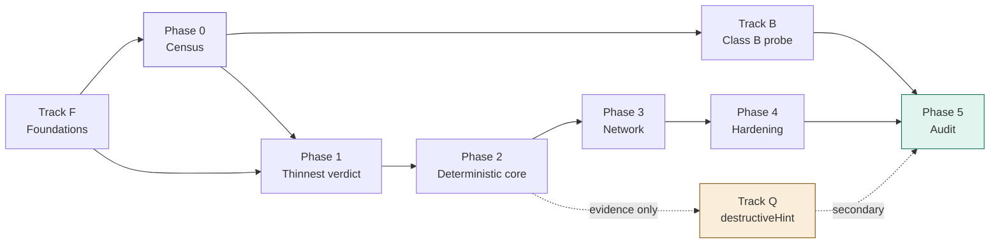

# Implementation Backlog

**Derived from:** [architecture.md](architecture.md), which supersedes [design.md](design.md).
**Status:** Pre-implementation
**Last updated:** July 2026

This is the canonical task list. It is mirrored into GitHub Issues; every issue title
carries its task ID so the two can be reconciled mechanically. When they disagree, this
file wins.

---

## How to read this

- **Tracks** run in parallel. **Phases** are sequential and match architecture.md §10.
- `Depends on` lists task IDs that must be complete, not merely started.
- `Exit` is the observable condition that closes the task. If it cannot be observed, it is
  not an exit criterion and the task needs rewriting.
- Tasks marked **⚑ blocking** gate an entire phase.

---

## Track F — Foundations

Cross-cutting work that gates Phase 0 and Phase 1. None of it produces a finding; all of it
prevents rework later.

### F-00 Pinned Linux development and CI target

**Depends on:** —
**Exit:** A reproducible Linux environment (fixed kernel version, fixed overlayfs mount
options) that development and CI can both target, documented as such.
**Status:** Done — [ADR-010](adr/010-pinned-linux-environment.md). Target: a pinned Ubuntu
24.04 LTS ("Noble Numbat") cloud image, referenced by an exact dated build serial (e.g.
`releases/noble/release-20260705/` via Canonical's permanent archive, never the `release/`
symlink that repoints over time) rather than a dedicated bare-metal/cloud box — the
trade-off table in the ADR turned on the box option not actually solving F-00's own
"contributor local access" checklist item (it gives remote access to one shared machine, not
local access to a reproducible one) and reintroducing the "one sandbox at a time" concurrency
constraint architecture.md §7 already imposes at worker-pool scale, now at the individual
contributor's desk too. GA kernel series pinned at **6.8** (`linux-image-generic`, not the
HWE track, which deliberately jumps series over the LTS lifecycle — exactly the drift being
prevented). Verification checksum is not asserted in the doc itself — recording it is the
first action for whoever actually provisions the image, not a value invented from an
unverified search result.

Referenced as blocking in [ADR-007](adr/007-implementation-language.md) ("sandbox is
unbuildable on the macOS host by construction... this is now blocking") and in
`crates/sandbox/src/lib.rs` ("untestable on the primary development host. That is F-00's
problem") since the language decision was made, but never actually added to this backlog
until now — a real gap between the docs and the tracked work, found while scoping the
census staging below.

**Gates P1-02 onward, not Phase 0.** Stage 0/1 census (registry metadata; `initialize` +
`tools/list` against remote HTTP servers) touches no sandbox code. Stage 2 census (Class A
servers, which requires locally executing the server to discover it) needs *containment*
but not *this* — a stock container runtime is adequate for containment-without-observation,
per the reasoning in the P0-06/P0-07 notes below. F-00 is specifically about the
fixed-kernel-version precision that *observation-grade* overlayfs work (Phase 1+) needs,
which containerized execution without observation does not.

**CI gap, disclosed rather than papered over.** GitHub's hosted `ubuntu-24.04` runner label
pins the Ubuntu release, not the point-in-time kernel build inside it — GitHub updates
images under a stable label over time, and hosted runners don't expose nested
virtualisation/KVM, so CI cannot simply boot the pinned VM image itself today. The ADR
records a self-hosted-runner-on-the-pinned-image escalation path but deliberately does not
build it yet (no Phase 1+ sandbox code exists to need it). What ships now: F-03's existing
kernel-prerequisite probe step in `.github/workflows/ci.yml` prints `uname -r` so drift
against the ADR-010 pin is visible in every CI run's log rather than silent — it does not
fail the build on a mismatch, since the hosted runner was never claimed to satisfy the pin
exactly and there is no owned fallback yet to fail over to.

- [x] Choose the target: a pinned VM image (recommended — a container shares the host
      kernel, which defeats "pinned" if the host itself isn't fixed) vs. a dedicated
      bare-metal/cloud Linux box — VM image chosen, full trade-off table in ADR-010
- [x] Pin the kernel version and record it — Ubuntu 24.04 LTS GA kernel series 6.8
      (`linux-image-generic`), image referenced by dated archive serial
- [x] Pin overlayfs mount options — `redirect_dir=off`, `metacopy=off` (security-load-bearing:
      the kernel's own docs warn against `metacopy=on` with untrusted layers, which is
      exactly design.md §3's hostile-tool trust model), `index=off` (no layer reuse/export
      exists to protect, per architecture.md §4.1's "arms are never reused"), `userxattr`
      conditional on P1-03's not-yet-made privileged-vs-rootless mount choice
- [x] Document how a contributor gets local access matching CI's environment — Lima (or
      Vagrant+libvirt/qemu/UTM) booting the pinned, checksum-verified image locally on any
      host OS/architecture; arm64 natively for Apple Silicon contributors since none of the
      namespace/overlayfs/cgroups behaviour in scope is architecture-sensitive

### F-01 ⚑ Choose implementation language and workspace layout — ADR-007

**Depends on:** —
**Exit:** ADR-007 merged in `docs/adr/`, recording the choice and the rejected options.
**Status:** Done — [ADR-007](adr/007-implementation-language.md). **Rust**, edition 2024,
single Cargo workspace, hand-rolled MCP client.

architecture.md §8 deliberately leaves this open (`crates/ (or packages/)`). It cannot stay
open — the purity constraint in ADR-005 is materially easier to enforce in a language with a
real module/dependency graph, and the sandbox layer is Linux syscall work.

- [x] Evaluate against: syscall ergonomics (namespaces, overlayfs, cgroups, seccomp), ability
      to enforce the `normalise`/`verdict` purity rule statically, ~~MCP client library
      maturity~~ — **criterion struck.** SDK maturity points the wrong way: mature SDKs
      discard wire bytes during deserialisation, which breaks P0-01's byte-exact capture and
      therefore P0-02's pin, and they expose a tool-call method that P0-01 forbids
      structurally. Decision rests on the first two criteria.
- [x] Record the decision and consequences as ADR-007
- [x] Note explicitly which parts, if any, are permitted to be a second language — fixtures /
      mock backends / P4-05 hostile server (any language, never in the harness build graph),
      and `results/` analysis (Python). Everything else is Rust, `destructive` included.

### F-02 Scaffold the repository skeleton

**Depends on:** F-01
**Exit:** Every directory in architecture.md §8 exists with a placeholder module that builds.
**Status:** Done — `cargo build --workspace` and `cargo clippy --workspace --all-targets`
both clean on the macOS host.

- [x] `intake` `discovery` `census` `planner` `world` `argsynth` `sandbox` `observe`
      `integrity` `normalise` `verdict` `destructive` `store` `orchestrator`
- [x] `rulesets/` `fixtures/generic/` `fixtures/per-server/` `results/census/`
      `results/conformance/` `docs/adr/`
- [x] `sandbox` gated as Linux-only at the build level, not by runtime check —
      `#![cfg(target_os = "linux")]` at the crate root, so off Linux it compiles to an empty
      crate and the workspace still builds
- [x] **One crate added beyond architecture.md §8: `datamodel`.** Shared vocabulary, pure
      data types, no behaviour, `no_std`. It is what lets `normalise` and `verdict` name
      their inputs without reaching for an I/O crate. Named `datamodel` rather than `model`
      because "model" already means *language model* throughout these docs — and this crate
      sits inside the pure allowlist, where that ambiguity would be actively dangerous.
- [x] `xtask/` added for workspace tooling (hosts the F-04 check)

### F-03 CI: build, test, lint

**Depends on:** F-02
**Exit:** CI green on a trivial PR; Linux runner exercises the `sandbox` module.
**Status:** Done — `.github/workflows/ci.yml`, `ubuntu-24.04` (version-pinned, matching the
ADR-007 posture rather than `ubuntu-latest`). Triggers on push to `main` and on pull
requests. Local baseline confirmed clean before landing: `cargo build`, `cargo test`, and
`cargo clippy --workspace --all-targets -- -D warnings` all pass with zero warnings on
1.85.1.

- [x] Build + test + lint on every push — checkout → cache → `rustup show` (installs the
      pinned toolchain from `rust-toolchain.toml`) → build → test → clippy → `cargo purity`
- [x] Linux runner with the kernel features the sandbox needs (overlayfs, cgroups v2, user
      ns) — a dedicated smoke-check step probes all three (`/sys/fs/cgroup/cgroup.controllers`,
      `sudo unshare` across mount/uts/ipc/net/pid/user, a real overlay mount/unmount) and
      fails the build loudly if the runner image lacks one, rather than letting P1-03
      discover it silently later. Probes run under `sudo` deliberately — they check kernel
      *subsystem* availability, independent of the unprivileged-userns policy question,
      which is P1-03's design concern, not this check's.
- [x] Fail the build on warnings in `normalise` and `verdict` — implemented as
      `cargo clippy --workspace --all-targets -- -D warnings`, a strict superset of the
      minimum ask. Workspace is at zero warnings today; the one known future cost is that
      `unsafe_code = "warn"` (workspace lint) becomes a hard error once P1-03 adds real
      syscall code to `sandbox`, forcing an explicit `#[allow(unsafe_code)]` per block —
      consistent with this codebase's existing pattern of demanding explicit justification
      for risky code (the ADR-005 purity allowlist), so treated as intended friction rather
      than a defect.

### F-04 ⚑ Enforce the purity rule in CI

**Depends on:** F-02
**Exit:** A deliberately-added edge from `verdict` to `store` fails CI. Demonstrate it, then
revert.
**Status:** Done — `cargo purity`. Demonstrated: with `store.workspace = true` added to
`crates/verdict/Cargo.toml`, `cargo build --workspace` **succeeds** (the edge is legal Rust —
which is precisely why the check must exist) and `cargo purity` **fails with exit 1**, naming
the offending edge. Reverted; check green.

ADR-005 is the invariant that makes reproducibility real rather than aspirational.
architecture.md §8: *"If that edge ever appears in the dependency graph, reproducibility is
gone."* A rule nobody checks is a comment.

- [x] Dependency-graph assertion — implemented as an **allowlist**, not the denylist this
      task's wording implies. A pure crate's transitive closure must be a *subset* of
      `PURE_ALLOWLIST` (currently `{datamodel}`). Strictly stronger: a denylist passes for
      any I/O crate nobody thought to name.
- [x] Negative test proving the check fires — `xtask/tests/purity.rs`, 6 tests. Run against
      *synthetic* graphs, so proving the rule bites does not require leaving a broken edge in
      the tree. Includes the literal `verdict` → `store` case and unforeseen offenders
      (`tokio`, `reqwest`, `chrono`, …) that are caught without being enumerated.
- [x] Layer 2 — per-crate `clippy.toml` in `normalise` and `verdict` banning clock, path,
      file, and socket types. A crate can have an empty dependency tree and still call `std`.
- [x] Layer 3 — `#![no_std]` on `datamodel`, `normalise`, and `verdict`. Taking a clock as a
      dependency is not a mistake CI catches after the fact; it is code that does not link.
      For `normalise` this is provisional, per ADR-007 — P1-06 tests whether real path
      matching can stay `no_std`.

**Note for F-03:** `cargo purity` must be its own CI step, not a test. `cargo tree` inside
`cargo test` is a recursive cargo invocation contending for the same package-cache lock.

### F-05 Content-addressed evidence store

**Depends on:** F-01
**Exit:** Blob written, addressed by digest, read back byte-identical; re-writing identical
content is a no-op.
**Status:** Done — `crates/store::BlobStore`, plus `datamodel::Digest` (a pure 32-byte value
type; hashing itself lives in `store`, not `datamodel`, so `sha2` never enters the
`normalise`/`verdict` purity closure). Algorithm: SHA-256, chosen as the unopinionated
well-audited default since no doc mandates one. 8 unit tests, `cargo purity` still clean.

architecture.md §12 item 4 — stand this up *before* any sandbox work so Phase 1 evidence is
replayable from day one.

- [x] Content addressing over raw bytes — `put` hashes the input itself; the caller never
      chooses the address
- [x] Immutability enforced at the API level, not by convention — no update/delete method
      exists at all; writes go through a temp-file-then-rename so a partial write is never
      observable; a digest whose on-disk content doesn't match what the address claims
      (`get` or `put`) is a hard `StoreError::Corrupt`, never silently accepted
- [x] Local filesystem backend; object-store backend deferred to P5-01
- [x] `re-put of identical content is a no-op` proven, not assumed — the test revokes write
      permission on the store root after the first `put`, so a second `put` of the same
      bytes can only pass if it truly skips the write

### F-06 Metadata DB schema

**Depends on:** F-01
**Exit:** Migrations apply cleanly; all seven entities from architecture.md §6 present with
their foreign keys.
**Status:** Done — `crates/store::db`, SQLite via `rusqlite` (`bundled` feature, same
reproducibility posture as the pinned toolchain and F-05's blob store). One migration,
`crates/store/migrations/0001_initial_schema.sql`, applied by a ~20-line hand-rolled runner
(a framework would be pure overhead for one file). `FIXTURE`'s columns were unspecified in
architecture.md §6 — filled in and mirrored back into that doc in the same change. 7 tests,
including that FK enforcement actually rejects a dangling reference, that a second
`open_and_migrate` against the same on-disk DB doesn't re-apply the migration (checked via
the `schema_migrations` row count, not just "no error"), and that every invariant below is
exercised in both directions (accepted when it should be, rejected when it shouldn't).

- [x] `SERVER` `TOOL_SNAPSHOT` `RUN` `INTEGRITY` `EVIDENCE` `VERDICT` `RULESET` `FIXTURE`
- [x] `VERDICT` keys on `snapshot_id`, never `(server_id, tool_name)` — invariant 1;
      `verdict` has no `server_id`/`tool_name` columns at all
- [x] `VERDICT.reason_code` non-null whenever `outcome = 'unverifiable'` — invariant 3,
      enforced as a `CHECK` constraint
- [x] `VERDICT.embargo_state` and `VERDICT.disclosed_at` included now (§12 item 6 — cheap
      today, expensive in Phase 5)
- [x] `VERDICT` table is derivable and safe to truncate; `EVIDENCE` is not — `evidence` has
      `BEFORE UPDATE`/`BEFORE DELETE` triggers that hard-fail, mirroring F-05's blob store
      (no update/delete method there either) so immutability holds on both sides of the
      evidence/metadata split

### F-07 Canonical evidence-tree serialisation — ADR-009

**Depends on:** F-05
**Exit:** ADR-009 merged defining how a directory tree (the overlay upper layer) serialises
into the byte blob F-05's content-addressed store actually stores.
**Status:** Done — [ADR-009](adr/009-evidence-tree-serialisation.md). Bespoke, sorted,
**single-blob** format (`evtree1`): one capture is one `Vec<u8>` handed straight to
`BlobStore::put`, matching architecture.md §6's one-`EVIDENCE`-row-one-`blob_ref` shape
exactly, rather than a git-tree-style multi-blob Merkle DAG (rejected — no repeated-history
use case here to amortise the extra indirection against; see the ADR's "On B specifically"
note) or an external tar/PAX format (rejected — classic `ustar` mtime resolution is 1 second,
lossy against the nanosecond-precision losslessness requirement). Entries are POSIX file
types generically (regular/directory/symlink/fifo/char-device/block-device/socket) plus a
full captured xattr set, sorted by raw path bytes with fixed-width big-endian fields — no
overlay-specific "whiteout" tag exists in the format itself, since a whiteout is fully
representable as a generic char-device entry with `dev_major=0`/`dev_minor=0`, and hardcoding
the special case would be interpretation, which architecture.md §3.1 forbids this layer from
doing (interpretation stays in `normalise`, per ADR-005).

Referenced in [ADR-007](adr/007-implementation-language.md) ("the primary evidence artifact
is a directory tree, not a byte string, and F-05's content addressing needs a tree format
before it means anything") and in `datamodel`'s `RawEvidence` doc comment ("shape is
deferred to ADR-009") since F-05 landed, but never actually added to this backlog until
now — found alongside the F-00 gap while scoping the census work below. Blocks P1-04
(Observation collector), the first component with an actual directory tree to harvest.

- [x] Decide the serialisation format (git-tree-like, tar-like, or bespoke) and its
      reproducibility properties — ordering, mtimes, whiteouts; design.md §9's overlayfs
      semantics apply directly — bespoke chosen; full options table and whiteout/opaque
      handling in the ADR
- [x] The format must stay lossless per `RawEvidence`'s existing contract: *"capture is
      lossless... discarding [mtimes/inode data] at capture time is normalisation, and
      ADR-005 requires normalisation to be a pure function of stored evidence"* — mode,
      uid/gid, nanosecond mtime, inode, dev major/minor, full xattr set, and complete file
      content are all retained verbatim; nothing is filtered or rounded at capture time
- [x] Two independent captures of the same directory tree must serialise to byte-identical
      output — this is what makes F-05's content addressing meaningful for tree evidence,
      not just single blobs, the same property P1-02 proves for the base layer itself —
      follows directly from the format's forced sort order and the absence of any
      capture-time-clock/PID/hostname field; the ADR states precisely how this is a
      narrower, cheaper claim than P1-02's own (harder) construction-reproducibility
      property, and how P1-02 reuses this format's digest-comparison test rather than
      inventing its own

---

## Phase 0 — Census

No sandbox code. Ships a publishable finding on its own (ADR-001), which is what inverts the
project's risk profile.

**Staging, added once P0-01–P0-05 landed and it became clear the phase decomposes further
than P0-06/07/08 originally implied:**

- **Stage 0 — registry-metadata census.** `registry::fetch_all` → `catalogue::ingest` →
  `classify::classify` → `census::coverage::tally`, over `server.json` documents alone.
  **Zero contact with any third-party MCP server** — the Class A/B/`unclassifiable` ratio
  needs nothing else. This decouples P0-08 from P0-07: the ratio does not need the full
  annotation census to exist first, only the registry listing, so it can and should ship
  before Stage 1/2 do.
- **Stage 1 — Class B annotation census.** `initialize` + `tools/list` over HTTP against
  live remote (Class B) servers. No local execution, no tool calls — exactly what any MCP
  client does on connect. Needs politeness controls (rate limiting, a `User-Agent`
  identifying the study, honest failure/timeout reporting per P0-07's own requirement).
- **Stage 2 — Class A annotation census.** Same as Stage 1, but discovering a Class A
  (locally-launchable) server means executing it (`npx`, `uvx`, a container image, ...) to
  speak stdio to it — this is execution, unlike Stage 0/1. It needs *containment* (don't let
  an adversarial server hurt the host) but, critically, **not the observation** the Phase
  1+ sandbox exists for (no changeset, no noise floor — census reads only what
  `tools/list` says, never what the tool does). A stock container runtime is adequate
  containment for that narrower job, and using one for Stage 2 does not compromise the
  hand-rolled-sandbox decision in ADR-007, which is about observation quality, not
  containment per se. Record how each server was discovered (bare host vs. containerized)
  as provenance on the result, so census data is never silently pooled across the two the
  way ADR-002 already forbids pooling across oracles.

### P0-01 ⚑ Discovery client

**Depends on:** F-02
**Exit:** `initialize` + `tools/list` succeeds against both a stdio server and a remote HTTP
server; raw JSON persisted verbatim.
**Status:** Done — `crates/discovery`. Hand-rolled JSON-RPC 2.0 (per ADR-007; no `rmcp`),
`serde`/`serde_json` for wire encoding and `ureq` (rustls, no native-tls/openssl) for the
HTTP transport. Verified against the live MCP spec before implementing rather than assuming
a revision: current stable is `2025-11-25` (a `2026-07-28` revision is in release-candidate
status and removes the `initialize` handshake entirely — a shape change for this whole
module, not a version bump; flagged for O-01, not addressed here). 15 tests: unit tests for
JSON-RPC framing and response routing (id mismatch, JSON-RPC error objects, malformed JSON,
peer-closed-without-responding — all via a real bidirectional `UnixStream` pair, not a
mock), plus true end-to-end integration tests against a real spawned subprocess (stdio) and
a real hand-rolled `TcpListener`-based HTTP/1.1 server (no external network calls, fully
hermetic and CI-reproducible). Re-ran 5x locally to rule out flakiness in the
thread/socket-timing-sensitive tests.

- [x] stdio transport — newline-delimited JSON-RPC over a spawned child's stdio; the
      `Child` is reaped on drop (kill + wait) so a discovery target that never exits can't
      accumulate as a zombie across a census run
- [x] Streamable HTTP transport — the single-JSON-response case; a server that upgrades to
      `text/event-stream` gets a clear rejection rather than silent mishandling (out of
      scope for this thinnest path, not silently broken)
- [x] Raw response captured **byte-exact** before any parsing — the pin depends on this;
      `Discovery.initialize_raw` / `.tools_list_raw` are the untouched wire bytes, and
      nothing in this crate parses them any further than routing the JSON-RPC envelope
      (id, result vs. error) to decide success/failure
- [x] Must not call any tool. Enforce structurally, not by discipline — the `Transport`
      trait (the only thing that can send an arbitrary MCP method string) is `pub(crate)`;
      nothing outside this crate can name it. `DiscoveryClient::discover` is the only
      public entry point, and its three method names (`initialize`,
      `notifications/initialized`, `tools/list`) are literals in its body, never parameters
- [x] Record the negotiated spec revision into `TOOL_SNAPSHOT.spec_revision` — taken from
      the server's own `initialize` response, not the version the client asked for

### P0-02 ⚑ Metadata pinner

**Depends on:** P0-01, F-05
**Exit:** Pin is stable across repeated discovery of an unchanged server, and changes when
any byte of a tool's name, schema, annotations, or description changes.
**Status:** Done — `crates/discovery::pin`, built on P0-01's byte-exact capture and reusing
F-05's `datamodel::Digest`/SHA-256 (one digest format across the system, not a second one
invented here). Every field is kept as `serde_json::value::RawValue` end to end — never
routed through `serde_json::Value`, whose `BTreeMap`-backed object type would silently sort
keys back into canonical order on re-serialisation and defeat the whole point. Per-tool pin
is a hash-of-hashes over `(name, inputSchema, annotations, description)`, each with a
presence marker byte so an absent field can never collide with a present-but-empty one; the
server pin hashes the per-tool pins in response order, so a server that reorders its own
tool list between two discoveries changes its pin too. 8 tests, including the literal exit
line ("reorder JSON keys → pin changes") and one that documents rather than papers over a
real boundary: serde's `Option<T>` collapses an explicit JSON `null` and an absent key
before `RawValue` ever sees either, so this module can't and doesn't try to tell them apart.

Defends against rug pulls (architecture.md §0). *"A verdict without a pin is meaningless."*

- [x] Per-tool hash over `(name, inputSchema, annotations, description)` as received
- [x] Per-server hash over the tool set
- [x] **No normalisation before hashing** — the pin is over bytes, not semantics
- [x] Test: reorder JSON keys → pin changes. That is correct behaviour, not a bug.

### P0-03 Catalogue ingest

**Depends on:** F-02
**Exit:** A registry entry resolves to either an installable artifact or an endpoint, with
provenance recorded.
**Status:** Done — `crates/intake::catalogue`. Targets the real, current schema (verified
via web search rather than assumed): the official MCP Registry's `server.json` format,
schema `2025-12-11`, `packages[]` (npm/pypi/cargo/nuget/oci/mcpb) and `remotes[]`
(streamable-http/sse), which the spec explicitly allows to coexist on one entry. `ingest`
takes already-fetched bytes — fetching from a live registry is a separate, later concern
this task's contract doesn't include. 9 tests, including one against the official schema
doc's own minimal example rather than an invented fixture.

- [x] Resolve registry entries to source, package, image, or HTTP endpoint — every
      `packages[]`/`remotes[]` entry with its required fields becomes a `ResolvedTarget`;
      both arrays are processed, not just whichever one is checked first
- [x] Must not execute anything, including package install scripts — there is no code path
      in this module that spawns a process or invokes a package manager; it only parses JSON
- [x] Unresolvable entries are recorded, not dropped — `ingest` returns `IngestOutcome`
      directly (never wrapped in a `Result`), so there is no `Err` arm a caller could
      discard; a malformed sub-entry (e.g. a package missing `identifier`) is recorded in
      `skipped` rather than sinking an otherwise-resolvable entry, and an entry with zero
      usable targets becomes `Unresolvable` rather than an empty `Resolved`

### P0-04 Containability classifier

**Depends on:** P0-03
**Exit:** Every corpus server carries Class A, Class B, or `unclassifiable`, plus the reason.
**Status:** Done — `crates/intake::classify`. Reuses `datamodel::ContainabilityClass`
(already scaffolded in F-02) rather than a second parallel type, so classification can
never drift from what F-06's `SERVER.containability_class` column and its `CHECK`
constraint accept. A package target always wins over a coexisting remote — the registry
schema explicitly allows `packages` and `remotes` on the same entry, and "launchable
locally" only needs one to be true. 6 tests, including one that constructs the
"resolved but empty" state directly (bypassing `ingest()`'s own invariant that `Resolved`
implies a non-empty target list) to prove the classifier doesn't blindly trust an
invariant it can't see enforced — it degrades to `Unclassifiable` rather than panicking.

architecture.md §12 item 3 — the Class A/B ratio gates how ambitious Phase 5 can be.

- [x] Class A: launchable locally — any `ResolvedTarget::Package`, regardless of what else
      the entry also declares
- [x] Class B: remote HTTP endpoint only — `ResolvedTarget::Endpoint` present, no package
- [x] `unclassifiable` is a real class, not a fallback — never guess — every classification
      traces to a concrete fact from `catalogue::ingest`'s output (an `Unresolvable` reason,
      or the target list's actual contents), never to absence of information defaulting
      silently to one class
- [x] Reason string stored alongside the class — always human-readable prose; no closed
      reason-code taxonomy at this layer the way the verdict engine has one (P2-11)

### P0-05 Coverage aggregator

**Depends on:** P0-02
**Exit:** Per annotation, per tool, per server: `explicit` / `defaulted` / `absent`.
**Status:** Done — `crates/census::coverage`. `Defaulted` (the tool's `annotations` object
exists but omits this key) and `Absent` (no `annotations` object at all) are kept as
separate buckets rather than collapsed into one "not set" — both reach the same spec
default from a client's point of view, but they're different findings for design.md's open
question 1 ("mismatch" vs. "absence"). Per-server and corpus-wide rollup are the same
`tally()` function applied to different-sized input slices — a tally has no notion of a
server boundary, only the caller's choice of which tools to include does, so a second
rollup function would have been pure duplication. 6 tests, including one that proves the
corpus-wide claim directly: tallying two servers separately and tallying their concatenated
tools together produce the same combined counts.

- [x] Distinguish explicitly-declared from spec-defaulted from wholly absent
- [x] Must not touch behavioural evidence — operates only on the `tools/list` response's
      `annotations` objects; no dependency on `sandbox`, `observe`, or `store` anywhere in
      this module
- [x] Roll up to per-server and corpus-wide — one `tally()` function, scope is just which
      tools you pass it

### P0-06 Seed corpus run — 100 servers

**Depends on:** P0-04, P0-05
**Exit:** Census completes over 100 servers; pin stability and coverage taxonomy validated
against hand inspection of a sample.
**Status:** Done — both halves complete.

**Class A half** (this being the half that was open): `cargo xtask census-stage2-class-a
100` against 100 live Class A (locally-launchable) servers sampled from the registry by the
same stable-hash selection Stage 1 uses, executed via Docker (`docker run`, `--memory=256m
--pids-limit=256 --cpus=1`, no other flags) rather than the hand-rolled Phase 1+ sandbox —
per the Staging note above, Stage 2 needs containment, not the observation machinery that
sandbox exists for, and a stock container runtime is adequate for that narrower job.
`results/census/class_a_annotation_coverage.json`, every record tagged
`"execution_provenance": "containerized_docker"` so this can never be silently pooled with
Stage 0/1 (registry-only / Class B) data. **57 succeeded (57.0%), 43 failed, 956 tools
discovered.** Failure breakdown: `io_or_timeout` 36 (real npm/uvx crashes — bad Node-engine
requirements, ESM/CJS mismatches, missing required env vars, wrong `uvx` entry-point names
— and genuinely hung servers the watchdog killed, indistinguishable at the transport layer
from each other, reported as one honest category rather than guessed apart), `protocol` 5,
`unsupported_registry_type` 2 (`nuget` — no container invocation built for it; `cargo` and
`mcpb` would land in the same bucket, not silently skipped from the sample). npm and pypi
are the only registry types this run's container invocations cover (`npx`/`uvx` inside
`node:22-alpine` / `ghcr.io/astral-sh/uv:python3.12-alpine`) plus `oci` (image reference run
directly) — the actual Class A registry-type mix turned out to be npm-dominant (see the
100-entry sample pulled while scoping this: 30 npm, 2 oci, 1 pypi), so this covers the
overwhelming majority of the class as it exists today.

Two real bugs found running this against live, arbitrary, unauthenticated third-party
package code rather than only fakes — same discipline the Class B half's commit already
established:

1. `ChildProcessTransport` had no timeout at all — a hung or deliberately stalling
   containerized server would block `recv_line` forever. Fixed by adding
   `DiscoveryClient::stdio_with_timeout` / `ChildProcessTransport::spawn_with_timeout`
   (`crates/discovery/src/{client,transport}.rs`): a watcher thread sends the child a `kill
   -9` after a 45s deadline. Regression test added:
   `discover_is_unblocked_by_the_watchdog_when_the_server_never_responds`
   (`crates/discovery/tests/stdio_discovery.rs`), against a new `hang` mode in the fake
   stdio server that never responds — asserts on wall-clock time, not just the error
   variant, so a regression that silently dropped the watchdog would hang the test rather
   than pass it.
2. That same watchdog's `kill -9` targets the *host-side `docker run` CLI process*, not the
   container. A SIGKILL'd CLI process gets no chance to tell the daemon to honour `--rm`,
   so the container it launched keeps running, orphaned. Found by hand: `docker ps` after
   the first full run showed four containers still `Up 3 hours` from timed-out attempts in
   that exact sweep. Fixed in `xtask/src/class_a_stage2.rs` by giving every attempt a unique
   `--name` and calling `docker rm -f` on it unconditionally after every attempt, success or
   failure — independent of whatever state the CLI process or container ended up in. This
   is a host-resource-hygiene bug, not a data-correctness one: it affects leftover
   containers, not what `tools/list` returned, so the published coverage numbers above
   (from the run that found the bug, before the fix) are unaffected and are being kept
   rather than discarded — a re-run to regenerate them with the fix already in place would
   be re-doing Stage 1/2 work for a cosmetic reason, and the fix itself is what matters for
   every run after this one. All orphaned containers from that run were found and removed by
   hand before this was closed out.

Hand-verified 5 of the 57 successful servers (245 tools total) by re-invoking their
container directly and comparing raw `tools/list` JSON against the recorded
[`census::coverage`] classification: `tiktapdown-mcp` (npm, 4 tools), `unreal-engine-mcp
-server` (npm, 23), `mcp-slack-crunchtools` (pypi, 15), and `@arielbk/anki-mcp` (npm, 91) —
all four tool-count-for-tool-count matches, and all had no `annotations` object on any tool
(uniformly `Absent`, matching the raw JSON exactly) — plus `mcparmory-apify` (pypi, 112
tools), which exercised the interesting case directly: every tool has an `annotations`
object but with varying keys (e.g. `create_actor` → `{"openWorldHint": true}` only,
correctly `Defaulted` for `readOnlyHint`/`destructiveHint`/`idempotentHint` and `Explicit`
for `openWorldHint`), and the per-tool `readOnlyHint` split (54 explicit + 58 defaulted, 0
absent) sums exactly to its recorded `tool_count`. Nothing needed fixing.

- [x] Hand-verify the taxonomy on a sample of Class A results, the same way the Class B
      half required — done above: 5 servers, 245 tools, spanning both the uniformly
      `Absent` case (4 servers) and the `Explicit`/`Defaulted` mix case (`mcparmory-apify`),
      every tool-count and per-tool classification matched the raw JSON by hand.
- [x] Every result record carries `execution_provenance` — `"containerized_docker"` on all
      100 attempts, checked as a `CHECK`-equivalent by inspection of the output file rather
      than a separate assertion; there is no code path in `class_a_stage2.rs` that emits a
      server record without it.
- [x] No bare-host execution path exists for Class A discovery — the only program this
      module ever spawns is `docker`; `npx`/`uvx` and the target package run *inside* the
      container it constructs, never on the runner host.

**Class B half** (done previously): `cargo xtask census-stage1 100` against 100 live Class B servers,
`results/census/class_b_annotation_coverage.json`. 26 succeeded (74 failed — mostly `401`,
i.e. auth required, plus 14 genuine SSE-only servers correctly out of this transport's
declared scope; see that commit for the full breakdown), 289 tools discovered. Two real
bugs were found and fixed by running this against live servers rather than only fakes:
`HttpTransport` was missing `text/event-stream` from its `Accept` header (a spec violation
that got 14 servers spuriously rejected with `406`, not a real reachability problem), and
`RegistryClient::fetch_all` had no way to stop early once a caller had enough matching
entries. Both fixed and tested before this data was produced.

architecture.md §12 item 1. This is Stage 1/2 work (see the Phase 0 staging note above) —
it needs real `initialize`/`tools/list` exchanges with live servers, not just registry
metadata.

- [x] Hand-verify the taxonomy on ≥20 tools; fix the taxonomy, not the data — 47 tools
      inspected by hand across three servers (`cargo xtask dump-tools`), spanning all three
      coverage states. 34 were uniformly `Absent` (no `annotations` object at all — matches
      the raw JSON). 13 from a fourth server exercised the interesting case directly:
      `search_docs` declares `readOnlyHint`/`idempotentHint`/`openWorldHint` but omits
      `destructiveHint` → correctly `Explicit`×3 + `Defaulted`×1; `warmup_docs_cache`
      inverts that (declares `destructiveHint`, omits `readOnlyHint`); `openWorldHint:false`
      on `get_start_path` correctly classifies as `Explicit`, not confused with absence.
      Every record checked matched by hand. Nothing needed fixing.
- [x] Re-run discovery on the same 100 and confirm pins are stable — done against the 26
      that actually succeeded (`cargo xtask census-pin-stability`,
      `results/census/pin_stability.json`): each re-discovered twice, back to back. 26/26
      stable, 0 unstable, 0 failed to re-discover. Caveat noted in that commit: this is
      immediate back-to-back re-discovery, not separated by real elapsed time, so it
      confirms the pinning mechanism is deterministic given identical bytes, not that pins
      survive longer-interval drift or deployment churn.

### P0-07 Full census — ≥1,000 servers

**Depends on:** P0-06
**Exit:** Coverage numbers over ≥1,000 servers written to `results/census/`. **Publishable.**
**Status:** Class B half done — `results/census/class_b_annotation_coverage.json`, 1,000
servers, `cargo xtask census-stage1 1000`. **250 succeeded (25.0%), 3,183 tools
discovered.** Class A half explicitly **not attempted** — out of scope for the work that
closed out P0-06. Stage 2 (containerized `docker run` execution) now exists and is
validated at the P0-06 seed scale (100 servers, see above), so the tool to do this run
exists; scaling it to ≥1,000 servers the way Stage 1 scaled is deliberately left as a
separate step, per the same validate-then-scale discipline the Class B half already
followed (100 before 1,000) — this is real, until it's actually run.

Sampling was fixed before this ran, not after: taking "the first N" Class B candidates in
registry order clusters under whichever namespace sorts first alphabetically (every earlier
sample was all `a*` prefixes) — replaced with a deterministic hash-based selection over the
*entire* Class B population, so the sample is unbiased with respect to namespace while
staying reproducible run to run.

This is the Phase 0 exit criterion and plausibly the headline result — open question 1 asks
whether the story is about *mismatch* or about *absence*. Stage 1/2 work, same as P0-06.
The `absent` bucket is identical (1,548) across all four annotations at this scale, same as
the 100-server sample — 48.6% of discovered tools never engage with the annotation system
at all, which is itself the strongest signal toward *absence* over *mismatch* so far.

- [x] Throughput profile suitable for the corpus size — sequential requests (never
      concurrent — unrelated third-party hosts, no reason to burst them), 12s per-request
      timeout tuned down from the 30s default after the 100-server sample showed responsive
      servers answer in low seconds; 1,000 servers completed well inside an hour
- [x] Failure/timeout rate reported alongside the coverage rate — full categorized
      breakdown in the results file and that commit: dominant reasons are `401` (auth
      required, reachable but access-gated) and genuine SSE-only servers (out of this
      transport's declared scope, not a failure of it), plus a long tail of real-world
      causes (dead hosts, malformed third-party JSON-RPC, TLS misconfiguration) — verified
      category by category before treating the data as valid, per that commit

### P0-08 Class A / Class B ratio report

**Depends on:** P0-04 — *not* P0-07, as originally listed. See "Staging" under Phase 0
above: the ratio needs only registry metadata (Stage 0), never a `tools/list` exchange with
any server, so it does not need to wait for the full annotation census to exist. The
dependency on P0-07 in the original phasing conflated "publish the ratio" with "publish it
*alongside* the full coverage numbers," which is a presentation choice, not a data
dependency.
**Exit:** Ratio published with the census.
**Status:** Done — `results/census/registry_class_ratio.json`, generated by
`cargo xtask census` against the live registry on 2026-07-26. **18,664 distinct servers**
(after fixing a real bug found in the process — the client's first run, before filtering to
`version=latest`, returned every historical version of every server as a separate entry:
59,484 records for 18,664 actual servers, some names over 1,000 times). **Class A: 9,526
(51.0%). Class B: 8,294 (44.4%). Unclassifiable: 844 (4.5%).**

This runs the *opposite* direction from the design note below: a slight majority of the
registry is locally launchable, not remote-only. Worth stating plainly alongside the number
wherever it's cited: this measures what a `server.json` entry *declares* as installable, not
whether that install path actually works — Stage 2 (executing Class A servers to discover
them) will be the first check on whether the declaration holds.

architecture.md §2 design note: if most public servers are remote-only, *"most of the
ecosystem is unauditable by any third party"* is a stronger claim than a mismatch rate. The
data says the opposite is true, which is itself worth publishing.

---

### P0-09 `server/discover` fallback for MCP spec `2026-07-28`

**Depends on:** P0-01
**Exit:** `DiscoveryClient` successfully discovers a server that speaks only the
`2026-07-28` handshake, with the discovery path (`initialize` vs `server/discover`) recorded
as provenance on the result — a second, orthogonal provenance axis alongside Stage 2's
bare-host-vs-containerized flag.

Surfaced by O-01's 2026-07-27 check (see "Ongoing" below), not originally anticipated: MCP
spec revision `2026-07-28` — shipping the day after that check — removes the `initialize` /
`notifications/initialized` handshake entirely. It's replaced by
`_meta["io.modelcontextprotocol/protocolVersion"]` on every request plus an optional
`server/discover` method. P0-01's `DiscoveryClient` hardcodes `initialize` +
`notifications/initialized` + `tools/list` as literal method names with no fallback — by
design, to keep tool-calling structurally unreachable from outside the crate — so a server
that adopts `2026-07-28` becomes silently undiscoverable: there's no loud `initialize`
failure to catch, just whatever error the new method name produces. Left unfixed, this
surfaces as unexplained new failures in a future P0-06/P0-07 census run, or worse, in
P1-08's first-verdict target server, well after the actual cause (a spec revision, not a
harness bug) has been forgotten.

- [ ] Attempt `server/discover` when `initialize` gets no response, or an error indicating
      an unrecognized method, instead of treating that as a bare discovery failure
- [ ] Record which handshake path succeeded as provenance on the result
- [ ] `TOOL_SNAPSHOT.spec_revision` (already captured per P0-01) reflects whichever revision
      was actually negotiated, regardless of which handshake produced it
- [ ] Re-run against a real `2026-07-28` server once one exists in the wild, not just a
      hand-built fixture, before trusting this at census scale

---

## Track B — Class B protocol-probe oracle

Runs after Phase 0, independently of the sandbox. Narrow exception carved out in
architecture.md §2.

### B-01 Protocol-probe protocol

**Depends on:** P0-04
**Exit:** probe → invoke → probe decides `readOnlyHint` for a Class B server that exposes
resources or state-reflecting read-only tools.
**Status:** Done — new crate `crates/probe` (not in architecture.md §8's original list;
added the same way `datamodel` was added beyond §8 in F-02, noted there for the same
reason). Surface is MCP **resources** only (`resources/list` + `resources/read`) — the
"state-reflecting read-only tool" half of architecture.md §2's exception is explicitly out
of scope for this pass, since using a tool-as-probe would need real semantic argument
synthesis (P2-06, unbuilt) rather than B-01's own placeholder-only
`probe::synthesize_arguments`. A resources/read snapshot is taken before and after
invocation and hashed (`probe::snapshot`); `probe::protocol::assess_read_only` /
`assess_idempotent` are pure decision functions over two digests, unit-tested against the
full truth table (holds/violated/unverifiable × declared true/false) with no network
involved. `probe::ProbeClient` (`crates/probe/src/client.rs`) is a second, separate
JSON-RPC-over-HTTP client from `discovery::DiscoveryClient` — deliberately: P0-01's
contract is "must not call any tool," enforced structurally by never exposing a
method-taking call, and this crate's entire job is to call one. Reuses
`discovery::jsonrpc::encode_request`/`encode_notification` (promoted from `pub(crate)` to
`pub` for exactly this) rather than duplicating correct JSON-RPC framing, but does not and
cannot reuse `discovery::transport` (stays `pub(crate)` to `discovery`, untouched). 45 new
unit/integration tests across `probe`'s five modules, including true end-to-end tests
against a real `TcpListener`-based fake HTTP server (same technique `discovery`'s own HTTP
tests and `intake::registry`'s tests already use) that drive `probe_read_only_hint`/
`probe_idempotent_hint` through every branch of the decision table.

- [x] Identify servers with a usable probe surface; the rest stay `unverifiable` —
      `probe::snapshot::discover_surface` treats a `resources/list` JSON-RPC "method not
      found" (-32601) or an empty list as `ProbeSurface::None`, propagating any other
      failure as a real error rather than silently guessing. A run that never reaches
      resources at all, and one whose invocation itself fails (placeholder arguments
      rejected — design.md §8's "semantic argument validity" limitation, landing here as a
      concrete `invocation_failed` reason code), both degrade to `Unverifiable` with a
      distinct reason code, never a forced verdict.
- [x] Extend to `idempotentHint` where the probe surface supports it —
      `probe::probe_idempotent_hint` runs invoke → probe (`s1`) → invoke again with
      identical synthesised arguments → probe (`s2`), and `assess_idempotent` decides from
      `s1` vs. `s2` alone (architecture.md §4.2's `D1`/`D2` shape, without the noise-floor
      or restart arms — see the caveat below on why not).

**Validated against live data**, not just synthetic tests: `cargo xtask probe-stage1 500`
against 500 live Class B servers sampled from the registry by the same stable-hash
methodology P0-06/P0-07 established (so the sample is comparable to, not a different
methodology from, the census data). 128/500 discovered successfully (25.6% — consistent
with P0-07's 25.0% over a similarly-sized Class B sample, cross-validating that this sample
isn't systematically different from the census one). Of those, 127 had ≥1 declared tool and
were probed (the 128th hit a genuine third-party bug: a `tools/list` response whose
`result` was valid JSON-RPC but didn't actually contain a `tools` array — found by this run
crashing the whole sweep the first time, since `discovery::pin_tools` fails hard on that
shape and the script originally propagated it with `?`; fixed to record it as a
`pin_failed` discovery-failure category and move on, per the "ASSUMED HOSTILE" trust model
— a malformed-but-not-erroring response is exactly the kind of thing that model predicts,
and one bad server must never abort a 500-server sweep).

Exactly one probe protocol per tool, exactly one tool per server (the first one declared),
to bound both third-party request volume and the number of real invocations — see the
crate's own doc comment for why that bound exists (this is the one crate in the workspace
whose job is to invoke tools against live infrastructure this project doesn't control).
254 probe protocols run (127 servers × 2 protocols). Of those, 207 produced a verdict; 47
hit a hard `ProbeError` mid-run (24 for `readOnlyHint`, 23 for `idempotentHint` — mostly a
`401`/`429`/`400` arriving between the surface-discovery call and the invocation, or a
malformed non-JSON-RPC response to a call that should have succeeded) and produced no
verdict at all, logged as a failure rather than coerced into one. Every one of the 207
verdicts carries `oracle = protocol_probe` (checked directly against the database, not just
trusted from the code — see B-02).

Outcome breakdown (`results/conformance/track_b_protocol_probe.json`,
`results/conformance/track_b_probe.sqlite3`):

| annotation | holds | unverifiable | violated |
|---|---|---|---|
| `readOnlyHint` | 5 | 96 | 2 |
| `idempotentHint` | 7 | 96 | 1 |

The dominant outcome is `unverifiable` (96/103 and 96/104) — expected and correct, not a
weak result: most Class B servers either don't support `resources/list` at all, or support
it but expose nothing the probe can use to decide a `false`-declared tool's behaviour
(§ "probe_surface_incomplete" in `probe::protocol`). A harness that mostly returned `holds`
here would be the "worst available failure mode" design.md §8 warns about, one layer up.

**Hand-verified a sample of the decisive (`holds`/`violated`) outcomes** — 8 servers total,
checked directly against the live server outside the harness (raw `curl` against
`initialize` + `resources/list`), not just re-read from the database:

- `racecalendar.app` (`get_f1_season_schedule`, declared `true`/`true`) and
  `proflightsearch.com` (`get_airport_delay_status`, declared `true`/`true`) both `holds`
  for both annotations — plausible on its face (a schedule/status lookup with no
  observable side effect) and the kind of case this oracle is supposed to catch cleanly.
- `api.mnemom.ai` (`claim_agent`, declared `false`/`false`) — `holds` for both, i.e. state
  *did* change — consistent with a tool literally named "claim" not being read-only.
- **A real, useful negative finding**: `mcp.pricetik.com`'s `pricetik_search` (declared
  `readOnlyHint: true`) came back `violated`. Manually inspecting the server's
  `resources/list` shows its resources are `ui://pricetik/deal-grid` etc. —
  MCP-UI *render templates* (`mimeType: text/html;profile=mcp-app`), not durable state.
  These very plausibly re-render with each tool's own output baked in, meaning a "search"
  tool changing the rendered deal-grid content is expected UI behaviour, not evidence
  against `readOnlyHint`. **This is a real limitation of B-01 as built, found by hand
  -verification rather than assumed**: the probe surface is "any listed resource,"
  undifferentiated between state-reflecting resources and UI-render resources, and the
  latter is close to guaranteed to look mutated after any successful tool call regardless
  of true idempotence or read-only-ness. Recorded here rather than quietly fixed, in the
  same spirit as design.md §8's other named limitations (external state invisibility,
  normalisation sensitivity, the caching confound) — a candidate refinement for whoever
  picks up B-01 next is restricting the probe surface to resources whose `mimeType` isn't
  a UI-render type, or requiring a resource to be read-stable across two immediate reads
  with no intervening call before trusting it as a probe surface at all.
- `api.isittrustready.ai`'s `get_agent` (declared `readOnlyHint: true`,
  `idempotentHint: true`) also came back `violated` for both. Its resources
  (`mnemom://catalog/values`, `mnemom://rubric/reputation`, `mnemom://jwks`, ...) read as
  genuine reference/state data, not render templates — unlike the pricetik case, this one
  does not have an obvious methodological explanation and is left as a plausible real
  finding, not confirmed further (a live trust-scoring API updating something after an
  agent lookup is not an implausible mechanism). Flagged here as *not conclusively
  resolved* rather than asserted either way — an example of the class of finding
  disclosure (P5-03) would eventually need to route to the server's maintainer.

**Caveats, stated plainly:** (1) no noise-floor arm (ADR-003's control) and no
restart-interleaved caching check — architecture.md §4.2's full multi-arm protocol assumes
independent runs from a byte-identical base, which a live third party offers neither of;
Track B's protocol is deliberately the simpler two-/three-probe version, and the
pricetik/isittrustready findings above are exactly the kind of ambiguity that gap leaves
open. (2) One tool probed per server, not every tool — a scale/politeness bound, not a
claim that the untested tools on a probed server behave the same way. (3) Sample size is
127 probed servers out of an ecosystem of thousands; treat the outcome table as indicative,
not a headline mismatch rate the way P0-07's census numbers are.

### B-02 Oracle tagging

**Depends on:** B-01, F-06
**Exit:** Every verdict carries `oracle` = `kernel_changeset` or `protocol_probe`.
**Status:** Done — the `VERDICT.oracle` column and its `CHECK` constraint already existed
(F-06); this task was entirely about populating it correctly, per the task brief. Added
`crates/store/src/db.rs::{ServerRecord, ToolSnapshotRecord, VerdictRecord}` plus
`insert_server`/`insert_tool_snapshot`/`insert_verdict`/`list_verdicts` — the first typed
row-insertion API this schema has ever had (every prior row, in every F-06 test, came from
hand-written raw SQL). `datamodel::{Oracle, Outcome, Annotation}` each gained
`as_db_str`/`from_db_str`/`Display`, so the exact TEXT written for `oracle` can never drift
from what `VERDICT`'s `CHECK` constraint accepts — the mapping lives in one place
(`datamodel`), not re-derived at every call site. 2 new `store::db` tests, including one
that inserts a `protocol_probe` verdict and a sibling `kernel_changeset` verdict on two
different snapshots and confirms both round-trip correctly and distinctly — the literal
exit criterion, exercised through the typed API, not just asserted against a raw string.

**Validated against the same 500-server run as B-01**: queried
`results/conformance/track_b_probe.sqlite3` directly (`SELECT DISTINCT oracle FROM
verdict`) — all 207 real verdicts this run produced carry `oracle = 'protocol_probe'`, with
no other value present. No Class A (`kernel_changeset`) verdicts exist yet in this database
or anywhere in the codebase — P1-07 (the Class A verdict engine) is still `todo!()`,
blocked on ADR-008/ADR-009 per its own status — so B-02's "every verdict carries an oracle"
claim is currently proven for the one oracle that exists in practice; the `kernel_changeset`
side of the `CHECK` constraint and of `insert_verdict`'s type signature is exercised only by
the `store::db` unit test referenced above, not yet by a real Class A run. That gap closes
naturally when P1-08 lands.

### B-03 ⚑ Cross-oracle aggregation guard

**Depends on:** B-02
**Exit:** Any report that mixes oracles without separating them fails a test.
**Status:** Done — `crates/store/src/aggregate.rs`. `aggregate()` is the only correct way
to build a report from raw verdicts in this codebase: it groups strictly by
`(annotation, oracle, outcome)`, so oracle is part of the grouping key by construction and
there is no code path that could merge two oracles' counts. The actual guard,
`verify_report_matches_records`, is independent of `aggregate()` on purpose — it takes an
arbitrary reported row (`ReportRow`, with an `Option<Oracle>` specifically so it can
represent the buggy shape a careless aggregator would produce) plus the raw source records,
and rejects a row whose oracle is undisclosed or whose count doesn't match exactly the
records sharing that one oracle.

ADR-002: *"an easy invariant to state and an easy one to violate in a summary table."* Made
literally a test, not a habit: `verify_report_matches_records_rejects_a_report_with_no_oracle_disclosed`
and `verify_report_matches_records_rejects_a_pooled_count_mislabelled_under_one_oracle`
(`crates/store/src/aggregate.rs`) each construct a deliberately mixed report — 5
`kernel_changeset` + 3 `protocol_probe` verdicts pooled into one count of 8, once with no
oracle disclosed at all and once mislabelled under `kernel_changeset` — and assert the
guard rejects both, with the specific `AggregationError` naming exactly what's wrong. A
third test (`verify_report_matches_records_accepts_aggregates_own_output`) proves the guard
never rejects `aggregate()`'s own correct output — the guard has teeth in both directions,
not just a rejection path with no corresponding acceptance path.

**Dogfooded against the real B-01 data, not only synthetic records**: `probe-stage1`
reads back all 207 verdicts this run wrote, converts them to `VerdictSummary` via
`store::db::VerdictRow`'s `From` impl, aggregates them, and calls
`verify_report_matches_records` on the result before the run is allowed to finish
(`xtask/src/probe_stage1.rs`) — it passed, as it must, since every verdict this run ever
produces is tagged `protocol_probe` by construction (`ProbeAssessment::ORACLE` is a `const`,
not a per-call field). The interesting adversarial case — an actual report that *does* mix
`kernel_changeset` and `protocol_probe` — can't be dogfooded yet for the same reason noted
in B-02: no Class A verdicts exist in this codebase until P1-08 lands. The guard is proven
against synthetic mixed data now and will get its first real mixed-oracle input the day a
Class A run and a Class B run land in the same report.

---

## Phase 1 — Thinnest verdict

Target from design.md §10: a real verdict on a real tool within two weeks. The anti-goal —
building the full containment stack before the first verdict — is what this phase exists to
prevent.

### P1-01 ⚑ Path taxonomy decision — ADR-008

**Depends on:** —
**Exit:** ADR-008 merged defining `user_state` / `server_internal` / `ephemeral`.
**Status:** Done — [ADR-008](adr/008-path-taxonomy.md). Rules are versioned glob lists in
`rulesets/`, not Rust code (P1-06's constraint, applied here). Default is `user_state`
(the conservative direction — misclassifying something as user state makes a tool look
*less* read-only than it is, never more, mirroring `unverifiable` over false `holds`).
Both allowlists (`ephemeral`: `/tmp/**`, lockfiles, PID files, sockets; `server_internal`:
XDG-style cache/config/state dirs, `__pycache__`, npm's cache layout) are seeded from
external naming conventions rather than invented, per ADR-003's discipline that an
unobserved pattern is a guess, not a finding. Explicitly left coarse and empirically
revisable by P2-10, and explicitly leaves room for the P2-05 world provisioner to override
the default classification for bespoke fixtures without specifying that interface yet.

architecture.md §12 item 2 — **this blocks ruleset v1.** §4.3 recommends emitting the verdict
against `user_state` while reporting the other two, so critics have something to argue with
that is not the verdict itself.

### P1-02 ⚑ Overlayfs base-layer builder

**Depends on:** F-02
**Exit:** Two independent constructions of the same base produce byte-identical layers.
Prove it in a test.

architecture.md §12 item 5 — everything downstream depends on this. A nondeterministic base
silently poisons every diff, and the failure is invisible in the output.

- [ ] Deterministic construction: no timestamps, no random ordering, no ambient state
- [ ] Byte-reproducibility test across two constructions
- [ ] Whiteout and opaque-directory semantics understood and documented (design.md §9)

### P1-03 Sandbox supervisor — mount namespace, overlayfs, timeout

**Depends on:** P1-02
**Exit:** Tool launches inside a mount namespace over an overlay, is killed at timeout, and
tears down cleanly.

- [ ] Mount namespace + overlayfs upper layer
- [ ] Hard timeout
- [ ] MCP **client stays on the host**, server runs in the sandbox, protocol crosses over
      stdio (architecture.md §5 — keeps protocol handling outside the blast radius)
- [ ] Must not emit any verdict

### P1-04 Observation collector — upper layer

**Depends on:** P1-03
**Exit:** Upper layer harvested into the evidence store, content-addressed.

- [ ] Harvest and store; **interpret nothing**
- [ ] Record exit status and orphan-PID state for the gate

### P1-05 Integrity gate v1

**Depends on:** P1-04
**Exit:** Clean-teardown and timeout checks; a failed run yields `unverifiable` with a reason
code and no verdict.

ADR-004 — the gate is a hard precondition and **not configurable off**. A timed-out run with
an empty changeset is not `readOnlyHint: holds`; that is the worst available failure mode.

- [ ] `containment_uncertain` on orphan PIDs
- [ ] `timeout` on hard-timeout kill
- [ ] Not bypassable by configuration. Test that it cannot be disabled.

### P1-06 Normaliser + ruleset v1

**Depends on:** P1-01, P1-05
**Exit:** `(raw_evidence, ruleset_version) → canonical_changeset`, pure and deterministic.

- [ ] Rulesets are versioned data in `rulesets/`, not code
- [ ] Reads nothing outside its inputs — no clock, no filesystem, no network
- [ ] Ruleset v1 kept deliberately thin; v2 gets derived from measured noise in P2-10

### P1-07 Verdict engine + `readOnlyHint`

**Depends on:** P1-06
**Exit:** `canonical(D1)` non-empty over `user_state` contradicts a `true` declaration.

- [ ] Pure: cannot take a model, network client, or clock as a dependency (F-04 enforces)
- [ ] Emits `holds` / `violated` / `unverifiable` with `reason_code` and `oracle`

### P1-08 ⚑ End-to-end: first real verdict

**Depends on:** P1-07, P0-01
**Exit:** One real `readOnlyHint` verdict on one real tool from one real MCP server, end to
end. **This is the Phase 1 exit criterion.**

### P1-09 ⚑ Replay test

**Depends on:** P1-08, F-05
**Exit:** An integration test regenerates the full verdict table from stored evidence plus a
ruleset version, executing no tool.

architecture.md §6 invariant 2: *"it is worth an integration test that literally does it."*
This is the property that makes ruleset iteration safe.

---

## Phase 2 — Deterministic core

### P2-01 Sandbox — PID and user namespaces

**Depends on:** P1-03
**Exit:** Tool is PID 1; namespace teardown kills all descendants; orphans detected.

### P2-02 Sandbox — cgroups v2

**Depends on:** P2-01
**Exit:** `memory.max`, `cpu.max`, `pids.max` enforced; a fork bomb is contained; per-run
resource cost recorded.

### P2-03 Full integrity gate

**Depends on:** P2-02
**Exit:** All four gate branches from architecture.md §5.1 implemented.

- [ ] `execution_truncated` on resource-cap hit — a capped run's empty changeset proves
      nothing
- [ ] Escape-class denied syscall sets `adversarial_flag` but **accepts** the evidence;
      attempted escapes are among the most interesting findings the harness can produce
- [ ] Flag follows the record all the way into publication

### P2-04 Run planner

**Depends on:** P2-03
**Exit:** A request for `{readOnly, idempotent, openWorld}` compiles to the minimal
deduplicated arm set from architecture.md §4.1.

- [ ] Arm 1 serves as `readOnlyHint` evidence, the `D1` idempotency arm, *and* the strict
      `openWorldHint` observation
- [ ] Must **not** reorder or share arms that are required to be independent
- [ ] Every arm gets a freshly constructed sandbox from a byte-identical base
- [ ] Arms are never reused across tools

### P2-05 World provisioner — generic fixtures

**Depends on:** P1-02
**Exit:** Seeded FS and seeded DB, byte-reproducible across constructions.

### P2-06 Argument synthesiser

**Depends on:** P2-05
**Exit:** Schema-driven generation + fixture binding + cache-busting variants.

- [ ] Structural validity from the input schema
- [ ] Semantic validity via fixture binding to entities that actually exist
- [ ] Cache-busting variants for the P2-09 caching branch
- [ ] If an argument is reused across arms that must be identical, **record that it was**

### P2-07 Arms 1′, 2, and 2R

**Depends on:** P2-04, P2-06
**Exit:** Repeat single-call, double-call in-process, and call/restart/call arms all produce
independent changesets.

### P2-08 ⚑ Noise floor

**Depends on:** P2-07
**Exit:** `N = D1 Δ D1′` computed per tool, per run.

ADR-003. Measured, never assumed. Comparing one call against two without first establishing
how much two *identical* single-call runs differ is measuring noise plus signal and reporting
it as signal.

### P2-09 `idempotentHint` multi-arm protocol

**Depends on:** P2-08
**Exit:** The decision tree in architecture.md §4.2 implemented.

- [ ] `D2 Δ D1 ⊄ N` → `violated`
- [ ] `D2R Δ D1 ⊄ N` → `unverifiable`, reason `caching_suppressed_in_process`
- [ ] Both within `N` → `holds`
- [ ] Framed as an equivalence metamorphic relation with `N` as the tolerance — say it that
      way in the paper

### P2-10 Ruleset v2, derived from measured noise

**Depends on:** P2-08
**Exit:** Noise floor measured across ≥50 tools; ruleset v2 derived from it. **Publishable.**

- [ ] Every element of an observed `N` is a candidate normalisation rule
- [ ] **A rule that never appears in any observed `N` should not exist.** Audit v1 against
      this and delete what fails.
- [ ] Re-run P1-09 replay under v2 and diff the verdict tables

### P2-11 Reason-code taxonomy

**Depends on:** P2-09
**Exit:** Closed set of reason codes, documented.

architecture.md §6 invariant 3: *"`unverifiable` without a reason is not a finding, it is a
shrug."* These codes are what the paper reports.

---

## Phase 3 — Network

### P3-01 Network namespace — strict mode

**Depends on:** P2-03
**Exit:** No route out; egress attempts fail and are logged.

### P3-02 veth pair + intercepting proxy

**Depends on:** P3-01
**Exit:** Every connection logged with its destination.

### P3-03 Mock backend redirection

**Depends on:** P3-02, P2-05
**Exit:** A tool needing an external API is transparently served by an in-sandbox mock.

### P3-04 Destination classification

**Depends on:** P3-02
**Exit:** Each destination classified in-sandbox versus external.

### P3-05 `openWorldHint` protocol

**Depends on:** P3-04
**Exit:** The decision tree in architecture.md §4.4 implemented.

- [ ] Egress attempted → `openWorld = true`, contradicts a `false` declaration
- [ ] No egress + tool succeeded → consistent with closed world
- [ ] No egress + tool failed → ambiguous, rerun instrumented

### P3-06 Fixture-generality metric

**Depends on:** P3-03
**Exit:** Ratio of tools working against a generic mock versus needing bespoke fixtures.

Answers open question 2 empirically, and is a publishable result in its own right. It is also
the primary determinant of achievable audit scale.

---

## Phase 4 — Hardening

### P4-01 seccomp-bpf filter

**Depends on:** P2-02
**Exit:** `mount`, `ptrace`, `bpf`, `kexec` and similar denied.

### P4-02 Denied-syscall audit log

**Depends on:** P4-01
**Exit:** Denials harvested into evidence and surfaced to the integrity gate.

### P4-03 Adversarial flagging through to publication

**Depends on:** P4-02, P2-03
**Exit:** `adversarial_flag` present on the published record, not just in the DB.

### P4-04 Worker re-imaging

**Depends on:** P2-03
**Exit:** Workers re-imaged **between servers**, not between tools — bounds the damage from a
successful escape (architecture.md §7).

### P4-05 Hostile test server

**Depends on:** P4-01, P4-04
**Exit:** A deliberately hostile server attempting escape, exfiltration, resource exhaustion,
and hangs is contained; every attempt appears in evidence. **Phase 4 exit criterion.**

- [ ] Note in results that observation *evasion* remains out of scope (design.md §8)

---

## Phase 5 — Audit and publication

### P5-01 Orchestrator scale-out

**Depends on:** P4-05
**Exit:** Queue + worker pool over Linux hosts; object-store backend for evidence.

- [ ] **One sandbox per worker slot at a time.** Concurrent sandboxes share a kernel and page
      cache, and the timing coupling is exactly the noise P2-08 is trying to measure. Scale
      out, not up.

### P5-02 Offline derivation job

**Depends on:** P5-01, P1-09
**Exit:** Batch job over the object store regenerates all verdicts; it is not a step in the
run loop.

### P5-03 Disclosure workflow

**Depends on:** F-06
**Exit:** Embargo state machine, maintainer contact path, disclosure timestamps.

Open question 4, now a component rather than an afterthought. Open question 3 recommendation:
aggregate by default, named on violation after disclosure — the metadata pin is what makes
named publication defensible, since a claim is bound to an exact observed snapshot.

### P5-04 Aggregate reporting

**Depends on:** P5-02, B-03
**Exit:** Rates by annotation, by containability class, and by oracle, written to
`results/conformance/`.

- [ ] Never aggregate across oracles without disclosure (ADR-002)
- [ ] Report the no-verdict fraction as a metric in its own right — ADR-004 predicts it may
      be large early on, and it is a useful signal about harness maturity

### P5-05 Publish ruleset and limitations

**Depends on:** P5-04
**Exit:** Normalisation ruleset and every limitation from design.md §8 published alongside
the results.

Design constraints, not deferred work: external state invisibility, semantic argument
validity, normalisation sensitivity, caching confound, observation evasion. Each must appear
in published results.

---

## Track Q — `destructiveHint` (quarantined)

Runs out-of-band on stored evidence. **Never in the run loop, never in the verdict engine.**
ADR-006.

### Q-01 Mechanical proxy

**Depends on:** P2-09
**Exit:** Canonical changeset partitioned into `deletions ∪ overwrites` versus `pure
additions`.

### Q-02 Human-labelled held-out set

**Depends on:** Q-01
**Exit:** Labelled set with documented labelling protocol and inter-rater agreement.

### Q-03 Model classifier — untrusted input

**Depends on:** Q-02
**Exit:** Classifier runs out-of-band over stored evidence.

This is **the one place in the system exposed to tool poisoning** — it reads tool
descriptions, an established prompt-injection vector, and feeds them to a model.

- [ ] Descriptions treated as untrusted data, never as instruction
- [ ] Runs offline over stored evidence; never in the run loop
- [ ] **Cannot write into the deterministic verdict path.** Enforce structurally.

### Q-04 Agreement statistics

**Depends on:** Q-03
**Exit:** Agreement between mechanical proxy, model classification, and human labels.

The headline number is the **agreement statistic, not a mismatch rate**. Reported as a
secondary result; must not contaminate the deterministic three.

---

## Ongoing

### O-01 Track the Tool Annotations Interest Group

**Exit:** No exit — standing task.

Open question 5. Five SEPs are open and the IG is actively debating runtime evaluation.
`TOOL_SNAPSHOT.spec_revision` and `VERDICT.protocol_version` exist so results survive a spec
change, but someone has to notice the change.

**Checked 2026-07-27.**

**⚑ Flagged for other tasks, not just this one: P0-01's `2026-07-28` warning is confirmed
real, not a false alarm.** Verified three independent ways, not just the blog post: (1) the
official RC announcement states the `initialize`/`initialized` handshake "is removed" —
[blog.modelcontextprotocol.io/posts/2026-07-28-release-candidate](https://blog.modelcontextprotocol.io/posts/2026-07-28-release-candidate/);
(2) the live `schema/draft/schema.ts` in `modelcontextprotocol/modelcontextprotocol` (fetched
today, `LATEST_PROTOCOL_VERSION = "2026-07-28"`) contains **zero** occurrences of
`initialize`/`InitializeRequest`/`initialized` — the types are simply gone, not deprecated;
(3) what replaces it is in the same file: protocol version now travels as
`_meta["io.modelcontextprotocol/protocolVersion"]` on every request, and an optional
`server/discover` request (`method: "server/discover"`) replaces the old upfront capability
exchange. RC was locked 2026-05-21; final ships **2026-07-28 — tomorrow, as of this check**.
As of today the negotiated-and-stable revision genuinely in use across the corpus is still
`2025-11-25`; nothing needs to change today. But this is a structural break, exactly as
flagged, not a version bump: **P0-01's `DiscoveryClient` hardcodes `initialize` +
`notifications/initialized` + `tools/list` as literal method names** (by design, per its own
status note, to keep tool-calling structurally unreachable) and has no fallback path for a
server that only speaks `server/discover`. Every server that upgrades to `2026-07-28` becomes
undiscoverable by the current harness — silently, since there's no `initialize` for it to
fail loudly against; it'll just get whatever error the server returns for an unrecognized
method. This will first show up as unexplained new failures in P0-06/P0-07 Class A/B census
runs and in P1-08's first-verdict target server, well before anyone thinks to check the spec
revision. Recommend a follow-up task (not created here, since O-01 is check-and-report only):
teach discovery to attempt `server/discover` when `initialize` gets no response, and record
which path succeeded as provenance, mirroring the Stage 2 bare-host-vs-containerized
provenance pattern already used in the Phase 0 staging note.

**Tool annotations themselves (the four this project verifies): unchanged.** Confirmed
directly against `ToolAnnotations` in the same draft `schema.ts` (lines ~1899–1939, GitHub
`main`, checked today): `readOnlyHint` (default `false`), `destructiveHint` (default `true`,
"meaningful only when `readOnlyHint == false`"), `idempotentHint` (default `false`, same
caveat), `openWorldHint` (default `true`) — names, semantics, and defaults are byte-identical
to design.md §1's table and to the `2025-11-25` schema. One low-quality secondary source
(an SEO content site, not cited further here) implied `destructiveHint`'s default might have
moved to `false`; checked directly against the authoritative schema and that is false — not
propagating it. No client-requirement changes found either. design.md §1's warning ("verify
against the current spec revision before implementation") is satisfied for today; re-check
after `2026-07-28` actually ships and again before P1-07 (`readOnlyHint` verdict engine) is
implemented for real.

**IG and SEP status.** [Tool Annotations Interest Group charter](https://modelcontextprotocol.io/community/interest-groups/tool-annotations)
is real and active, chartered 2026-04-20. Facilitators: Sam Morrow (GitHub), Robert Reichel
(OpenAI); participants from Microsoft, Cloudflare, GitHub, Nordstrom. Meeting cadence is
listed as "TBD" — no public schedule or minutes exist to check; that part of this task is
genuinely unknowable via search, not being guessed at. Of the five SEPs architecture.md §11
counted as open in March 2026 (SEP-1913, SEP-1984, SEP-1561 `unsafeOutputHint`, SEP-1560
`secretHint`, SEP-1487 `trustedHint`), three are now **closed** — checked live via
`gh api repos/modelcontextprotocol/modelcontextprotocol/issues/{1561,1560,1487}`, all
`"state":"closed"`, each closed by a maintainer as "dormant per SEP guidelines" after ~90
days of inactivity (automated bot reminder, no sponsor, then closure), not merged or accepted
into the spec. The other two remain open and undrafted-into-spec (`gh api .../pulls/{1913,1984}`,
both `"state":"open"`, `"merged":false`): SEP-1913 "Trust and Sensitivity Annotations" and
SEP-1984 "Comprehensive Tool Annotations for Enhanced Governance and UX" are now the IG's
flagship proposals, per its charter's own "Active SEPs Under Discussion" table, alongside two
newer, annotation-adjacent-but-not-hint proposals not in architecture.md's original five:
SEP-1862 (Tool Resolution / preflight checks) and SEP-2417 (Model Preferences for Tools). Net
effect: the field of proposals narrowed from three single-purpose hint additions plus two
broad ones, down to the two broad ones — nothing has shipped, and none of it touches the four
existing annotations this project verifies. The charter's own open-questions list still
explicitly asks "should runtime annotations... be added to the protocol?", confirming
architecture.md's "actively debating runtime evaluation" is still accurate today, unresolved
either way.

### O-02 Prior-art re-survey before publication

**Exit:** Re-run before each publishable milestone (P0-07, P2-10, P5-04).

design.md §11: if an ecosystem-wide conformance audit already exists, this work reframes as
an extension or a replication with a different containment approach.
