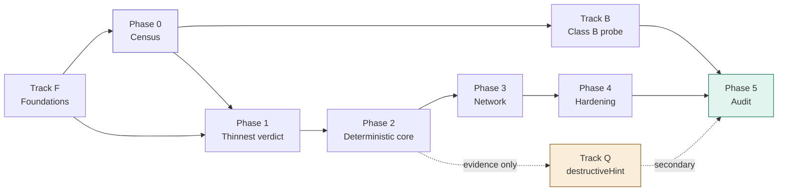

# Implementation Backlog

**Derived from:** [architecture.md](architecture.md), which supersedes [design.md](design.md).
**Status:** Pre-implementation
**Last updated:** July 2026

This is the canonical task list. It is mirrored into GitHub Issues; every issue title
carries its task ID so the two can be reconciled mechanically. When they disagree, this
file wins.

---

## How to read this

- **Tracks** run in parallel. **Phases** are sequential and match architecture.md §10.
- `Depends on` lists task IDs that must be complete, not merely started.
- `Exit` is the observable condition that closes the task. If it cannot be observed, it is
  not an exit criterion and the task needs rewriting.
- Tasks marked **⚑ blocking** gate an entire phase.

---

## Track F — Foundations

Cross-cutting work that gates Phase 0 and Phase 1. None of it produces a finding; all of it
prevents rework later.

### F-01 ⚑ Choose implementation language and workspace layout — ADR-007

**Depends on:** —
**Exit:** ADR-007 merged in `docs/adr/`, recording the choice and the rejected options.
**Status:** Done — [ADR-007](adr/007-implementation-language.md). **Rust**, edition 2024,
single Cargo workspace, hand-rolled MCP client.

architecture.md §8 deliberately leaves this open (`crates/ (or packages/)`). It cannot stay
open — the purity constraint in ADR-005 is materially easier to enforce in a language with a
real module/dependency graph, and the sandbox layer is Linux syscall work.

- [x] Evaluate against: syscall ergonomics (namespaces, overlayfs, cgroups, seccomp), ability
      to enforce the `normalise`/`verdict` purity rule statically, ~~MCP client library
      maturity~~ — **criterion struck.** SDK maturity points the wrong way: mature SDKs
      discard wire bytes during deserialisation, which breaks P0-01's byte-exact capture and
      therefore P0-02's pin, and they expose a tool-call method that P0-01 forbids
      structurally. Decision rests on the first two criteria.
- [x] Record the decision and consequences as ADR-007
- [x] Note explicitly which parts, if any, are permitted to be a second language — fixtures /
      mock backends / P4-05 hostile server (any language, never in the harness build graph),
      and `results/` analysis (Python). Everything else is Rust, `destructive` included.

### F-02 Scaffold the repository skeleton

**Depends on:** F-01
**Exit:** Every directory in architecture.md §8 exists with a placeholder module that builds.
**Status:** Done — `cargo build --workspace` and `cargo clippy --workspace --all-targets`
both clean on the macOS host.

- [x] `intake` `discovery` `census` `planner` `world` `argsynth` `sandbox` `observe`
      `integrity` `normalise` `verdict` `destructive` `store` `orchestrator`
- [x] `rulesets/` `fixtures/generic/` `fixtures/per-server/` `results/census/`
      `results/conformance/` `docs/adr/`
- [x] `sandbox` gated as Linux-only at the build level, not by runtime check —
      `#![cfg(target_os = "linux")]` at the crate root, so off Linux it compiles to an empty
      crate and the workspace still builds
- [x] **One crate added beyond architecture.md §8: `datamodel`.** Shared vocabulary, pure
      data types, no behaviour, `no_std`. It is what lets `normalise` and `verdict` name
      their inputs without reaching for an I/O crate. Named `datamodel` rather than `model`
      because "model" already means *language model* throughout these docs — and this crate
      sits inside the pure allowlist, where that ambiguity would be actively dangerous.
- [x] `xtask/` added for workspace tooling (hosts the F-04 check)

### F-03 CI: build, test, lint

**Depends on:** F-02
**Exit:** CI green on a trivial PR; Linux runner exercises the `sandbox` module.
**Status:** Done — `.github/workflows/ci.yml`, `ubuntu-24.04` (version-pinned, matching the
ADR-007 posture rather than `ubuntu-latest`). Triggers on push to `main` and on pull
requests. Local baseline confirmed clean before landing: `cargo build`, `cargo test`, and
`cargo clippy --workspace --all-targets -- -D warnings` all pass with zero warnings on
1.85.1.

- [x] Build + test + lint on every push — checkout → cache → `rustup show` (installs the
      pinned toolchain from `rust-toolchain.toml`) → build → test → clippy → `cargo purity`
- [x] Linux runner with the kernel features the sandbox needs (overlayfs, cgroups v2, user
      ns) — a dedicated smoke-check step probes all three (`/sys/fs/cgroup/cgroup.controllers`,
      `sudo unshare` across mount/uts/ipc/net/pid/user, a real overlay mount/unmount) and
      fails the build loudly if the runner image lacks one, rather than letting P1-03
      discover it silently later. Probes run under `sudo` deliberately — they check kernel
      *subsystem* availability, independent of the unprivileged-userns policy question,
      which is P1-03's design concern, not this check's.
- [x] Fail the build on warnings in `normalise` and `verdict` — implemented as
      `cargo clippy --workspace --all-targets -- -D warnings`, a strict superset of the
      minimum ask. Workspace is at zero warnings today; the one known future cost is that
      `unsafe_code = "warn"` (workspace lint) becomes a hard error once P1-03 adds real
      syscall code to `sandbox`, forcing an explicit `#[allow(unsafe_code)]` per block —
      consistent with this codebase's existing pattern of demanding explicit justification
      for risky code (the ADR-005 purity allowlist), so treated as intended friction rather
      than a defect.

### F-04 ⚑ Enforce the purity rule in CI

**Depends on:** F-02
**Exit:** A deliberately-added edge from `verdict` to `store` fails CI. Demonstrate it, then
revert.
**Status:** Done — `cargo purity`. Demonstrated: with `store.workspace = true` added to
`crates/verdict/Cargo.toml`, `cargo build --workspace` **succeeds** (the edge is legal Rust —
which is precisely why the check must exist) and `cargo purity` **fails with exit 1**, naming
the offending edge. Reverted; check green.

ADR-005 is the invariant that makes reproducibility real rather than aspirational.
architecture.md §8: *"If that edge ever appears in the dependency graph, reproducibility is
gone."* A rule nobody checks is a comment.

- [x] Dependency-graph assertion — implemented as an **allowlist**, not the denylist this
      task's wording implies. A pure crate's transitive closure must be a *subset* of
      `PURE_ALLOWLIST` (currently `{datamodel}`). Strictly stronger: a denylist passes for
      any I/O crate nobody thought to name.
- [x] Negative test proving the check fires — `xtask/tests/purity.rs`, 6 tests. Run against
      *synthetic* graphs, so proving the rule bites does not require leaving a broken edge in
      the tree. Includes the literal `verdict` → `store` case and unforeseen offenders
      (`tokio`, `reqwest`, `chrono`, …) that are caught without being enumerated.
- [x] Layer 2 — per-crate `clippy.toml` in `normalise` and `verdict` banning clock, path,
      file, and socket types. A crate can have an empty dependency tree and still call `std`.
- [x] Layer 3 — `#![no_std]` on `datamodel`, `normalise`, and `verdict`. Taking a clock as a
      dependency is not a mistake CI catches after the fact; it is code that does not link.
      For `normalise` this is provisional, per ADR-007 — P1-06 tests whether real path
      matching can stay `no_std`.

**Note for F-03:** `cargo purity` must be its own CI step, not a test. `cargo tree` inside
`cargo test` is a recursive cargo invocation contending for the same package-cache lock.

### F-05 Content-addressed evidence store

**Depends on:** F-01
**Exit:** Blob written, addressed by digest, read back byte-identical; re-writing identical
content is a no-op.
**Status:** Done — `crates/store::BlobStore`, plus `datamodel::Digest` (a pure 32-byte value
type; hashing itself lives in `store`, not `datamodel`, so `sha2` never enters the
`normalise`/`verdict` purity closure). Algorithm: SHA-256, chosen as the unopinionated
well-audited default since no doc mandates one. 8 unit tests, `cargo purity` still clean.

architecture.md §12 item 4 — stand this up *before* any sandbox work so Phase 1 evidence is
replayable from day one.

- [x] Content addressing over raw bytes — `put` hashes the input itself; the caller never
      chooses the address
- [x] Immutability enforced at the API level, not by convention — no update/delete method
      exists at all; writes go through a temp-file-then-rename so a partial write is never
      observable; a digest whose on-disk content doesn't match what the address claims
      (`get` or `put`) is a hard `StoreError::Corrupt`, never silently accepted
- [x] Local filesystem backend; object-store backend deferred to P5-01
- [x] `re-put of identical content is a no-op` proven, not assumed — the test revokes write
      permission on the store root after the first `put`, so a second `put` of the same
      bytes can only pass if it truly skips the write

### F-06 Metadata DB schema

**Depends on:** F-01
**Exit:** Migrations apply cleanly; all seven entities from architecture.md §6 present with
their foreign keys.
**Status:** Done — `crates/store::db`, SQLite via `rusqlite` (`bundled` feature, same
reproducibility posture as the pinned toolchain and F-05's blob store). One migration,
`crates/store/migrations/0001_initial_schema.sql`, applied by a ~20-line hand-rolled runner
(a framework would be pure overhead for one file). `FIXTURE`'s columns were unspecified in
architecture.md §6 — filled in and mirrored back into that doc in the same change. 7 tests,
including that FK enforcement actually rejects a dangling reference, that a second
`open_and_migrate` against the same on-disk DB doesn't re-apply the migration (checked via
the `schema_migrations` row count, not just "no error"), and that every invariant below is
exercised in both directions (accepted when it should be, rejected when it shouldn't).

- [x] `SERVER` `TOOL_SNAPSHOT` `RUN` `INTEGRITY` `EVIDENCE` `VERDICT` `RULESET` `FIXTURE`
- [x] `VERDICT` keys on `snapshot_id`, never `(server_id, tool_name)` — invariant 1;
      `verdict` has no `server_id`/`tool_name` columns at all
- [x] `VERDICT.reason_code` non-null whenever `outcome = 'unverifiable'` — invariant 3,
      enforced as a `CHECK` constraint
- [x] `VERDICT.embargo_state` and `VERDICT.disclosed_at` included now (§12 item 6 — cheap
      today, expensive in Phase 5)
- [x] `VERDICT` table is derivable and safe to truncate; `EVIDENCE` is not — `evidence` has
      `BEFORE UPDATE`/`BEFORE DELETE` triggers that hard-fail, mirroring F-05's blob store
      (no update/delete method there either) so immutability holds on both sides of the
      evidence/metadata split

---

## Phase 0 — Census

No sandbox code. Ships a publishable finding on its own (ADR-001), which is what inverts the
project's risk profile.

### P0-01 ⚑ Discovery client

**Depends on:** F-02
**Exit:** `initialize` + `tools/list` succeeds against both a stdio server and a remote HTTP
server; raw JSON persisted verbatim.
**Status:** Done — `crates/discovery`. Hand-rolled JSON-RPC 2.0 (per ADR-007; no `rmcp`),
`serde`/`serde_json` for wire encoding and `ureq` (rustls, no native-tls/openssl) for the
HTTP transport. Verified against the live MCP spec before implementing rather than assuming
a revision: current stable is `2025-11-25` (a `2026-07-28` revision is in release-candidate
status and removes the `initialize` handshake entirely — a shape change for this whole
module, not a version bump; flagged for O-01, not addressed here). 15 tests: unit tests for
JSON-RPC framing and response routing (id mismatch, JSON-RPC error objects, malformed JSON,
peer-closed-without-responding — all via a real bidirectional `UnixStream` pair, not a
mock), plus true end-to-end integration tests against a real spawned subprocess (stdio) and
a real hand-rolled `TcpListener`-based HTTP/1.1 server (no external network calls, fully
hermetic and CI-reproducible). Re-ran 5x locally to rule out flakiness in the
thread/socket-timing-sensitive tests.

- [x] stdio transport — newline-delimited JSON-RPC over a spawned child's stdio; the
      `Child` is reaped on drop (kill + wait) so a discovery target that never exits can't
      accumulate as a zombie across a census run
- [x] Streamable HTTP transport — the single-JSON-response case; a server that upgrades to
      `text/event-stream` gets a clear rejection rather than silent mishandling (out of
      scope for this thinnest path, not silently broken)
- [x] Raw response captured **byte-exact** before any parsing — the pin depends on this;
      `Discovery.initialize_raw` / `.tools_list_raw` are the untouched wire bytes, and
      nothing in this crate parses them any further than routing the JSON-RPC envelope
      (id, result vs. error) to decide success/failure
- [x] Must not call any tool. Enforce structurally, not by discipline — the `Transport`
      trait (the only thing that can send an arbitrary MCP method string) is `pub(crate)`;
      nothing outside this crate can name it. `DiscoveryClient::discover` is the only
      public entry point, and its three method names (`initialize`,
      `notifications/initialized`, `tools/list`) are literals in its body, never parameters
- [x] Record the negotiated spec revision into `TOOL_SNAPSHOT.spec_revision` — taken from
      the server's own `initialize` response, not the version the client asked for

### P0-02 ⚑ Metadata pinner

**Depends on:** P0-01, F-05
**Exit:** Pin is stable across repeated discovery of an unchanged server, and changes when
any byte of a tool's name, schema, annotations, or description changes.
**Status:** Done — `crates/discovery::pin`, built on P0-01's byte-exact capture and reusing
F-05's `datamodel::Digest`/SHA-256 (one digest format across the system, not a second one
invented here). Every field is kept as `serde_json::value::RawValue` end to end — never
routed through `serde_json::Value`, whose `BTreeMap`-backed object type would silently sort
keys back into canonical order on re-serialisation and defeat the whole point. Per-tool pin
is a hash-of-hashes over `(name, inputSchema, annotations, description)`, each with a
presence marker byte so an absent field can never collide with a present-but-empty one; the
server pin hashes the per-tool pins in response order, so a server that reorders its own
tool list between two discoveries changes its pin too. 8 tests, including the literal exit
line ("reorder JSON keys → pin changes") and one that documents rather than papers over a
real boundary: serde's `Option<T>` collapses an explicit JSON `null` and an absent key
before `RawValue` ever sees either, so this module can't and doesn't try to tell them apart.

Defends against rug pulls (architecture.md §0). *"A verdict without a pin is meaningless."*

- [x] Per-tool hash over `(name, inputSchema, annotations, description)` as received
- [x] Per-server hash over the tool set
- [x] **No normalisation before hashing** — the pin is over bytes, not semantics
- [x] Test: reorder JSON keys → pin changes. That is correct behaviour, not a bug.

### P0-03 Catalogue ingest

**Depends on:** F-02
**Exit:** A registry entry resolves to either an installable artifact or an endpoint, with
provenance recorded.
**Status:** Done — `crates/intake::catalogue`. Targets the real, current schema (verified
via web search rather than assumed): the official MCP Registry's `server.json` format,
schema `2025-12-11`, `packages[]` (npm/pypi/cargo/nuget/oci/mcpb) and `remotes[]`
(streamable-http/sse), which the spec explicitly allows to coexist on one entry. `ingest`
takes already-fetched bytes — fetching from a live registry is a separate, later concern
this task's contract doesn't include. 9 tests, including one against the official schema
doc's own minimal example rather than an invented fixture.

- [x] Resolve registry entries to source, package, image, or HTTP endpoint — every
      `packages[]`/`remotes[]` entry with its required fields becomes a `ResolvedTarget`;
      both arrays are processed, not just whichever one is checked first
- [x] Must not execute anything, including package install scripts — there is no code path
      in this module that spawns a process or invokes a package manager; it only parses JSON
- [x] Unresolvable entries are recorded, not dropped — `ingest` returns `IngestOutcome`
      directly (never wrapped in a `Result`), so there is no `Err` arm a caller could
      discard; a malformed sub-entry (e.g. a package missing `identifier`) is recorded in
      `skipped` rather than sinking an otherwise-resolvable entry, and an entry with zero
      usable targets becomes `Unresolvable` rather than an empty `Resolved`

### P0-04 Containability classifier

**Depends on:** P0-03
**Exit:** Every corpus server carries Class A, Class B, or `unclassifiable`, plus the reason.
**Status:** Done — `crates/intake::classify`. Reuses `datamodel::ContainabilityClass`
(already scaffolded in F-02) rather than a second parallel type, so classification can
never drift from what F-06's `SERVER.containability_class` column and its `CHECK`
constraint accept. A package target always wins over a coexisting remote — the registry
schema explicitly allows `packages` and `remotes` on the same entry, and "launchable
locally" only needs one to be true. 6 tests, including one that constructs the
"resolved but empty" state directly (bypassing `ingest()`'s own invariant that `Resolved`
implies a non-empty target list) to prove the classifier doesn't blindly trust an
invariant it can't see enforced — it degrades to `Unclassifiable` rather than panicking.

architecture.md §12 item 3 — the Class A/B ratio gates how ambitious Phase 5 can be.

- [x] Class A: launchable locally — any `ResolvedTarget::Package`, regardless of what else
      the entry also declares
- [x] Class B: remote HTTP endpoint only — `ResolvedTarget::Endpoint` present, no package
- [x] `unclassifiable` is a real class, not a fallback — never guess — every classification
      traces to a concrete fact from `catalogue::ingest`'s output (an `Unresolvable` reason,
      or the target list's actual contents), never to absence of information defaulting
      silently to one class
- [x] Reason string stored alongside the class — always human-readable prose; no closed
      reason-code taxonomy at this layer the way the verdict engine has one (P2-11)

### P0-05 Coverage aggregator

**Depends on:** P0-02
**Exit:** Per annotation, per tool, per server: `explicit` / `defaulted` / `absent`.
**Status:** Done — `crates/census::coverage`. `Defaulted` (the tool's `annotations` object
exists but omits this key) and `Absent` (no `annotations` object at all) are kept as
separate buckets rather than collapsed into one "not set" — both reach the same spec
default from a client's point of view, but they're different findings for design.md's open
question 1 ("mismatch" vs. "absence"). Per-server and corpus-wide rollup are the same
`tally()` function applied to different-sized input slices — a tally has no notion of a
server boundary, only the caller's choice of which tools to include does, so a second
rollup function would have been pure duplication. 6 tests, including one that proves the
corpus-wide claim directly: tallying two servers separately and tallying their concatenated
tools together produce the same combined counts.

- [x] Distinguish explicitly-declared from spec-defaulted from wholly absent
- [x] Must not touch behavioural evidence — operates only on the `tools/list` response's
      `annotations` objects; no dependency on `sandbox`, `observe`, or `store` anywhere in
      this module
- [x] Roll up to per-server and corpus-wide — one `tally()` function, scope is just which
      tools you pass it

### P0-06 Seed corpus run — 100 servers

**Depends on:** P0-04, P0-05
**Exit:** Census completes over 100 servers; pin stability and coverage taxonomy validated
against hand inspection of a sample.

architecture.md §12 item 1.

- [ ] Hand-verify the taxonomy on ≥20 tools; fix the taxonomy, not the data
- [ ] Re-run discovery on the same 100 and confirm pins are stable

### P0-07 Full census — ≥1,000 servers

**Depends on:** P0-06
**Exit:** Coverage numbers over ≥1,000 servers written to `results/census/`. **Publishable.**

This is the Phase 0 exit criterion and plausibly the headline result — open question 1 asks
whether the story is about *mismatch* or about *absence*.

- [ ] Throughput profile suitable for the corpus size
- [ ] Failure/timeout rate reported alongside the coverage rate

### P0-08 Class A / Class B ratio report

**Depends on:** P0-07
**Exit:** Ratio published with the census.

architecture.md §2 design note: if most public servers are remote-only, *"most of the
ecosystem is unauditable by any third party"* is a stronger claim than a mismatch rate.

---

## Track B — Class B protocol-probe oracle

Runs after Phase 0, independently of the sandbox. Narrow exception carved out in
architecture.md §2.

### B-01 Protocol-probe protocol

**Depends on:** P0-04
**Exit:** probe → invoke → probe decides `readOnlyHint` for a Class B server that exposes
resources or state-reflecting read-only tools.

- [ ] Identify servers with a usable probe surface; the rest stay `unverifiable`
- [ ] Extend to `idempotentHint` where the probe surface supports it

### B-02 Oracle tagging

**Depends on:** B-01, F-06
**Exit:** Every verdict carries `oracle` = `kernel_changeset` or `protocol_probe`.

### B-03 ⚑ Cross-oracle aggregation guard

**Depends on:** B-02
**Exit:** Any report that mixes oracles without separating them fails a test.

ADR-002: *"an easy invariant to state and an easy one to violate in a summary table."* Make
it a test, not a habit.

---

## Phase 1 — Thinnest verdict

Target from design.md §10: a real verdict on a real tool within two weeks. The anti-goal —
building the full containment stack before the first verdict — is what this phase exists to
prevent.

### P1-01 ⚑ Path taxonomy decision — ADR-008

**Depends on:** —
**Exit:** ADR-008 merged defining `user_state` / `server_internal` / `ephemeral`.
**Status:** Done — [ADR-008](adr/008-path-taxonomy.md). Rules are versioned glob lists in
`rulesets/`, not Rust code (P1-06's constraint, applied here). Default is `user_state`
(the conservative direction — misclassifying something as user state makes a tool look
*less* read-only than it is, never more, mirroring `unverifiable` over false `holds`).
Both allowlists (`ephemeral`: `/tmp/**`, lockfiles, PID files, sockets; `server_internal`:
XDG-style cache/config/state dirs, `__pycache__`, npm's cache layout) are seeded from
external naming conventions rather than invented, per ADR-003's discipline that an
unobserved pattern is a guess, not a finding. Explicitly left coarse and empirically
revisable by P2-10, and explicitly leaves room for the P2-05 world provisioner to override
the default classification for bespoke fixtures without specifying that interface yet.

architecture.md §12 item 2 — **this blocks ruleset v1.** §4.3 recommends emitting the verdict
against `user_state` while reporting the other two, so critics have something to argue with
that is not the verdict itself.

### P1-02 ⚑ Overlayfs base-layer builder

**Depends on:** F-02
**Exit:** Two independent constructions of the same base produce byte-identical layers.
Prove it in a test.

architecture.md §12 item 5 — everything downstream depends on this. A nondeterministic base
silently poisons every diff, and the failure is invisible in the output.

- [ ] Deterministic construction: no timestamps, no random ordering, no ambient state
- [ ] Byte-reproducibility test across two constructions
- [ ] Whiteout and opaque-directory semantics understood and documented (design.md §9)

### P1-03 Sandbox supervisor — mount namespace, overlayfs, timeout

**Depends on:** P1-02
**Exit:** Tool launches inside a mount namespace over an overlay, is killed at timeout, and
tears down cleanly.

- [ ] Mount namespace + overlayfs upper layer
- [ ] Hard timeout
- [ ] MCP **client stays on the host**, server runs in the sandbox, protocol crosses over
      stdio (architecture.md §5 — keeps protocol handling outside the blast radius)
- [ ] Must not emit any verdict

### P1-04 Observation collector — upper layer

**Depends on:** P1-03
**Exit:** Upper layer harvested into the evidence store, content-addressed.

- [ ] Harvest and store; **interpret nothing**
- [ ] Record exit status and orphan-PID state for the gate

### P1-05 Integrity gate v1

**Depends on:** P1-04
**Exit:** Clean-teardown and timeout checks; a failed run yields `unverifiable` with a reason
code and no verdict.

ADR-004 — the gate is a hard precondition and **not configurable off**. A timed-out run with
an empty changeset is not `readOnlyHint: holds`; that is the worst available failure mode.

- [ ] `containment_uncertain` on orphan PIDs
- [ ] `timeout` on hard-timeout kill
- [ ] Not bypassable by configuration. Test that it cannot be disabled.

### P1-06 Normaliser + ruleset v1

**Depends on:** P1-01, P1-05
**Exit:** `(raw_evidence, ruleset_version) → canonical_changeset`, pure and deterministic.

- [ ] Rulesets are versioned data in `rulesets/`, not code
- [ ] Reads nothing outside its inputs — no clock, no filesystem, no network
- [ ] Ruleset v1 kept deliberately thin; v2 gets derived from measured noise in P2-10

### P1-07 Verdict engine + `readOnlyHint`

**Depends on:** P1-06
**Exit:** `canonical(D1)` non-empty over `user_state` contradicts a `true` declaration.

- [ ] Pure: cannot take a model, network client, or clock as a dependency (F-04 enforces)
- [ ] Emits `holds` / `violated` / `unverifiable` with `reason_code` and `oracle`

### P1-08 ⚑ End-to-end: first real verdict

**Depends on:** P1-07, P0-01
**Exit:** One real `readOnlyHint` verdict on one real tool from one real MCP server, end to
end. **This is the Phase 1 exit criterion.**

### P1-09 ⚑ Replay test

**Depends on:** P1-08, F-05
**Exit:** An integration test regenerates the full verdict table from stored evidence plus a
ruleset version, executing no tool.

architecture.md §6 invariant 2: *"it is worth an integration test that literally does it."*
This is the property that makes ruleset iteration safe.

---

## Phase 2 — Deterministic core

### P2-01 Sandbox — PID and user namespaces

**Depends on:** P1-03
**Exit:** Tool is PID 1; namespace teardown kills all descendants; orphans detected.

### P2-02 Sandbox — cgroups v2

**Depends on:** P2-01
**Exit:** `memory.max`, `cpu.max`, `pids.max` enforced; a fork bomb is contained; per-run
resource cost recorded.

### P2-03 Full integrity gate

**Depends on:** P2-02
**Exit:** All four gate branches from architecture.md §5.1 implemented.

- [ ] `execution_truncated` on resource-cap hit — a capped run's empty changeset proves
      nothing
- [ ] Escape-class denied syscall sets `adversarial_flag` but **accepts** the evidence;
      attempted escapes are among the most interesting findings the harness can produce
- [ ] Flag follows the record all the way into publication

### P2-04 Run planner

**Depends on:** P2-03
**Exit:** A request for `{readOnly, idempotent, openWorld}` compiles to the minimal
deduplicated arm set from architecture.md §4.1.

- [ ] Arm 1 serves as `readOnlyHint` evidence, the `D1` idempotency arm, *and* the strict
      `openWorldHint` observation
- [ ] Must **not** reorder or share arms that are required to be independent
- [ ] Every arm gets a freshly constructed sandbox from a byte-identical base
- [ ] Arms are never reused across tools

### P2-05 World provisioner — generic fixtures

**Depends on:** P1-02
**Exit:** Seeded FS and seeded DB, byte-reproducible across constructions.

### P2-06 Argument synthesiser

**Depends on:** P2-05
**Exit:** Schema-driven generation + fixture binding + cache-busting variants.

- [ ] Structural validity from the input schema
- [ ] Semantic validity via fixture binding to entities that actually exist
- [ ] Cache-busting variants for the P2-09 caching branch
- [ ] If an argument is reused across arms that must be identical, **record that it was**

### P2-07 Arms 1′, 2, and 2R

**Depends on:** P2-04, P2-06
**Exit:** Repeat single-call, double-call in-process, and call/restart/call arms all produce
independent changesets.

### P2-08 ⚑ Noise floor

**Depends on:** P2-07
**Exit:** `N = D1 Δ D1′` computed per tool, per run.

ADR-003. Measured, never assumed. Comparing one call against two without first establishing
how much two *identical* single-call runs differ is measuring noise plus signal and reporting
it as signal.

### P2-09 `idempotentHint` multi-arm protocol

**Depends on:** P2-08
**Exit:** The decision tree in architecture.md §4.2 implemented.

- [ ] `D2 Δ D1 ⊄ N` → `violated`
- [ ] `D2R Δ D1 ⊄ N` → `unverifiable`, reason `caching_suppressed_in_process`
- [ ] Both within `N` → `holds`
- [ ] Framed as an equivalence metamorphic relation with `N` as the tolerance — say it that
      way in the paper

### P2-10 Ruleset v2, derived from measured noise

**Depends on:** P2-08
**Exit:** Noise floor measured across ≥50 tools; ruleset v2 derived from it. **Publishable.**

- [ ] Every element of an observed `N` is a candidate normalisation rule
- [ ] **A rule that never appears in any observed `N` should not exist.** Audit v1 against
      this and delete what fails.
- [ ] Re-run P1-09 replay under v2 and diff the verdict tables

### P2-11 Reason-code taxonomy

**Depends on:** P2-09
**Exit:** Closed set of reason codes, documented.

architecture.md §6 invariant 3: *"`unverifiable` without a reason is not a finding, it is a
shrug."* These codes are what the paper reports.

---

## Phase 3 — Network

### P3-01 Network namespace — strict mode

**Depends on:** P2-03
**Exit:** No route out; egress attempts fail and are logged.

### P3-02 veth pair + intercepting proxy

**Depends on:** P3-01
**Exit:** Every connection logged with its destination.

### P3-03 Mock backend redirection

**Depends on:** P3-02, P2-05
**Exit:** A tool needing an external API is transparently served by an in-sandbox mock.

### P3-04 Destination classification

**Depends on:** P3-02
**Exit:** Each destination classified in-sandbox versus external.

### P3-05 `openWorldHint` protocol

**Depends on:** P3-04
**Exit:** The decision tree in architecture.md §4.4 implemented.

- [ ] Egress attempted → `openWorld = true`, contradicts a `false` declaration
- [ ] No egress + tool succeeded → consistent with closed world
- [ ] No egress + tool failed → ambiguous, rerun instrumented

### P3-06 Fixture-generality metric

**Depends on:** P3-03
**Exit:** Ratio of tools working against a generic mock versus needing bespoke fixtures.

Answers open question 2 empirically, and is a publishable result in its own right. It is also
the primary determinant of achievable audit scale.

---

## Phase 4 — Hardening

### P4-01 seccomp-bpf filter

**Depends on:** P2-02
**Exit:** `mount`, `ptrace`, `bpf`, `kexec` and similar denied.

### P4-02 Denied-syscall audit log

**Depends on:** P4-01
**Exit:** Denials harvested into evidence and surfaced to the integrity gate.

### P4-03 Adversarial flagging through to publication

**Depends on:** P4-02, P2-03
**Exit:** `adversarial_flag` present on the published record, not just in the DB.

### P4-04 Worker re-imaging

**Depends on:** P2-03
**Exit:** Workers re-imaged **between servers**, not between tools — bounds the damage from a
successful escape (architecture.md §7).

### P4-05 Hostile test server

**Depends on:** P4-01, P4-04
**Exit:** A deliberately hostile server attempting escape, exfiltration, resource exhaustion,
and hangs is contained; every attempt appears in evidence. **Phase 4 exit criterion.**

- [ ] Note in results that observation *evasion* remains out of scope (design.md §8)

---

## Phase 5 — Audit and publication

### P5-01 Orchestrator scale-out

**Depends on:** P4-05
**Exit:** Queue + worker pool over Linux hosts; object-store backend for evidence.

- [ ] **One sandbox per worker slot at a time.** Concurrent sandboxes share a kernel and page
      cache, and the timing coupling is exactly the noise P2-08 is trying to measure. Scale
      out, not up.

### P5-02 Offline derivation job

**Depends on:** P5-01, P1-09
**Exit:** Batch job over the object store regenerates all verdicts; it is not a step in the
run loop.

### P5-03 Disclosure workflow

**Depends on:** F-06
**Exit:** Embargo state machine, maintainer contact path, disclosure timestamps.

Open question 4, now a component rather than an afterthought. Open question 3 recommendation:
aggregate by default, named on violation after disclosure — the metadata pin is what makes
named publication defensible, since a claim is bound to an exact observed snapshot.

### P5-04 Aggregate reporting

**Depends on:** P5-02, B-03
**Exit:** Rates by annotation, by containability class, and by oracle, written to
`results/conformance/`.

- [ ] Never aggregate across oracles without disclosure (ADR-002)
- [ ] Report the no-verdict fraction as a metric in its own right — ADR-004 predicts it may
      be large early on, and it is a useful signal about harness maturity

### P5-05 Publish ruleset and limitations

**Depends on:** P5-04
**Exit:** Normalisation ruleset and every limitation from design.md §8 published alongside
the results.

Design constraints, not deferred work: external state invisibility, semantic argument
validity, normalisation sensitivity, caching confound, observation evasion. Each must appear
in published results.

---

## Track Q — `destructiveHint` (quarantined)

Runs out-of-band on stored evidence. **Never in the run loop, never in the verdict engine.**
ADR-006.

### Q-01 Mechanical proxy

**Depends on:** P2-09
**Exit:** Canonical changeset partitioned into `deletions ∪ overwrites` versus `pure
additions`.

### Q-02 Human-labelled held-out set

**Depends on:** Q-01
**Exit:** Labelled set with documented labelling protocol and inter-rater agreement.

### Q-03 Model classifier — untrusted input

**Depends on:** Q-02
**Exit:** Classifier runs out-of-band over stored evidence.

This is **the one place in the system exposed to tool poisoning** — it reads tool
descriptions, an established prompt-injection vector, and feeds them to a model.

- [ ] Descriptions treated as untrusted data, never as instruction
- [ ] Runs offline over stored evidence; never in the run loop
- [ ] **Cannot write into the deterministic verdict path.** Enforce structurally.

### Q-04 Agreement statistics

**Depends on:** Q-03
**Exit:** Agreement between mechanical proxy, model classification, and human labels.

The headline number is the **agreement statistic, not a mismatch rate**. Reported as a
secondary result; must not contaminate the deterministic three.

---

## Ongoing

### O-01 Track the Tool Annotations Interest Group

**Exit:** No exit — standing task.

Open question 5. Five SEPs are open and the IG is actively debating runtime evaluation.
`TOOL_SNAPSHOT.spec_revision` and `VERDICT.protocol_version` exist so results survive a spec
change, but someone has to notice the change.

### O-02 Prior-art re-survey before publication

**Exit:** Re-run before each publishable milestone (P0-07, P2-10, P5-04).

design.md §11: if an ecosystem-wide conformance audit already exists, this work reframes as
an extension or a replication with a different containment approach.
